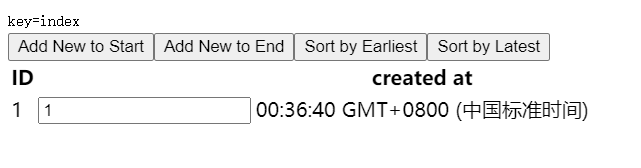
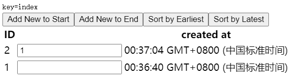
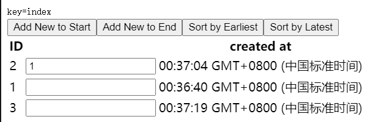
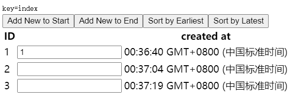

## 设计动机

在某一时间节点调用 React 的 `render()` 方法，会创建一棵由 React 元素组成的树。在下一次 state 或 props 更新时，相同的 `render()` 方法会返回一棵不同的树。React 需要基于这两棵树之间的差别来判断如何高效的更新 UI，以保证当前 UI 与最新的树保持同步。

此算法有一些通用的解决方案，即生成将一棵树转换成另一棵树的最小操作次数。然而，即使使用[最优的算法](http://grfia.dlsi.ua.es/ml/algorithms/references/editsurvey_bille.pdf)，该算法的复杂程度仍为 O(n 3 )，其中 n 是树中元素的数量。

如果在 React 中使用该算法，那么展示 1000 个元素则需要 10 亿次的比较。这个开销实在是太过高昂。于是 React 在以下两个假设的基础之上提出了一套 O(n) 的启发式算法：

1. 两个不同类型的元素会产生出不同的树；
2. 开发者可以通过设置 `key` 属性，来告知渲染哪些子元素在不同的渲染下可以保存不变；

## Diffing 算法

当对比两棵树时，React 首先比较两棵树的根节点。不同类型的根节点元素会有不同的形态。

### 对比不同类型的元素

当根节点为不同类型的元素时，React 会拆卸原有的树并且建立起新的树。举个例子，当一个元素从 `a` 变成 `img`，从 `Article` 变成 `Comment`，或从 `div` 变成 `button` 都会**触发一个完整的重建流程**。

当卸载一棵树时，对应的 DOM 节点也会被销毁。组件实例将执行 `componentWillUnmount()` 方法。当建立一棵新的树时，对应的 DOM 节点会被创建以及插入到 DOM 中。组件实例将执行 `UNSAFE_componentWillMount()` 方法(已过时)，紧接着 `componentDidMount()` 方法。所有与之前的树相关联的 state 也会被销毁。

在根节点以下的组件也会被卸载，它们的状态会被销毁。比如，当比对以下更变时：

```
<div>
  <Counter />
</div>

<span>
  <Counter />
</span>
```

React 会销毁 `Counter` 组件并且重新装载一个新的组件。

### 对比同一类型的元素

当对比两个相同类型的 React 元素时，React **会保留 DOM 节点**，**仅比对及更新有改变的属性**。

```
<div className="before" title="stuff" />

<div className="after" title="stuff" />
```

通过对比这两个元素，React 知道**只需要**修改 DOM 元素上的 `className` 属性。

当更新 `style` 属性时，React 仅更新有所更变的属性

```
<div style={{color: 'red', fontWeight: 'bold'}} />

<div style={{color: 'green', fontWeight: 'bold'}} />
```

通过对比这两个元素，React 知道只需要修改 DOM 元素上的 `color` 样式，**无需修改 `fontWeight`**。

在处理完当前节点之后，React **继续对子节点进行递归**。

### 对比同类型的组件元素

当一个组件更新时，组件实例会保持不变，因此可以在不同的渲染时保持 state 一致。React 将更新该组件实例的 props 以保证与最新的元素保持一致(`When a component updates, the instance stays the same, so that state is maintained across renders. React updates the props of the underlying component instance to match the new element`)，并且调用该实例的 `UNSAFE_componentWillReceiveProps()`、`UNSAFE_componentWillUpdate()` 以及 `componentDidUpdate()` 方法。

下一步，调用 `render()` 方法，diff 算法将在之前的结果以及新的结果中进行递归。

### 对子节点进行递归

默认情况下，当递归 DOM 节点的子元素时，React 会同时遍历两个子元素的列表；当产生差异时，生成一个 mutation。

在子元素列表末尾新增元素时，更新开销比较小。比如：

```
<ul>
  <li>first</li>
  <li>second</li>
</ul>

<ul>
  <li>first</li>
  <li>second</li>
  <li>third</li>
</ul>
```

React 会先匹配两个 `first` 对应的树，然后匹配第二个元素 `second` 对应的树，最后插入第三个元素的 `third` 树

如果只是简单的将新增元素插入到表头，那么更新开销会比较大

```
<ul>
  <li>Duke</li>
  <li>Villanova</li>
</ul>

<ul>
  <li>Connecticut</li>
  <li>Duke</li>
  <li>Villanova</li>
</ul>
```

React 并不会意识到应该保留 `Duke` 和 `Villanova`，而是**会重建每一个子元素**。这种情况会带来性能问题。

### Keys

为了解决上述问题，React 引入了 `key` 属性。当子元素拥有 key 时，React 使用 key 来匹配原有树上的子元素以及最新树上的子元素。以下示例在新增 `key` 之后，使得树的转换效率得以提高：

```
<ul>
  <li key="2015">Duke</li>
  <li key="2016">Villanova</li>
</ul>

<ul>
  <li key="2014">Connecticut</li>
  <li key="2015">Duke</li>
  <li key="2016">Villanova</li>
</ul>
```

现在 React 知道只有带着 `'2014'` key 的元素是新元素，带着 `'2015'` 以及 `'2016'` key 的元素仅仅移动了。(不会重新构建key相同的元素，但也还是会进行比对更新)

实际开发中，编写一个 key 并不困难。你要展现的元素可能已经有了一个唯一 ID，于是 key 可以直接从你的数据中提取

当以上情况不成立时，你可以新增一个 ID 字段到你的模型中，或者**利用一部分内容作为哈希值来生成一个 key**。这个 key 不需要全局唯一，但在列表中需要保持唯一

最后，你也可以使用元素在数组中的下标作为 key。这个策略在元素不进行重新排序时比较合适，如果有顺序修改，diff 就会变慢

当基于下标的组件进行重新排序时，组件状态（这里的状态可以理解为子组件内部的state，当子组件的key变动时，其状态可能会丢失？可以验证下）可能会遇到一些问题。由于组件实例是基于它们的 key 来决定是否更新以及复用，如果 key 是一个下标，那么修改顺序时会修改当前的 key，导致非受控组件的状态（比如输入框）可能出现无法预期的变动。例如：[Create a New Pen (codepen.io)](https://codepen.io/pen?&editors=0010&layout=left)

```jsx
const ToDo = props => (
  <tr>
    <td>
      <label>{props.id}</label>
    </td>
    <td>
      <input />
    </td>
    <td>
      <label>{props.createdAt.toTimeString()}</label>
    </td>
  </tr>
);

class ToDoList extends React.Component {
  constructor() {
    super();
    const date = new Date();
    const todoCounter = 1;
    this.state = {
      todoCounter: todoCounter,
      list: [
        {
          id: todoCounter,
          createdAt: date,
        },
      ],
    };
  }

  sortByEarliest() {
    const sortedList = this.state.list.sort((a, b) => {
      return a.createdAt - b.createdAt;
    });
    this.setState({
      list: [...sortedList],
    });
  }

  sortByLatest() {
    const sortedList = this.state.list.sort((a, b) => {
      return b.createdAt - a.createdAt;
    });
    this.setState({
      list: [...sortedList],
    });
  }

  addToEnd() {
    const date = new Date();
    const nextId = this.state.todoCounter + 1;
    const newList = [
      ...this.state.list,
      {id: nextId, createdAt: date},
    ];
    this.setState({
      list: newList,
      todoCounter: nextId,
    });
  }

  addToStart() {
    const date = new Date();
    const nextId = this.state.todoCounter + 1;
    const newList = [
      {id: nextId, createdAt: date},
      ...this.state.list,
    ];
    this.setState({
      list: newList,
      todoCounter: nextId,
    });
  }

  render() {
    return (
      <div>
        <code>key=index</code>
        <br />
        <button onClick={this.addToStart.bind(this)}>
          Add New to Start
        </button>
        <button onClick={this.addToEnd.bind(this)}>
          Add New to End
        </button>
        <button onClick={this.sortByEarliest.bind(this)}>
          Sort by Earliest
        </button>
        <button onClick={this.sortByLatest.bind(this)}>
          Sort by Latest
        </button>
        <table>
          <tr>
            <th>ID</th>
            <th />
            <th>created at</th>
          </tr>
          {this.state.list.map((todo, index) => (
            <ToDo key={index} {...todo} />
          ))}
        </table>
      </div>
    );
  }
}

ReactDOM.render(
  <ToDoList />,
  document.getElementById('root')
);
```

**此代码中，数组使用index作为key，当数组重新排序（例如按照创建时间顺序排序）或者在头尾添加一个新元素时，因为key永远都是按照1、2、3的顺序，所以react会认为数组的顺序没变化，只会更新对应的内容（例如props里的），而其他内容则不会发生变化（例如输入框中的文本）。（除了显示异常外，这也是diff变慢的原因，因为它没有复用，而是几乎更新了每一个元素）**



点击第一个按钮



点击第二个按钮



点击第三个按钮



**将key改为id即可解决这个问题，这样react就能知道数组的顺序发生了变化，从而更新对应的输入框文本，且可复用原有列表项的props数据**

## 权衡

请谨记协调算法是一个实现细节。React 可以在每个 action 之后对整个应用进行重新渲染，得到的最终结果也会是一样的。在此情境下，**重新渲染表示在所有组件内调用 `render` 方法，这不代表 React 会卸载或装载它们。React 只会基于以上提到的规则来决定如何进行差异的合并**

在当前的实现中，可以理解为一棵子树能在其兄弟之间移动，但不能移动到其他位置。在这种情况下，算法会重新渲染整棵子树

由于 React 依赖启发式算法，因此当以下假设没有得到满足，性能会有所损耗

1. 该算法不会尝试匹配不同组件类型的子树。如果你发现你在两种不同类型的组件中切换，但输出非常相似的内容，建议把它们改成同一类型。在实践中，我们没有遇到这类问题。
2. **Key 应该具有稳定，可预测，以及列表内唯一的特质。不稳定的 key（比如通过 `Math.random()` 生成的）会导致许多组件实例和 DOM 节点被不必要地重新创建，这可能导致性能下降和子组件中的状态丢失**。（这里可以试下，如果一个属性是存在子组件的state中的，当这个子组件key发生变动时，子组件的状态是否还存在）