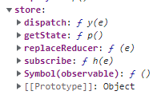

从初始化到一次dispatch的过程

1、调用`var store = Redux.createStore(counter)`，其中counter是初始化reducer函数

创建后，store存在global中

counter函数：

```
     function counter(state, action) {
        if (typeof state === 'undefined') {
          return 0
        }

        switch (action.type) {
          case 'INCREMENT':
            return state + 1
          case 'DECREMENT':
            return state - 1
          default:
            return state
        }
      }
```



注意，调用`var store = Redux.createStore(counter)`会触发一次dispatch，这时候就会调用reducer函数，reducer函数内部能够将state初始化为0

2、假设有一个元素`var valueEl = document.getElementById('value')`，该元素要使用state的值，且当state的值变化时，该元素的值也要发生变化

即，当state的值变化时，渲染该元素，渲染是通过render函数实现的

```js
      function render() {
        valueEl.innerHTML = store.getState().toString()
        // 与const countPlusTwo = useSelector(state => state.counter.value + 2)有异曲同工之妙
        // 每当一个 action 被 dispatch 并且 Redux store 被更新时，useSelector 将重新运行我们的选择器函数。如果选择器返回的值与上次不同，useSelector 将确保我们的组件使用新值重新渲染
      }
```

而监听则是通过subscribe函数并传入render函数实现的 `store.subscribe(render)`

store.subscribe函数的主要逻辑如下：

```js
function subscribe(listener) {
    let isSubscribed = true

    ensureCanMutateNextListeners()
    // 将render函数加入监听列表中，这就是订阅
    nextListeners.push(listener)

    // unsubscribe(): 取消订阅，将该render函数从监听列表中移除
    return function unsubscribe() {
      isSubscribed = false

      ensureCanMutateNextListeners()
      const index = nextListeners.indexOf(listener)
      nextListeners.splice(index, 1) // 取消当前的订阅
      currentListeners = null
    }
  }
```

3、发送`store.dispatch({ type: 'INCREMENT' })`

dispatch函数逻辑如下：

```js
function dispatch(action) {
    try {
      isDispatching = true
      // 调用currentReducer并传入当前的state（currentState），currentReducer默认为处时传入的reducer函数，可通过replaceReducer方法更改
      currentState = currentReducer(currentState, action)
    } finally {
      isDispatching = false
    }
	// currentListeners = nextListeners是一个赋值语句，这两者的关系并不是很清楚，总之这就是监听列表
    const listeners = (currentListeners = nextListeners)
    // 依次调用监听列表中的render函数，将state的修改结果渲染出去
    for (let i = 0; i < listeners.length; i++) {
      const listener = listeners[i]
      listener()
    }

    return action
  }
```

