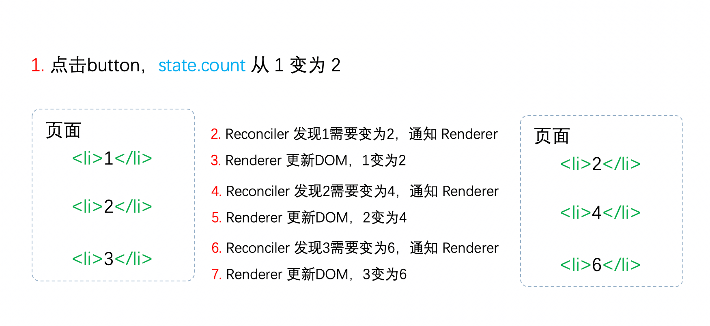
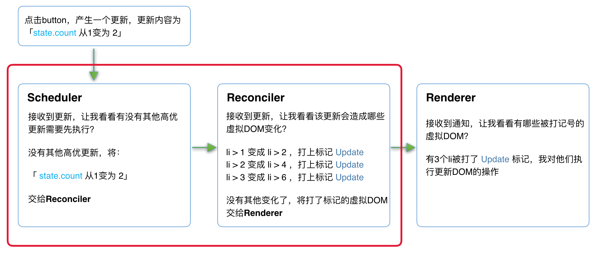

# React理念

> React 是用 JavaScript 构建**快速响应**的大型 Web 应用程序的首选方式

日常浏览网页时，有两类场景会制约`快速响应`：

- 当遇到大计算量的操作或者设备性能不足使，页面掉帧导致卡顿。
- 发送网络请求后，由于需要等待数据返回才能进一步操作导致不能快速响应。

## CPU的瓶颈

主流浏览器刷新频率为60Hz，即每（1000ms / 60Hz）16.6ms浏览器刷新一次。

我们知道，JS可以操作DOM，`GUI渲染线程`与`JS线程`是互斥的。所以**JS脚本执行**和**浏览器布局、绘制**不能同时执行。

在每16.6ms时间内，需要完成如下工作：

```text
JS脚本执行 -----  样式布局 ----- 样式绘制
```

当JS执行时间过长，超出了16.6ms，这次刷新就没有时间执行**样式布局**和**样式绘制**了

所以会导致页面掉帧、卡顿

**react的解决方式**：在浏览器每一帧的时间中，预留一些时间给JS线程，`React`利用这部分时间更新组件（可以看到，在[源码 (opens new window)](https://github.com/facebook/react/blob/1fb18e22ae66fdb1dc127347e169e73948778e5a/packages/scheduler/src/forks/SchedulerHostConfig.default.js#L119)中，预留的初始时间是5ms）。

当预留的时间不够用时，`React`将线程控制权交还给浏览器使其有时间渲染UI，`React`则等待下一帧时间到来继续被中断的工作

> 这种将长任务分拆到每一帧中，像蚂蚁搬家一样一次执行一小段任务的操作，被称为`时间切片`（time slice）

此时我们的长任务被拆分到每一帧不同的`task`中，`JS脚本`执行时间大体在`5ms`左右，这样浏览器就有剩余时间执行**样式布局**和**样式绘制**，减少掉帧的可能性。

所以，解决`CPU瓶颈`的关键是实现`时间切片`，而`时间切片`的关键是：将**同步的更新**变为**可中断的异步更新**。

## IO的瓶颈

`网络延迟`是前端开发者无法解决的。如何在`网络延迟`客观存在的情况下，减少用户对`网络延迟`的感知？

`React`给出的答案是[将人机交互研究的结果整合到真实的 UI 中 (opens new window)](https://zh-hans.reactjs.org/docs/concurrent-mode-intro.html#putting-research-into-production)

即在进行某项操作时，先在当前页面停留一小段时间，这一小段时间被用来请求数据。

当“这一小段时间”足够短时，用户是无感知的。如果请求时间超过一个范围，再显示`loading`的效果

# React15架构

React15架构可以分为两层：

- Reconciler（协调器）—— 负责找出变化的组件
- Renderer（渲染器）—— 负责将变化的组件渲染到页面上

### Reconciler（协调器）

我们知道，在`React`中可以通过`this.setState`、`this.forceUpdate`、`ReactDOM.render`等API触发更新。

每当有更新发生时，**Reconciler**会做如下工作：

- 调用函数组件、或class组件的`render`方法，将返回的JSX转化为虚拟DOM
- 将虚拟DOM和上次更新时的虚拟DOM对比
- 通过对比找出本次更新中变化的虚拟DOM
- 通知**Renderer**将变化的虚拟DOM渲染到页面上

### Renderer（渲染器）

由于`React`支持跨平台，所以不同平台有不同的**Renderer**。我们前端最熟悉的是负责在浏览器环境渲染的**Renderer** —— [ReactDOM (opens new window)](https://www.npmjs.com/package/react-dom)。

除此之外，还有：

- [ReactNative (opens new window)](https://www.npmjs.com/package/react-native)渲染器，渲染App原生组件
- [ReactTest (opens new window)](https://www.npmjs.com/package/react-test-renderer)渲染器，渲染出纯Js对象用于测试
- [ReactArt (opens new window)](https://www.npmjs.com/package/react-art)渲染器，渲染到Canvas, SVG 或 VML (IE8)

在每次更新发生时，**Renderer**接到**Reconciler**通知，将变化的组件渲染在当前宿主环境。

## React15架构的缺点

在**Reconciler**中，`mount`的组件会调用[mountComponent (opens new window)](https://github.com/facebook/react/blob/15-stable/src/renderers/dom/shared/ReactDOMComponent.js#L498)，`update`的组件会调用[updateComponent (opens new window)](https://github.com/facebook/react/blob/15-stable/src/renderers/dom/shared/ReactDOMComponent.js#L877)。这两个方法都会递归更新子组件。

由于递归执行，所以更新一旦开始，中途就无法中断。(这里是相对循环来说的，循环可以跳出，而递归不行)（其实递归中断不中断不是重点，重点是下方的不支持异步更新）当层级很深时，递归更新时间超过了16ms，用户交互就会卡顿。

在上一节中，我们已经提出了解决办法——用**可中断的异步更新**代替**同步的更新**。但React15的架构不支持异步更新

假设有如下情景



我们可以看到，**Reconciler**和**Renderer**是交替工作的，当第一个`li`在页面上已经变化后，第二个`li`再进入**Reconciler**。

由于整个过程都是同步的，所以在用户看来所有DOM是同时更新的（全都处理完再渲染）

如果中途中断更新会怎么样（实际并不会中途中断，这里只是假设）


当第一个`li`完成更新时中断更新，即步骤3完成后中断更新，此时后面的步骤都还未执行。

用户本来期望`123`变为`246`。实际却看见更新不完全的DOM！（即`223`）

基于这个原因，`React`决定重写整个架构。

# React16架构

React16架构可以分为三层：

- Scheduler（调度器）—— 空闲时触发回调；调度任务的优先级，高优任务优先进入**Reconciler**
- Reconciler（协调器）—— 负责找出变化的组件
- Renderer（渲染器）—— 负责将变化的组件渲染到页面上

### Scheduler（调度器）

既然我们以浏览器是否有剩余时间作为任务中断的标准，那么我们需要一种机制，当浏览器有剩余时间时通知我们。

`React`实现了功能更完备的`requestIdleCallback`polyfill，这就是**Scheduler**。除了在空闲时触发回调的功能外，**Scheduler**还提供了多种调度优先级供任务设置

###  Reconciler（协调器）

我们知道，在React15中**Reconciler**是递归处理虚拟DOM的。让我们看看[React16的Reconciler (opens new window)](https://github.com/facebook/react/blob/1fb18e22ae66fdb1dc127347e169e73948778e5a/packages/react-reconciler/src/ReactFiberWorkLoop.new.js#L1673)。

我们可以看见，更新工作从递归变成了可以中断的循环过程。每次循环都会调用`shouldYield`判断当前是否有剩余时间。

```js
/** @noinline */
function workLoopConcurrent() {
  // Perform work until Scheduler asks us to yield
  while (workInProgress !== null && !shouldYield()) {
    workInProgress = performUnitOfWork(workInProgress);
  }
}
```

那么React16是如何解决中断更新时DOM渲染不完全的问题呢？

在React16中，**Reconciler**与**Renderer**不再是交替工作。当**Scheduler**将任务交给**Reconciler**后，**Reconciler**会为变化的虚拟DOM打上代表增/删/更新的标记，类似这样：

```js
export const Placement = /*             */ 0b0000000000010;
export const Update = /*                */ 0b0000000000100;
export const PlacementAndUpdate = /*    */ 0b0000000000110;
export const Deletion = /*              */ 0b0000000001000;
```

整个**Scheduler**与**Reconciler**的工作都在内存中进行。只有当所有组件都完成**Reconciler**的工作，才会统一交给**Renderer**

### Renderer（渲染器）

**Renderer**根据**Reconciler**为虚拟DOM打的标记，同步执行对应的DOM操作（不会被打断，因为打断是js自己的逻辑主动打断，renderer没有这个逻辑）

在React16架构中整个更新流程为：



其中红框中的步骤随时可能由于以下原因被中断：

- 有其他更高优任务需要先更新
- 当前帧没有剩余时间

由于红框中的工作都在内存中进行，不会更新页面上的DOM，所以即使反复中断，用户也不会看见更新不完全的DOM（即上一节演示的情况）

# 代数效应

React核心团队成员[Sebastian Markbåge (opens new window)](https://github.com/sebmarkbage/)（`React Hooks`的发明者）曾说：我们在`React`中做的就是践行`代数效应`（Algebraic Effects）。

## 什么是代数效应

`代数效应`是`函数式编程`中的一个概念，用于将`副作用`从`函数`调用中分离。

个人理解：就是调用者不关心被调用者的过程、状态（例如同步异步）等（即副作用），只关注其结果。在传统编程中，是需要关注被调用者是否异步的，且这个异步是有传染性的，即调用者自身也要变成异步

## 代数效应在React中的应用

那么`代数效应`与`React`有什么关系呢？最明显的例子就是`Hooks`。

对于类似`useState`、`useReducer`、`useRef`这样的`Hook`，我们不需要关注`FunctionComponent`的`state`在`Hook`中是如何保存的，`React`会为我们处理。

我们只需要假设`useState`返回的是我们想要的`state`，并编写业务逻辑就行

## 代数效应与Fiber

`Fiber`并不是计算机术语中的新名词，他的中文翻译叫做`纤程`，与进程（Process）、线程（Thread）、协程（Coroutine）同为程序执行过程。

在很多文章中将`纤程`理解为`协程`的一种实现。在`JS`中，`协程`的实现便是`Generator`。

所以，我们可以将`纤程`(Fiber)、`协程`(Generator)理解为`代数效应`思想在`JS`中的体现。

`React Fiber`可以理解为：

`React`内部实现的一套状态更新机制。支持任务不同`优先级`，可中断与恢复，并且恢复后可以复用之前的`中间状态`。

其中每个任务更新单元为`React Element`对应的`Fiber节点`。

# Fiber

## Fiber的起源

**虚拟DOM**在`React`中有个正式的称呼——`Fiber`

`React16`将**递归的无法中断的更新**重构为**异步的可中断更新**，由于曾经用于递归的**虚拟DOM**数据结构已经无法满足需要。于是，全新的`Fiber`架构应运而生

## Fiber的含义

`Fiber`包含三层含义：

1. 作为架构来说，之前`React15`的`Reconciler`采用递归的方式执行，数据保存在递归调用栈中，所以被称为`stack Reconciler`。`React16`的`Reconciler`基于`Fiber节点`实现，被称为`Fiber Reconciler`。
2. 作为静态的数据结构来说，每个`Fiber节点`对应一个`React element`，保存了该组件的类型（函数组件/类组件/原生组件...）、对应的DOM节点等信息。
3. 作为动态的工作单元来说，每个`Fiber节点`保存了本次更新中该组件改变的状态、要执行的工作（需要被删除/被插入页面中/被更新...）

Fiber节点属性很多，可按三层含义来分类

### 作为架构来说

每个Fiber节点有个对应的`React element`，多个`Fiber节点`是如何连接形成树呢？靠如下三个属性

```js
// 指向父级Fiber节点
this.return = null;
// 指向子Fiber节点
this.child = null;
// 指向右边第一个兄弟Fiber节点
this.sibling = null;
```

```js
function App() {
  return (
    <div>
      i am
      <span>KaSong</span>
    </div>
  )
}
```

如上的组件结构，对应的Fiber树结构如下


### 作为静态的数据结构

```js
// Fiber对应组件的类型 Function/Class/Host...
this.tag = tag;
// key属性
this.key = key;
// 大部分情况同type，某些情况不同，比如FunctionComponent使用React.memo包裹
this.elementType = null;
// 对于 FunctionComponent，指函数本身，对于ClassComponent，指class本身，对于HostComponent，指DOM节点tagName
this.type = null;
// Fiber对应的真实DOM节点
this.stateNode = null;
```

这里Host是指原生dom元素

### 作为动态的工作单元

```js
// 保存本次更新造成的状态改变相关信息
this.pendingProps = pendingProps;
this.memoizedProps = null;
this.updateQueue = null;
this.memoizedState = null;
this.dependencies = null;

this.mode = mode;

// 保存本次更新会造成的DOM操作
this.effectTag = NoEffect;
this.nextEffect = null;

this.firstEffect = null;
this.lastEffect = null;

// 调度优先级相关
this.lanes = NoLanes;
this.childLanes = NoLanes;
```

# Fiber的工作原理

`Fiber节点`可以保存对应的`DOM节点`。

相应的，`Fiber节点`构成的`Fiber树`就对应`DOM树`。

那么如何更新`DOM`呢？这需要用到被称为“双缓存”的技术

## 什么是“双缓存”

当我们用`canvas`绘制动画，每一帧绘制前都会调用`ctx.clearRect`清除上一帧的画面。

如果当前帧画面计算量比较大，导致清除上一帧画面到绘制当前帧画面之间有较长间隙，就会出现白屏。

为了解决这个问题，我们可以**在内存中绘制当前帧动画，绘制完毕后直接用当前帧替换上一帧画面**，由于省去了两帧替换间的计算时间，不会出现从白屏到出现画面的闪烁情况。

这种**在内存中构建并直接替换**的技术叫做[双缓存 (opens new window)](https://baike.baidu.com/item/双缓冲)。

`React`使用“双缓存”来完成`Fiber树`的构建与替换——对应着`DOM树`的创建与更新

## 双缓存Fiber树

在`React`中最多会同时存在两棵`Fiber树`。当前屏幕上显示内容对应的`Fiber树`称为`current Fiber树`，正在内存中构建的`Fiber树`称为`workInProgress Fiber树`

`current Fiber树`中的`Fiber节点`被称为`current fiber`，`workInProgress Fiber树`中的`Fiber节点`被称为`workInProgress fiber`，**他们通过`alternate`属性连接**

```js
currentFiber.alternate === workInProgressFiber;
workInProgressFiber.alternate === currentFiber;
```

`React`应用的根节点通过使`current`指针在不同`Fiber树`的`rootFiber`间切换来完成`current Fiber`树的切换。

即当`workInProgress Fiber树`构建完成交给`Renderer`渲染在页面上后，应用根节点的`current`指针指向`workInProgress Fiber树`，此时`workInProgress Fiber树`就成为了新的`current Fiber树`。原有的current Fiber树销毁。

每次状态更新都会产生新的`workInProgress Fiber树`，通过`current`与`workInProgress`的替换，完成`DOM`更新。

## mount时

```js
function App() {
  const [num, add] = useState(0);
  return (
    <p onClick={() => add(num + 1)}>{num}</p>
  )
}

ReactDOM.render(<App/>, document.getElementById('root'));
```

1、首次执行`ReactDOM.render`会创建`fiberRootNode`（源码中叫`fiberRoot`）和`rootFiber`。其中`fiberRootNode`是整个应用的根节点，`rootFiber`是`<App/>`所在组件树的根节点

之所以要区分`fiberRootNode`与`rootFiber`，是因为在应用中我们可以多次调用`ReactDOM.render`渲染不同的组件树，他们会拥有不同的`rootFiber`。但是整个应用的根节点只有一个，那就是`fiberRootNode`。

`fiberRootNode`的`current`会指向rootFiber，即当前页面上已渲染内容对应的`Fiber树`，也可称之为`current Fiber树`。


```js
fiberRootNode.current = rootFiber;
```

由于是首屏渲染，页面中还没有挂载任何`DOM`，所以`fiberRootNode.current`指向的`rootFiber`没有任何`子Fiber节点`（即`current Fiber树`为空）

2、接下来进入`render阶段`，根据组件返回的`JSX`在内存中依次创建`Fiber节点`并连接在一起构建`Fiber树`，被称为`workInProgress Fiber树`。（下图中右侧为内存中构建的树，左侧为页面显示的树）

在构建`workInProgress Fiber树`时会**尝试复用**`current Fiber树`中已有的`Fiber节点`内的属性，在`首屏渲染`时只有`rootFiber`存在对应的`current fiber`（即`rootFiber.alternate`）


3、图中右侧已构建完的`workInProgress Fiber树`在`commit阶段`渲染到页面。

此时`DOM`更新为右侧树对应的样子。`fiberRootNode`的`current`指针指向`workInProgress Fiber树`使其变为`current Fiber 树`。


## update时

1、接下来我们点击`p节点`触发状态改变，这会开启一次新的`render阶段`并构建一棵新的`workInProgress Fiber 树`


和`mount`时一样，`workInProgress fiber`的创建可以**复用**`current Fiber树`对应的节点数据。

> 这个决定是否复用的过程就是Diff算法

2、`workInProgress Fiber 树`在`render阶段`完成构建后进入`commit阶段`渲染到页面上。渲染完毕后，`workInProgress Fiber 树`变为`current Fiber 树`


# JSX

JSX是一个 JavaScript 的语法扩展，为JS赋予了更多视觉表现力

## [React.createElement](https://github.com/facebook/react/blob/1fb18e22ae66fdb1dc127347e169e73948778e5a/packages/react/src/ReactElement.js#L348)

`JSX`在编译时会被`Babel`编译为`React.createElement`方法（这也是为什么在每个使用`JSX`的JS文件中，必须显式的声明 `import React from 'react'`）（也就是说，JSX表达式其实就是调用`React.createElement`）

```js
export function createElement(type, config, children) {
  let propName;

  const props = {};

  let key = null;
  let ref = null;
  let self = null;
  let source = null;

  if (config != null) {
    // 将 config 处理后赋值给 props
    // ...省略
  }

  const childrenLength = arguments.length - 2;
  // 处理 children，会被赋值给props.children
  // ...省略

  // 处理 defaultProps
  // ...省略

  return ReactElement(
    type,
    key,
    ref,
    self,
    source,
    ReactCurrentOwner.current,
    props,
  );
}

const ReactElement = function(type, key, ref, self, source, owner, props) {
  const element = {
    // 标记这是个 React Element
    $$typeof: REACT_ELEMENT_TYPE,

    type: type,
    key: key,
    ref: ref,
    props: props,
    _owner: owner,
  };

  return element;
};
```

可以看到，在`React.createElement`方法中，先对传入的参数config、子元素children以及一些默认参数等进行处理，然后会调用`ReactElement`方法返回一个包含组件数据的对象，该对象有个参数`$$typeof: REACT_ELEMENT_TYPE`标记了该对象是个`React Element`

在`React`中，所有`JSX`在运行时的返回结果（即`React.createElement()`的返回值）都是`React Element`

## `JSX`和`React Component`的关系

`React Component`指`ClassComponent`与`FunctionComponent`之类的

`React Element`（`JSX`在运行时的返回结果）的type字段，指向其组件本身（对于 FunctionComponent，指那个函数本身，对于ClassComponent，指那个class本身）

## JSX与Fiber节点的关系

`JSX`是一种描述当前组件内容的数据结构，他不包含组件**schedule**、**reconcile**、**render**所需的相关信息。

比如如下信息就不包括在`JSX`中：

- 组件在更新中的`优先级`
- 组件的`state`
- 组件被打上的用于**Renderer**的`标记`

这些内容都包含在`Fiber节点`中。

所以，**在组件`mount`时，`Reconciler`根据`JSX`描述的组件内容生成组件对应的`Fiber节点`**。

**在`update`时，`Reconciler`将`JSX`与`Fiber节点`保存的数据对比，生成组件对应的`Fiber节点`**，并根据对比结果为`Fiber节点`打上`标记`

