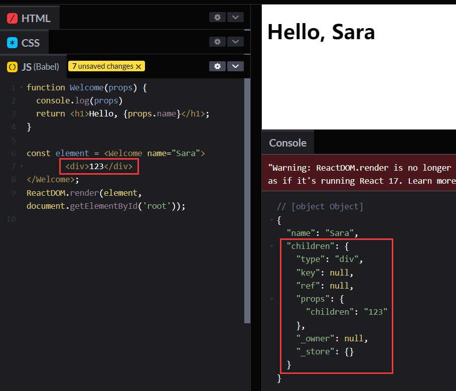

### 什么是组件

组件允许你将 UI 拆分为**独立可复用的代码片段**，并对每个片段进行独立构思

组件，从概念上类似于 JavaScript 函数。它**接受任意的入参（即 “props”）**，并**返回用于描述页面展示内容的 React 元素。**

### 函数组件与 class 组件

定义组件最简单的方式就是编写 JavaScript 函数

```js
function Welcome(props) {
  return <h1>Hello, {props.name}</h1>;
}
```

该函数**是一个有效的 React 组件**，**因为它接收<u>唯一</u>带有数据的 “props”（代表属性）对象与并返回一个 React 元素**。这类组件被称为“函数组件”，因为它**本质上就是 JavaScript 函数**。(如果入参有多个呢？算吗，验证下，看能否写成<Test />的形式)

同时还可以使用 [ES6 的 class](https://developer.mozilla.org/en/docs/Web/JavaScript/Reference/Classes) 来定义组件：

```js
class Welcome extends React.Component {
  render() {
    return <h1>Hello, {this.props.name}</h1>;
  }
}
```

上述两个组件在 React 里是等效的。

## 渲染组件

React 元素不只是 DOM 标签：`const element = <div />;`

也可以是用户自定义的组件：`const element = <Welcome name="Sara" />;`

当 React 元素为用户自定义组件时，**它会将 JSX 所接收的属性（attributes）以及<u>子组件（children）</u>转换为单个对象传递给组件，这个对象被称之为 “props”**。



### **组件名称必须以大写字母开头。**

React 会将以小写字母开头的组件视为原生 DOM 标签

### 通常来说，每个新的 React 应用程序的顶层组件都是 `App` 组件。

```jsx
function Welcome(props) {
  return <h1>Hello, {props.name}</h1>;
}

function App() {
  return (
    <div>
      <Welcome name="Sara" />      
      <Welcome name="Cahal" />      
      <Welcome name="Edite" />    
    </div>
  );
}

ReactDOM.render(
  <App />,
  document.getElementById('root')
);
```

## Props 的只读性

组件无论是使用[函数声明还是通过 class 声明](https://react.docschina.org/docs/components-and-props.html#function-and-class-components)，都决不能修改自身的 props。

**所有 React 组件都必须像纯函数一样保护它们的 props 不被更改。**

```js
function sum(a, b) {
  return a + b;
}
```

这样的函数被称为[“纯函数”](https://en.wikipedia.org/wiki/Pure_function)，因为该函数不会尝试更改入参，且多次调用下相同的入参始终返回相同的结果。

相反，下面这个函数则不是纯函数，因为它更改了自己的入参：

```js
function withdraw(account, amount) {
  account.total -= amount;
}
```