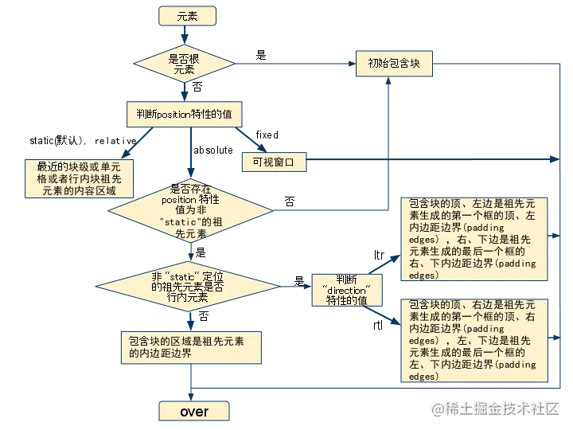
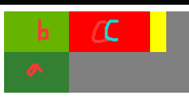
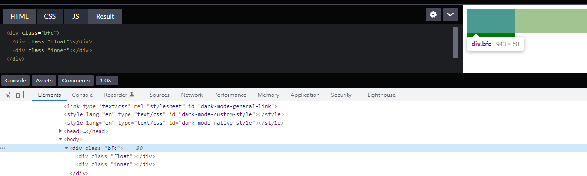
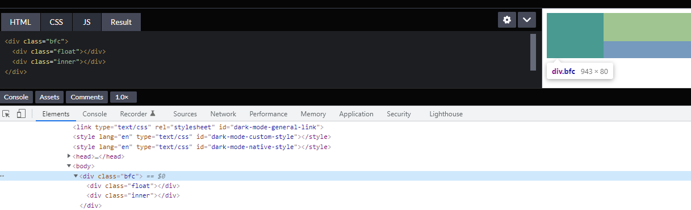

## 盒模型

`The CSS box model describes the rectangular boxes that are generated for elements in the document tree and laid out according to the visual formatting model.`

CSS盒模型描述了通过 **文档树中的元素** 以及相应的 **视觉格式化模型(visual formatting model)** 所生成的矩形盒子。

(个人理解：视觉格式化模型根据基础盒模型生成盒模型)

### 基础盒模型(CSS basic box model)

当浏览器对一个 **render tree** 进行渲染时，浏览器的渲染引擎就会根据 **基础盒模型(CSS basic box model)** ，将所有元素划分为一个个矩形的盒子，这些盒子的外观，属性由`CSS`来决定。

### 视觉格式化模型(visual formatting model)

**CSS** 的**视觉格式化模型(visual formatting model)** 是根据 **基础盒模型(CSS basic box model)** 将 **文档(doucment)** 中的元素转换一个个盒子的实际算法。

**官方说法就是：** 它规定了用户端在媒介中如何处理文档树( document tree )。

**视觉格式化模型(visual formatting model)**  的计算，都取决于一个矩形的边界，这个矩形，被称作是 **包含块( containing block )** 。 一般来说，(元素)生成的框会扮演它子孙元素包含块的角色；我们称之为：一个(元素的)框为它的子孙节点建造了包含块。包含块是一个相对的概念。



## 盒子的生成

盒子的生成是 **CSS视觉格式化模型** 的一部分，用于从文档元素生成盒子。盒子的类型取决于`CSS display` 属性。

**格式化上下文(formatting context)** 是定义 **盒子环境** 的规则，不同 **格式化上下文(formatting context)** 下的盒子有不同的表现

（**Formatting context（格式化上下文）** 是页面中的一块渲染区域，并且有一套渲染规则，它决定了其子元素将如何定位，以及和其他元素的关系和相互作用。）

### 一些定义

- 块级元素
  - 当元素的`display` 为 `block`、`list-item` 或 `table` 时，它就是块级元素。
- 块级盒子
  - 块级盒子用于描述它与父、兄弟元素之间的关系。
  - 每个块级盒子都会参与 **块格式化上下文（block formatting context）** 的创建。
  - 每个块级元素都会至少生成一个块级盒子，即**主块级盒子（principal block-level box）**
  - 主块级盒子包含由后代元素生成的盒子以及内容，同时它也会参与定位方案。
  - 一个同时是块容器盒子的块级盒子称为**块盒子（block box）**
    - block boxes：`Block-level boxes that are also block containers are called block boxes.`
    - block container box：`a block-level box is also a block container box`
    - `The three terms "block-level box," "block container box," and "block box" are sometimes abbreviated as "block" where unambiguous`
    - 就都说是块盒子就好了……
- 匿名盒子
  - 某些情况下需要进行视觉格式化时，需要添加一些增补性的盒子，这些盒子不能被`CSS 选择器`选中，也就是所有可继承的 CSS 属性值都为 `inherit` ，而所有不可继承的 CSS 属性值都为 `initial`。因此称为**匿名盒子(anonymous boxes)**。
- **行内级元素**：inline-level element，`display` 为 `inline`、`inline-block`、`inline-table` 的元素称为行内级元素。与块级元素一样，元素是否是行内级元素仅是元素本身的属性，并不直接用于格式化上下文的创建或布局。
- **行内级盒子**：inline-level box，由行内级元素生成。行内级盒子包括行内盒子和原子行内级盒子两种，区别在于该盒子是否参与行内格式化上下文的创建。
- **行内盒子**：inline box，参与行内格式化上下文创建的行内级盒子称为行内盒子。与块盒子类似，行内盒子也分为具名行内盒子和匿名行内盒子（anonymous inline box）两种。
- **原子行内级盒子**：atomic inline-level box，不参与行内格式化上下文创建的行内级盒子。原子行内级盒子一开始叫做原子行内盒子（atomic inline box），后被修正。原子行内级盒子的内容不会拆分成多行显示
- https://developer.mozilla.org/zh-CN/docs/Web/CSS/Visual_formatting_model
- 匿名行内盒子
  - 类似于块盒子，CSS引擎有时候也会自动创建一些行内盒子。这些行内盒子无法被选择符选中，因此是匿名的，它们从父元素那里继承那些可继承的属性，其他属性保持默认值 `initial`
- 行盒子
  - 行盒子由行内格式化上下文创建，用来显示一行文本。在块盒子内部，行盒子总是从块盒子的一边延伸到另一边（译注：即占据整个块盒子的宽度）。当有浮动元素时，行盒子会从向左浮动的元素的右边缘延伸到向右浮动的元素的左边缘。

## BFC(Block formatting contexts)

**BFC**(块级格式化上下文) 这个概念来自于 **视觉格式化模型(visual formatting model)** 中的 **正常流(Normal flow)**。

### 定义

满足以下，会创建新的 **BFC(Block formatting contexts)**。

**根元素**或其它包含它的元素；（也就是说，整个html标签就是个BFC）

**浮动** (元素的`float`不为`none`)；

**绝对定位元素** (元素的`position`为`absolute`或`fixed`)；

**行内块**`inline-blocks`(元素的 `display: inline-block`)；

**弹性盒 flex boxes** (元素的`display: flex`或`inline-flex`)

**overflow**的值不为`visible`的元素；

**表格单元格**(元素的`display: table-cell`，HTML表格单元格默认属性)；

- 表格的标题和单元格（`display` 为 `table-caption`，`table-cell`）
- 匿名表格单元格元素（`display` 为 `table` 或 `inline-table`）

注意，**是这些元素创建了块格式化上下文，它们本身不是块格式化上下文**。

### BFC 的范围

`A block formatting context contains everything inside of the element creating it, that is not also inside a descendant element that creates a new block formatting context.`

`BFC` 包含创建它的元素的所有子元素，但是不包括`创建了新的 BFC 的子元素`的内部元素（这里是两层不是三层）（这体现了 `BFC` **隔离** 的思想）

举例：

```
<table>
  <tr>
    <td></td>
  </tr>
</table>
```

假设 `table` 元素创建的 `BFC` 我们记为 `BFC_table`，`tr` 元素创建的 `BFC` 记为 `BFC_tr`，根据规则，两个 `BFC` 的范围分别为：

- `BFC_table`：只有 `tr` 元素，不包括 `tr` 里的 `td` 元素
- `BFC_tr`：`td` 元素

也就是所说，**一个元素不能同时存在于两个 BFC 中**

### 特性

- `BFC`就是页面中的一个隔离的独立容器，容器里的标签不会影响到外部标签

- `BFC` 内部的块级盒会在垂直方向上一个接一个排列 [①](https://link.juejin.cn?target=https%3A%2F%2Fcodepen.io%2Flycheelee%2Fpen%2FBaNYLNO%3Feditors%3D1100)

- 属于同一个`BFC`的两个相邻的标签外边距（垂直margin）会发生重叠（以大的为准） [②](https://link.juejin.cn?target=https%3A%2F%2Fcodepen.io%2Flycheelee%2Fpen%2FmdJXrwK%3Feditors%3D1100)

  - 重叠不仅仅发生在兄弟标签之间，如下代码，给top标签margin-bottom：10，inner标签margin-top：10，则inner标签的margin不会生效

    - ```
      <div class="top">TOP</div>
      <div class="bottom">
          <div class="inner">INNER</div>
        </div>
      </div>
      ```

  - 解决重叠的方法：创建新的BFC（如上方例子，给bottom创建新的bfc，即可解决top和inner的重叠问题）

  - **如果是兄弟节点之间发生重叠，给某一节点创建新的BFC不会解决重叠问题**，因为 `BFC 包含创建它的元素的所有子元素，但是不包括创建它的元素`，**此时这两个兄弟还是属于同一个BFC**

- 每个元素的外边距盒（margin box）的左边与包含块边框盒（border box）的左边相接触（从右向左的格式化，则相反），即使存在浮动也是如此 [③](https://link.juejin.cn?target=https%3A%2F%2Fcodepen.io%2Flycheelee%2Fpen%2FJjdpbGZ%3Feditors%3D1100)

  - 包含块就是 包住他 的父块
  - `即使存在浮动也是如此`指浮动的元素的外边距盒的左边也会与包含块边框盒的左边相接触
  - 不太明白这条特性有什么用

- 浮动盒的区域不会和 `BFC` 重叠 [④](https://link.juejin.cn?target=https%3A%2F%2Fcodepen.io%2Flycheelee%2Fpen%2FmdJXaXK%3Feditors%3D1100)

  - 设有兄弟标签a和b，a（绿色）向左浮动，默认情况下，a和b会重叠，如果将b设为bfc，则a和b不重叠，b会向右移动，左侧与a的右侧对齐（这里就与上一条不太一样了，a和b还属于同一个bfc下，就能生效了）
    - 
  - 设有兄弟标签a和b，a向左浮动，a与b重叠。设b有个子元素c，默认情况下，c在b左侧，与a也重叠。若给c创建一个bfc，则c会被顶开直至与a不重叠，不再位于b的左侧，如图
    - 
  - 由上两点可知，浮动盒的区域不会和 `BFC` 重叠就是字面意思：创建了BFC的元素，不会与浮动盒重叠

- 计算 `BFC` 的高度时，浮动元素也会参与计算（如果父元素没有创建 BFC，在计算父元素高度时，浮动元素不会参与计算，此时就会出现高度塌陷，图一：塌陷，图二：不塌陷） [⑤](https://link.juejin.cn?target=https%3A%2F%2Fcodepen.io%2Flycheelee%2Fpen%2FwvayENb%3Feditors%3D1100)

  - 
  - 给class=bfc的元素设置overflow: auto，创建bfc
    - 

### BFC 的应用

#### 解决高度塌陷

#### 解决Margin边距重叠

#### 解决浮动重叠

#### 自适应多栏布局

利用 `特性③` 和 `特性④`，中间栏创建 `BFC`，左右栏宽度固定后浮动。由于盒子的 margin box 的左边和包含块 border box 的左边相接触，同时浮动盒的区域不会和 `BFC` 重叠，所以中间栏的宽度会自适应，[示例](https://link.juejin.cn/?target=https%3A%2F%2Fcodepen.io%2Flycheelee%2Fpen%2FXWbEjNJ%3Feditors%3D1100)。

## IFC（Inline formatting context）

### 规则

- 各行内框（inline boxes）一个接一个地排列，其排列顺序根据书写模式（writing-mode）的设置来决定：
  - 对于水平书写模式，各个框从左边开始水平地排列
  - 对于垂直书写模式，各个框从顶部开始垂直地排列
- 当一行不够的时候会自动切换到下一行
- 行级上下文的高度由内部最高的内联盒子的高度决定。