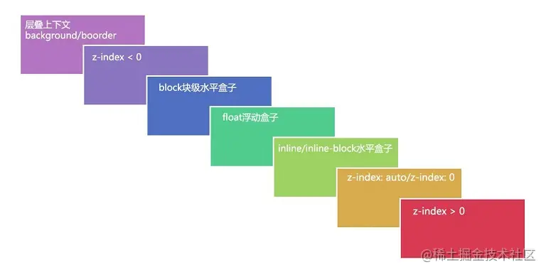
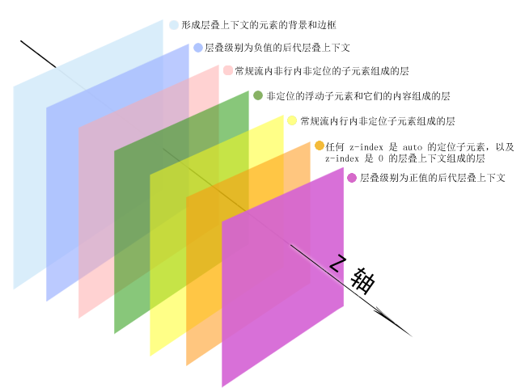
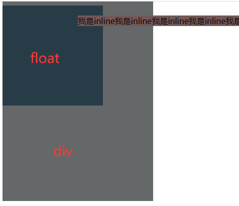

前置知识：

1. `z-index`属性值并不是在任何元素上都有效果。它**仅在**定位元素（定义了`position`属性，且属性值为非`static`值的元素）上有效果。
2. 判断元素在`Z轴`上的堆叠顺序，不仅仅是直接比较两个元素的`z-index`值的大小，这个堆叠顺序实际由元素的**层叠上下文**、**层叠等级**共同决定

### 层叠上下文(stacking context)

层叠上下文(stacking context)，是HTML中一个三维的概念。在CSS2.1规范中，每个盒模型的位置是三维的，分别是平面画布上的`X轴`，`Y轴`以及表示层叠的`Z轴`。

一般情况下，元素在页面上沿`X轴Y轴`平铺，我们察觉不到它们在`Z轴`上的层叠关系。而一旦元素发生堆叠，这时就能发现某个元素可能覆盖了另一个元素或者被另一个元素覆盖。

**如果一个元素含有层叠上下文，(也就是说它是层叠上下文元素)，则该元素就更靠上，离屏幕观察者更近**（这句话应该有误）

### 层叠等级（stacking level）

- 在同一个层叠上下文中，它定义的是该层叠上下文中的层叠上下文元素在`Z轴`上的上下顺序。
- 在其他普通元素（有z-index，但position为static的元素）中，它定义的是这些普通元素在`Z轴`上的上下顺序

以上第一点可以看作在根层叠上下文中，有两个层叠上下文元素a和b（与节点层级无关），他们的比较结果将决定a及其所有子元素和b及其所有子元素谁高谁低。第二点则是a和b内部的子元素相互之间的比较

或者简单地说，就是多层比较，先比较根层叠上下文中的所有层叠上下文元素，再对每个层叠上下文元素内部的元素进行相同的比较……（对于同一层叠上下文中，普通元素与层叠上下文元素进行比较（可看下方层叠顺序），因为层叠上下文元素是有定位的，所以层叠上下文元素z-index>=0时，始终在普通元素上方，<0时，始终在普通元素下方，不管普通元素的z-index为多少，也不管这个普通元素与层叠上下文是并列、父子还是其他什么关系）


同一个层叠上下文中的子元素，能够通过z-index属性决定高低。（所有元素都在根层叠上下文中，默认情况下所有元素都能通过z-index决定高低）

如果有某个元素具备了自己的层叠上下文，则其**子元素的z-index只会在该元素内部生效、比较**。相当于这个元素独立起来。

而该元素与其他元素的比较，依然是在外层层叠上下文中比较。

即有两个父div，它们内部各有两个子div，假设两个父div都有自己的层叠上下文，则先确定父div在根层叠上下文中的排序，再决定各自内部子元素的排序

### 如何产生“层叠上下文”

1. `HTML`中的根元素`<html></html>`本身就具有层叠上下文，称为“根层叠上下文”。
2. 普通元素设置`position`属性为**非**`static`值并设置`z-index`属性为具体数值，产生层叠上下文。
3. CSS3中的新属性也可以产生层叠上下文

### 层叠顺序(stacking order)

**层叠顺序规则仅在同一个层叠上下文中才有效**

表示元素发生层叠时按照特定的顺序规则在`Z轴`上垂直显示

前面所说的“层叠上下文”和“层叠等级”是一种概念，而这里的“层叠顺序”是一种规则。





在不考虑CSS3的情况下，当元素发生层叠时，层叠顺讯遵循上面途中的规则。 **这里值得注意的是：**

1. 左上角"层叠上下文`background/border`"指的是层叠上下文元素的背景和边框。
2. `inline/inline-block`元素的层叠顺序要高于`block`(块级)/`float`(浮动)元素。
3. 单纯考虑层叠顺序，`z-index: auto`和`z-index: 0`在同一层级，但这两个属性值本身是有根本区别的。

验证了下，没毛病



代码：

```html
<!DOCTYPE html>
<html lang="en">
<head>
    <meta charset="UTF-8">
    <title>层叠上下文</title>
</head>
<style>
    .d1 {
        display: inline-block;
        background-color: rgb(116, 88, 88);
        margin-left: -50px;
        margin-top: 20px;
    }

    .d2 {
        margin-top: -50px;
        width: 300px;
        height: 400px;
        background-color: rgb(101, 104, 105);
    }

    .d3 {
        height: 200px;
        width: 200px;
        float: left;
        background-color: rgb(39, 60, 70);
    }
</style>

<body>
    <div class="d1">
        我是inline我是inline我是inline我是inline我是inline我是inline我是inline我是inline我是inline我是inline我是inline我是inline我是inline我是inline
    </div>
    <div class="d3">
    </div>
    <div class="d2">
    </div>
</body>
</html>
```

### 判断技巧

1、首先先看要比较的两个元素是否处于同一个层叠上下文中：    1.1如果是，谁的层叠等级大，谁在上面（怎么判断层叠等级大小呢？——看“层叠顺序”图）。    

1.2如果不是，即两个元素不在统一层叠上下文中，先比较他们所处的层叠上下文的层叠等级。 

2、当两个元素层叠等级相同、层叠顺序相同时，在DOM结构中后面的元素层叠等级在前面元素之上。

