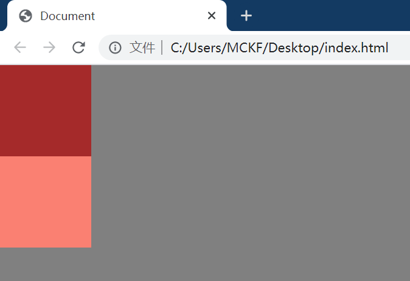
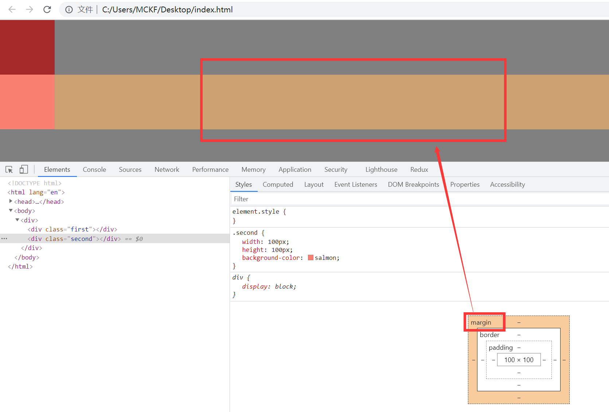
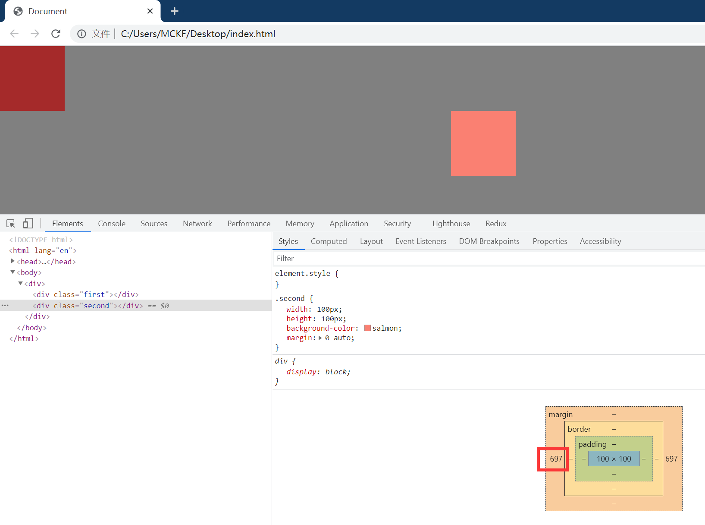
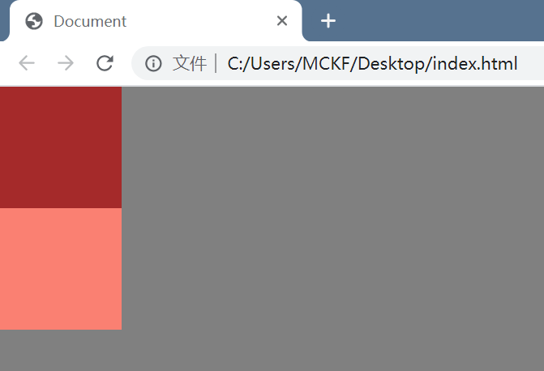
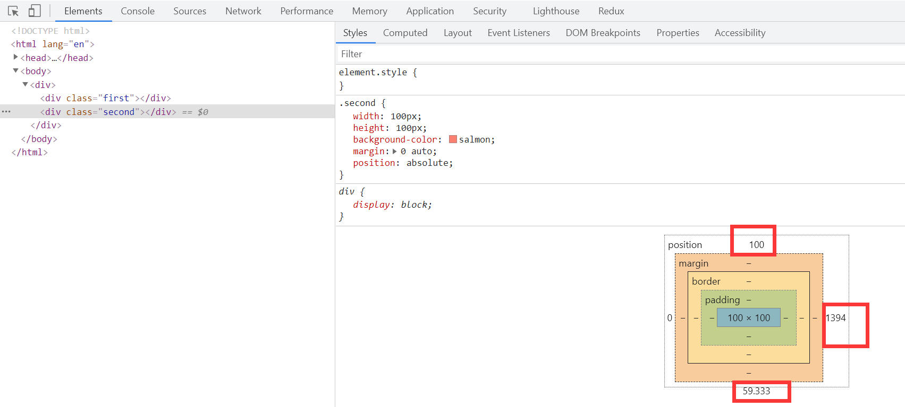
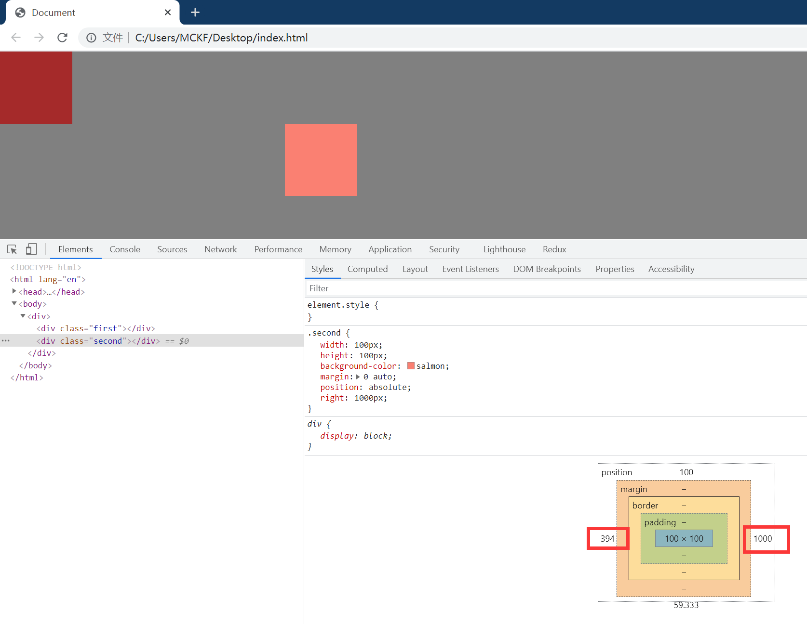
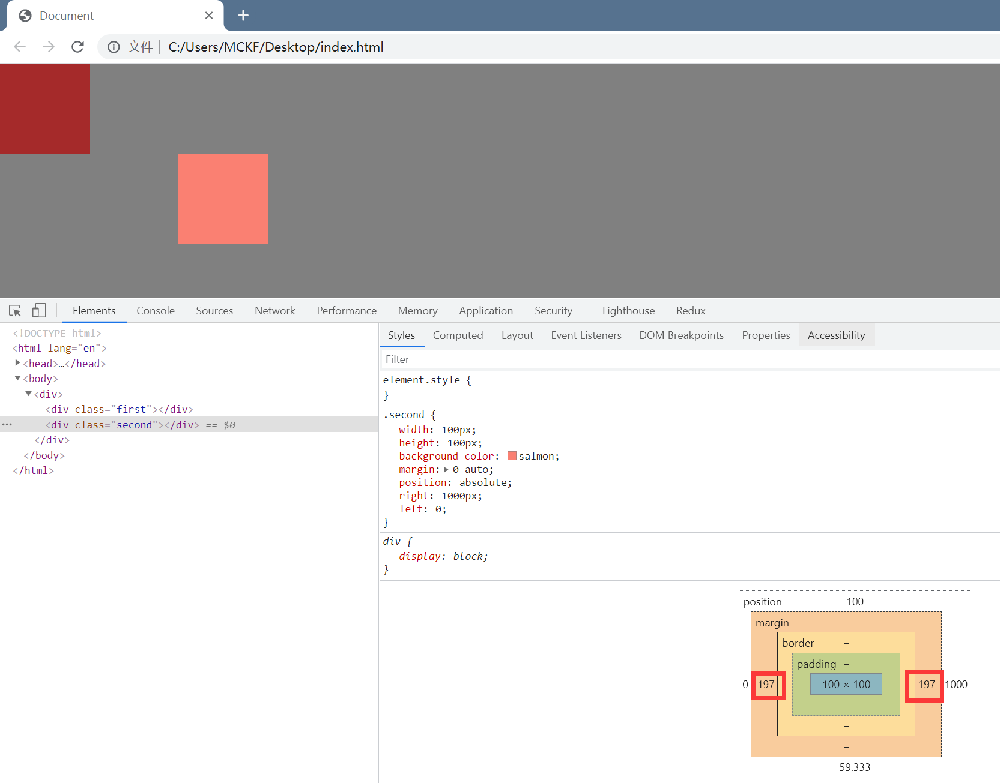
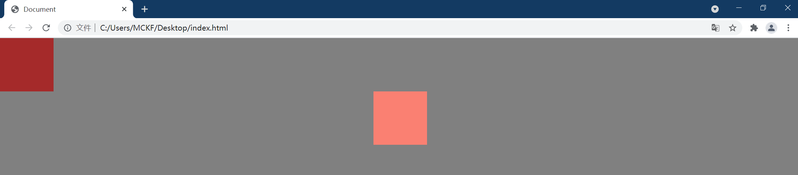

# 一、margin: auto的填充规则

- 如果一侧定值，一侧auto，则auto为剩余空间大小
-  如果两侧均是auto，则**平分剩余空间**

# 二、为何文档流中auto无法实现垂直居中

因为规范就是这样定义的，块级非替换元素在**==普通流内布局==**的宽度公式=左margin+左border+左padding+width+右padding+右border+右margin。

auto能实现水平居中是因为水平方向的 auto的计算值取决于可用空间（剩余空间）。

而对于高度是没有公式定义的，直接规定margin-top: auto; 和 margin-bottom: auto;时其计算值为0。(就算元素与包裹元素都有固定高度，也无法生效，除非用absolute)

> The following constraints must hold among the used values of the other properties:
>
> 'margin-left' + 'border-left-width' + 'padding-left' + 'width' + 'padding-right' + 'border-right-width' + 'margin-right' = width of containing block
>
> If both 'margin-left' and 'margin-right' are 'auto', their used values are equal. This horizontally centers the element with respect to the edges of the containing block.

> If 'margin-top', or 'margin-bottom' are 'auto', their used value is 0. If 'height' is 'auto', the height depends on whether the element has any block-level children and whether it has padding or borders:

# 三、margin: auto与absolute布局

先说结论：**==margin: auto在absolute布局中并不会失效==**

接下来一步一步验证

**第一步：创建两个元素：**

```html
<style>
        html,
        body {
            background-color: gray;
            width: 100%;
            height: 100%;
            margin: 0;
            padding: 0;
        }
    	.first {
            width: 100px;
            height: 100px;
            background-color: brown;
        }

        .second {
            width: 100px;
            height: 100px;
            background-color: salmon;
        }
</style>
<body>
    <div>
        <div class="first"></div>
        <div class="second"></div>
    </div>
</body>
```

效果如图所示：



按F12，选择“second”元素，将鼠标放在图中右下角的margin框上，可以看到上方second方块右侧出现了一行黄色区域，这就是margin：auto中的**可用空间（剩余空间）**



**第二步：设置水平居中**

调整second的style，设置margin: 0 auto，可以看到元素水平居中了，此时magin值就是上方提到的**可用空间**的值除以2。（屏幕总宽度为1494，可以通过将鼠标移动到body属性上看到，元素宽度为100，(1494-100)/2 = 697*2）

```css
        .second {
            width: 100px;
            height: 100px;
            background-color: salmon;
            margin: 0 auto;
        }
```



**第三步：设置second元素为absolute**

```css
        .second {
            width: 100px;
            height: 100px;
            background-color: salmon;
            position: absolute;
            margin: 0 auto;
        }
```



此时second元素脱离了文档流，看起来margin: 0 auto失效了，视觉上和第一步没什么区别，此时如果second下方还有一个thrid方块，就可以看到thrid方块上移到second的位置，这里不多赘述。

second元素脱离了文档流，**如何做到仍然保持在原位的？**原因是**绝对布局自动为second元素设置了偏移量**(top/left/bottom/right)，也就是说，second元素的top/left/bottom/right默认并不为0，如下图所示。



**为什么margin: 0 auto会失效？**因为这为了保持元素停在原位而自动设置的偏移量，占据了margin的**可用空间**，此时再将鼠标放至margin范围上，屏幕上不再出现黄色区域，因为position偏移量限制了盒模型的大小，这个大小正好与盒模型content内容相同，盒模型是由content+padding+border+margin组成的，因此已经没有多余的空间可以分配给margin了，也就是**margin的可用空间为0**。

**第四步：重铸margin: 0 auto荣光**

既然position偏移量压缩了margin的可用空间，那修改缩小偏移量是否能够复原margin: auto的效果？

从上图来看，right被设定为1394，现在把它改为1000px，看看效果

```css
        .second {
            width: 100px;
            height: 100px;
            background-color: salmon;
            margin: 0 auto;
            position: absolute;
            right: 1000px;
        }
```



可以看到元素发生了偏移，但margin并没有生效，可以看到在我们手动设置`right:1000px`后，**left被自动修改为394了**，一来一回又被填满了，元素宽度100+right1000+left394正好等于屏幕宽度1494，margin还是没有可用空间

那同时设定right和left会有什么效果呢？

```css
        .second {
            width: 100px;
            height: 100px;
            background-color: salmon;
            margin: 0 auto;
            position: absolute;
            right: 1000px;
            left: 0;
        }
```



效果如图，margin出现了，重置margin: auto荣光，吾辈义不容辞

效果更明显一点，right和left都设为0，可实现水平居中




**tip:**可通过设定top和bottom为0实现文档流布局中margin: auto无法实现的垂直居中！


总结：

只是因为元素脱离文档流，absolute为了保持元素在指定位置，自动为元素填充了left\right\top\bottom的值，没有留出能够让auto产生效果的剩余空间，只要修改left\right\top\bottom留出一定的空间，margin：auto即可生效，并且相比于文档流，在absolute布局中还可以实现垂直居中


- 在文档流中，根据官方定义，`margin:0 auto`就相当于top和bottom设置为0，left和right设置为auto
- `position: absolute`会使这个块脱离正常的文档流
- 设置`top: 0; left: 0; bottom: 0; right: 0;`会给这个块提供一个新的**边界盒（bounding box）**。这种情况下，这个块会**==填满==**它的偏移父元素的全部可用空间（偏移父元素：offset parent，指**除static 定位以外的**父元素或者是body）

- 给这个块指定`width`或者`height`会阻止它占据全部可用空间，转而由浏览器**根据这个新的边界盒**自动计算margin

- 由于这个块脱离了正常的文档流，同时有一个新的边界盒，因此浏览器可以很容易地为它提供相等的`margin-top`与`margin-bottom`值，从而使它垂直居中。

根据填充规则可知它是通过平分剩余空间来实现元素水平居中的

它在浮动元素（float）和内联元素（inline）中是不起作用的。在块级元素中，如果`position`的属性设置了`absolute`或者`fixed`值，它也不会起到作用。
