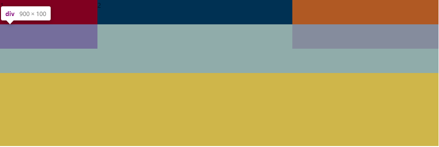

## 三列布局

- 左右固定，中间自适应

### 1、浮动布局

左右元素设置浮动

重点：左右元素在前，mid元素在后

局限性：

1. float自身与文字会打乱排版
2. 中间元素只有文字能自适应，真实的宽度并不会自适应，子元素会与左右元素重叠
3. 要考虑高度塌陷的问题
4. 总结：适用性很差

```
<div className={styles.wrap}>
  <div className={styles.left}>1</div>
  <div className={styles.right}>3</div>
  <div className={styles.mid}>2</div>
</div>
    
.wrap {
  height: 300px;
  background: rgb(223, 150, 150);
  div {
    height: 100px;
  }

  .left {
    float: left;
    width: 10%;
    background-color: rgb(204, 185, 134);
  }

  .right {
    width: 300px;
    background-color: rgb(139, 155, 81);
    float: right;
  }
}
```

### 2、绝对定位

左右元素absolute，宽度固定，靠近左右两边，mid元素设置左右margin为左右元素宽度

重点：父元素要设置为relative，因为需要作为子元素的定位点，不然子元素会飞掉

缺点：由于两边元素脱离了文档流，假设mid元素高度为50，当两边元素高度大于50且无法确定时，如果下方还有其他元素，则其他元素会顶到mid下方，并被左右元素遮住，如图



```
<div className={styles.wrap}>
  <div className={styles.left}>1</div>
  <div className={styles.right}>3</div>
  <div className={styles.mid}>2</div>
</div>
    
.wrap {
  position: relative;
  height: 100px;
  width: 900px;
  background: rgb(223, 150, 150);
  div {
    height: 100px;
  }

  .mid {
    margin-left: 200px;
    margin-right: 300px;
  }

  .left {
    position: absolute;
    left: 0;
    width: 200px;
    background-color: rgb(204, 185, 134);
  }

  .right {
    position: absolute;
    right: 0;
    width: 300px;
    background-color: rgb(139, 155, 81);
  }
}
```

### 3、calc

都设置为行内元素，左右元素固定宽度，中间元素设置calc(100% - xx)

### 4、flex

左右元素宽度固定，中间元素设置flex-grow：1