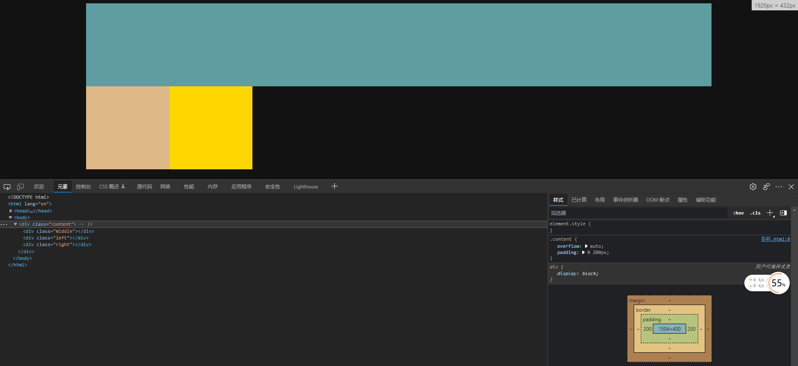
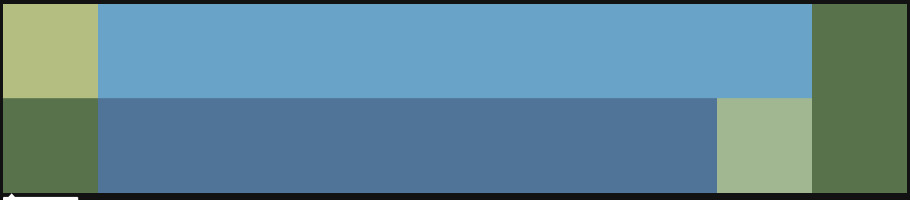

## 三列布局

- 左右固定，中间自适应

## 圣杯布局

### 要求

优先加载middle内容，三列等高布局

### 关键点

- middle、left、right都向左浮动
- 防止content高度塌陷，可以给content创建一个BFC（overflow设为auto），或给它一个显式高度
- middle要设置width为100%，因为浮动后div宽度默认会变为最小，而不是100%
- 给content设置左右padding为left和right元素的宽度，这样左右区域就空出来了，接下来将左右元素移动至左右区域即可
  - 
- left元素向左移动100% + 200px，其中100%代表middle的宽度，200px代表left自己的宽度，相当于left横越了整个middle
  - 这里移动可看作两步，先移动到content的内容左侧边缘，再往左移动至padding区域。具体实现可用margin-left：-（100%+200px），也可以margin-left：-100%，再用相对定位向左移动200px
- right元素向左移动200px-200px，即先移动至content的内容右侧边缘，再移动到padding区域，但这里实现就不能只靠margin了，无法满足需求，只能用margin+relative
- 这里左右元素向左移动能到上面去的原因是：三者本来在一条直线上的

### 代码

```
<!DOCTYPE html>
<html lang="en">

<head>
    <meta charset="UTF-8">
    <title>圣杯</title>
    <style>
        .content {
            overflow: auto;
            padding: 0 200px;
        }

        .middle,
        .left,
        .right {
            float: left;
        }

        .middle {
            width: 100%;
            background-color: cadetblue;
            height: 200px;
        }

        .left {
            background-color: burlywood;
            height: 200px;
            width: 200px;
            margin-left: calc(-100% - 200px);
        }

        .right {
            position: relative;
            background-color: gold;
            height: 200px;
            width: 200px;
            margin-left: -200px;
            right: -200px;
        }
    </style>
</head>
<body>
    <div class="content">
        <div class="middle"></div>
        <div class="left"></div>
        <div class="right"></div>
    </div>
</body>

</html>
```

### 思考

#### 为什么right元素不向右浮动？

因为middle元素也是浮动元素，三元素都向左浮动，可使三元素紧凑排序，挨在一起，如果right元素向右浮动，则与middle之间会有一个大空隙，且最终还是要向左移动才能满足需求，相当于平白无故多移动了一个空隙。当然，直接向上再向右移动也行，但那样与左元素移动方式不协调，且没什么好处



#### 为什么左右元素要用relative而不是absolute？

因为relative是移动指定的长度，而absolute是移动到指定位置，从逻辑上来说，relative更直观

#### 使用margin和margin+relative的区别？

relative只是移动一个投影，元素的真实位置还在content的内容区内。

这里注意下，**overflow:hidden对于溢出到padding的内容不隐藏**，所以其实是没什么明显区别的

## 双飞翼

**要求**：与圣杯一样

### 关键点

- middle、left、right都向左浮动
- 防止content高度塌陷，可以给content创建一个BFC（overflow设为auto），或给它一个显式高度
- middle要设置width为100%，因为浮动后div宽度默认会变为最小，而不是100%
- 以上三步都相同，接下来开始不同
- 不需要给content设置padding，直接将左右元素用margin移动到左右两侧，也不需要相对定位
- 此时content内容被左右元素盖住了
- 在middle内加一个子元素，给这个子元素设置内边距或外边距，即可实现最终效果

```
<!DOCTYPE html>
<html lang="en">

<head>
    <meta charset="UTF-8">
    <title>双飞翼</title>
    <style>
        .content {
            overflow: auto;
        }

        .middle,
        .left,
        .right {
            float: left;
        }

        .middle {
            width: 100%;
            background-color: cadetblue;
            height: 200px;

        }

        .middle-inner {
            padding: 0 200px;
            height: 100%;
        }

        .left {
            background-color: burlywood;
            height: 200px;
            width: 200px;
            margin-left: -100%;
        }

        .right {
            background-color: gold;
            height: 200px;
            width: 200px;
            margin-left: -200px;
        }
    </style>
</head>

<body>
    <div class="content">
        <div class="middle">
            <div class="middle-inner">middle-inner</div>
        </div>
        <div class="left"></div>
        <div class="right"></div>
    </div>
</body>

</html>
```

### 思考

#### 为什么不直接给middle设置padding/margin？

因为标准盒模型中，width不包括内边距，因此100%的width加上padding就会超出预期的长度。（在非float的默认情况下，若不设置width宽度，则默认为2*内边距+width=100%）

因此，若要设置，可将middle的width设置为100% - 2padding

#### 为什么要用float？

因为div会自占一行，而span无法设置宽高

## 差异

圣杯布局是压缩content的内容区，将左右元素移动至内边距区域内

双飞翼是压缩middle的内容区

## 原理

通过float使三个元素位于同一条水平线上，再利用margin来调整视觉位置