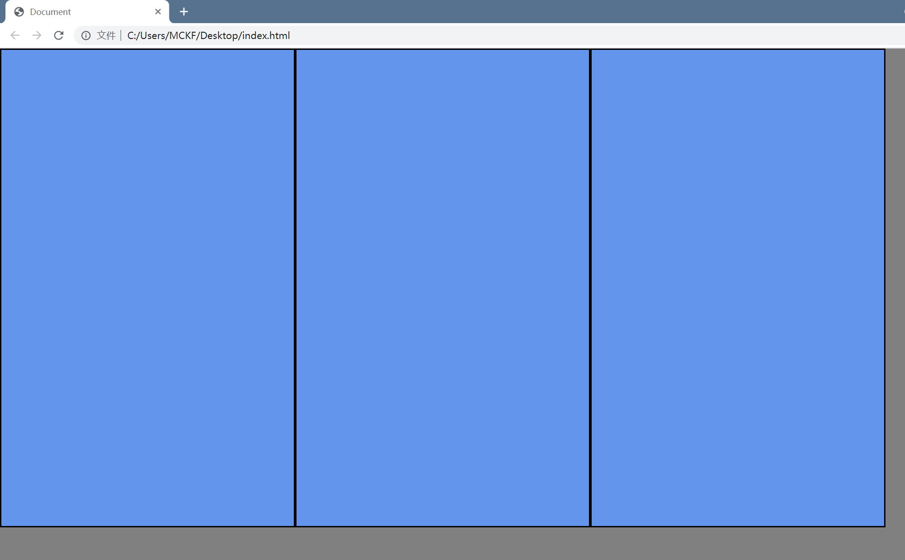
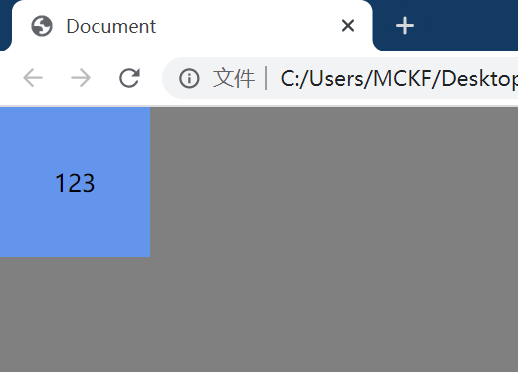

# 一、居中

居中一般是以盒子为单位的，可分为水平居中与垂直居中。

## 1、水平居中

### ①、margin: 0 auto；

需要**确定元素的宽度**，必须是**块级元素**，(如果是行内元素或行内块元素，则无法实现水平居中)

如果是绝对定位absolute与固定定位fixed需要额外的配置

### ②、inline与text-align: center;

**inline，inline-block元素**的水平居中，在父级块级元素中设置text-align: center;

```html
 <style>
 .box1 {
    width: 100%;
    text-align: center;
  }
 .inline1 {
    border-style: solid;
    border-width: 50px;
    border-color: brown;
  }
 </style>
<body>
    <div class="box1">
        <span class="inline1"></span>
    </div>
</body>
```

### ③、绝对或相对定位+半身位

此方法**需要确定元素的宽度**（才能移动半身位），所以只能是块元素、或行内块元素（内联元素不支持设置宽高）

如果设为absolute，行元素也行。因为就算元素原本是行元素，也会变成块元素。

```html
<style>
        .horizontal2 {
            width: 100px;
            height: 100px;
            background-color: brown;
            position: absolute;
            /* position: relative; */
            left: 50%;
            margin-left: -50px;
        }
</style>
<body>
	<div class="horizontal2"></div>
</body>
```

### ④、绝对定位+margin: auto

（需要设置元素宽度，因为块元素不设置宽度的话，会占满横向空间）

无关行或者块元素，因为就算元素原本是行元素，也会变成块元素。

```html
<style>
        .horizontal4 {
            width: 100px;
            height: 100px;
            background-color: brown;
            position: absolute;
            left: 0px;
            right: 0px;
            margin: 0 auto;
        }
</style>
<body>
    <div class="horizontal4"></div>
</body>
```

## 2、垂直水平居中

### ①、相对定位+半身位

**relative + 负margin(或transform)**

`margin-top:-50px`或`transform: translateY(-50%)`

这里也可以用绝对定位或固定定位，但要多一点配置

```html
<style>
  .vertical1 {
            width: 100px;
            height: 100px;
            background-color: brown;
            margin: 0 auto;
            /* transform: translateY(-50%); */
            margin-top: -50px;
            position: relative;
            top: 50%;
        }
</style>
<body>
    <div class="vertical1">
    </div>
</body>
```

### ②、绝对定位配合margin: auto

```html
<style>
  .vertical2 {
            width: 100px;
            height: 100px;
            background-color: brown;
            margin: auto;
            position: absolute;
            top: 0;
            left: 0;
            bottom: 0;
            right: 0;
        }
</style>
<body>
    <div class="vertical2">
    </div>
</body>
```

**原理：**

- 在文档流中，根据官方定义，`margin:0 auto`就相当于top和bottom设置为0，left和right设置为auto
- `position: absolute`会使这个块脱离正常的文档流
- 设置`top: 0; left: 0; bottom: 0; right: 0;`会给这个块提供一个新的**边界盒（bounding box）**。这种情况下，这个块会**==填满==**它的偏移父元素的全部可用空间（偏移父元素：offset parent，指**除static 定位以外的**父元素或者是body）
- 给这个块指定`width`或者`height`会阻止它占据全部可用空间，转而由浏览器**根据这个新的边界盒**自动计算margin
- 由于这个块脱离了正常的文档流，同时有一个新的边界盒，因此浏览器可以很容易地为它提供相等的`margin-top`与`margin-bottom`值，从而使它垂直居中。

### ③、弹性布局

### ④、隐藏兄弟元素

在父元素和目标元素中间插入一个兄弟元素，将目标元素顶到正好处于垂直居中的位置

### ⑤、vertical-align

这个适合用于行内元素的垂直居中，块元素是不行的。

原理是通过辅助元素help，令其高度与父元素相等，宽度为0，这样就隐藏起来了，再令目标元素与辅助元素中间对齐，即可达到效果。

`display:inline-block`很重要，因为vertical-align只能作用与内联元素，而内联元素又无法设置高度和宽度，因此需要`display:inline-block`

```html
<style>
		.content {
            display: inline-block;
            width: 50px;
            height: 50px;
            background-color: burlywood;
            vertical-align: middle;
        }

        .help {
            display: inline-block;
            height: 100%;
            width: 0;
            vertical-align: middle;
        }

        .contain {
            width: 500px;
            height: 500px;
            background-color: brown;
            margin: 0 auto;
            text-align: center;
        }
</style>

<body>
    <div class="contain">
        <span class="help"></span>
        <span class="content "></span>
    </div>
</body>
```

### ⑥、table-cell

- #### display: table与display: table-cell的用法

  - 在**父元素宽度固定**的情况下，用来平均分配子元素的宽度。（此时子元素的宽度无效）（**平均分配子元素的宽度，必须保证子元素<div>里的内容的宽度是一样的**）
  - table表格中的单元格最大的特点之一就是同一行列表元素**都等高**。（子元素、父元素的高度为父元素高度和子元素高度之中更大的一方）

```html
<style>
        .parent {
            display: table;
            text-align: center;
            width: 1300px;
            height: 100px;
            background-color: red;
        }

        .son {
            border-style: solid;
            display: table-cell;
            background-color: cornflowerblue;
            height: 700px;
            width: 50px;
        }
</style>
<body>
    <div class="parent">
        <div class="son">
        </div>
        <div class="son">
        </div>
        <div class="son">
        </div>
    </div>
</body>
```



- #### 匿名表格元素创建规则

  - 和表格元素一样，具有表格样式的元素当不存在符合要求的父元素时，那些“丢失”的元素会被模拟出来，使其符合`table`/`inline-table`、`table-row`、`table-cell`的三层嵌套关系。

- ### 利用display: table-cell实现水平垂直居中

  - 这里的垂直居中，是指让目标元素在表格单元格内实现垂直居中，当表格只有一个单元格时，就是在表格内垂直居中
  - table-cell不支持margin
  - 需要设置table-cell的宽高，否则单元格宽高会与内容宽高相同，也就没有所谓的居中了

```html
<style>
		.son {
            display: table-cell;
            background-color: cornflowerblue;
            height: 100px;
            width: 100px;
            vertical-align: middle;
            text-align: center;
        }
</style>
<body>
    <div>
        <div class="son">
            123
        </div>
    </div>
</body>
```



图中123就是垂直(vertical-align)水平(text-align)居中的。(内容太长的话会把单元格撑开)

