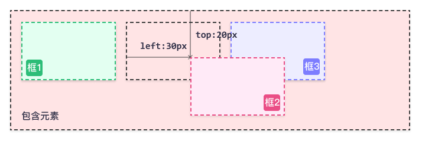
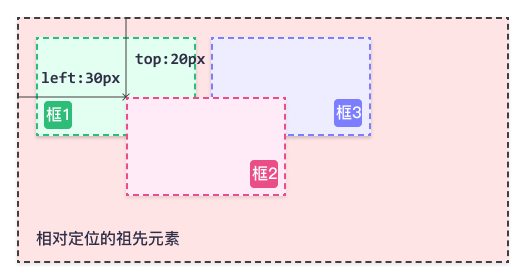

# Normal flow（文档流）

以下涉及的移动、浮动、定位等，都是以盒模型为单位进行移动的。

## 1、什么是文档流

是css中的一种默认定位机制，将窗体自上而下分成一行一行，并在每行中按从左至右排放元素（块级元素从上到下显示，内联元素从左往右显示）（这里的元素，也可以理解为盒模型），即为文档流，也称为普通流。

文档流的位置实际上就是在body标签里面。

**css有三种基本的定位机制：文档流，浮动(float)，定位(position)。**

## 2、什么是脱离文档流

元素脱离文档流之后，将不再在文档流中占据空间，不受文档流约束，而是处于浮动状态（可以理解为漂浮在文档流的上方）。当一个元素脱离文档流后，依然在文档流中的其他元素将忽略该元素并填补其原先的空间。

## 3、如何脱离文档流

### 先了解CSS position属性

position 属性规定元素的定位类型。任何元素都可以定位，不过绝对定位或固定定位元素会生成一个块级框，而不论该元素本身是什么类型。相对定位元素会相对于它在正常流中的默认位置偏移。

#### **static**

默认值。没有定位，元素出现在正常的流中

#### **relative**

相对定位，即元素会相对于起点进行移动。如下图所示，原本的图片是框一二三顺序排列，给框二加了相对定位后，在其左和上方添加了一些像素，导致其发生了偏移。**但是因为相对定位元素仍然占据原有的空间，不会影响其他元素的位置，所以会出现覆盖的情况。**（带着整个盒一起偏移，包括margin、padding等。如果是margin：0 auto；则先偏移，再平分剩余空间）

```css
#box_relative {
  position: relative;
  left: 30px;
  top: 20px;
}
```



#### **absolute**

设置为绝对定位的元素会**脱离文档流**，位置相对于最近的已定位（除static 定位以外的）祖先元素，如果元素没有已定位的祖先元素，那么它的位置相对于最初的包含块（<body>）。

**默认偏移位置就是元素本身的位置**！也就是如果不设置left\right\top\bottom，虽然元素脱离了文档流，但还是停在原本的位置。但是元素的**==left\right\top\bottom不为0！==**，而是相对于元素原本的位置默认设置！可以理解成 为了保持元素停留在原本的位置，自动设置了left\right\top\bottom的值！

元素原先在正常文档流中所占的空间会关闭，就好像该元素原来不存在一样，其他元素会顶上来。

元素定位后生成一个块级框，而不论原来它在正常流中生成何种类型的框。

因为绝对定位的框与文档流无关，所以它们可以覆盖页面上的其它元素。可以通过设置` z-index 属性`来控制这些框的堆放次序。

```css
#box_relative {
  position: absolute;
  left: 30px;
  top: 20px;
}
```



#### **fixed**：

元素完全**脱离文档流**，相对于浏览器窗口（<html>）进行定位。这意味着即使滚动页面，它也始终位于同一位置。固定定位的元素不会在页面中通常应放置的位置上留出空隙

### 脱离文档流的情况

#### ①、absolute

具体看上方的position

#### ②、fixed

具体看上方的position

#### ③、float

顾名思义，float就是让元素浮动起来，浮动的元素可以向左或向右移动，直到它的外边缘碰到包含框或另一个浮动元素为止。

定义了float属性的元素会脱离文档流，**==但并不脱离文本流==**

脱离文档流，指文档流中的其他元素会无视float元素，出现重叠覆盖的情况。

不脱离文本流，指文档流中的其他元素的文本会为float元素让出位置

float会改变元素的某些性质，如div宽度默认会变为最小，span可设置宽度等

