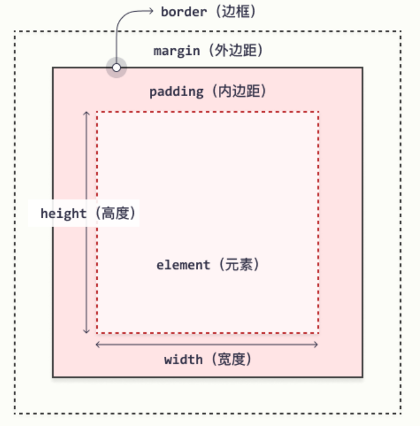

## 一、盒子的组成

盒模型又称为框模型，每个HTML元素都可看作是一个盒子，而盒子由外到内是由：**margin（外边距）、border（边框）、padding（内边距）、content（内容）**四个部分组成的，其中前三个为css属性，最后一个content则是HTML元素的内容

## 二、盒子的类型（Box Model）

### 1、W3C标准盒子模型

如图所示，标准盒模型中，**width=content的宽度，height=content的高度**，width和height是不包括内边距、边框和外边距在内的。

元素总宽度=width+2padding+2border+2margin，总高度=height+2padding+2border+2margin

假设我们要设置一个总宽度为100的元素，不能直接设置width=100，因为这样加上内边距、边框、外边距的长度后，元素总长度就超过100了，正确的做法是令width+2padding+2border+2margin=100

### 2、怪异盒模型（IE盒模型）

IE5.5及更早的版本使用的是IE盒模型。IE6及其以上的版本在标准兼容模式下使用的是W3C的盒模型标准。

如图所示，怪异盒模型中，**width=content+2padding+2border，height=content+2padding+2border**，width和height不包括外边距。

元素总宽度=width+2margin，总高度=height+2margin

## 三、盒模型切换

css3支持通过**box-sizing**属性来选择盒模型解析方式：

**content-box**——标准盒模型（默认）

**border-box**——怪异盒模型

实际上还有一种padding-box，表示将padding计算入width内，firefox浏览器支持此模式