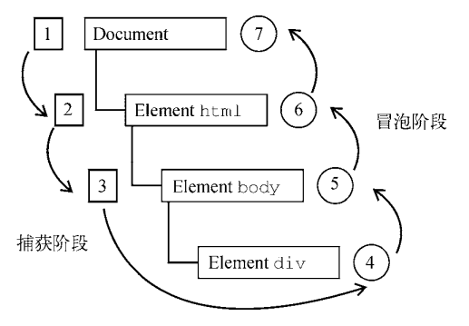
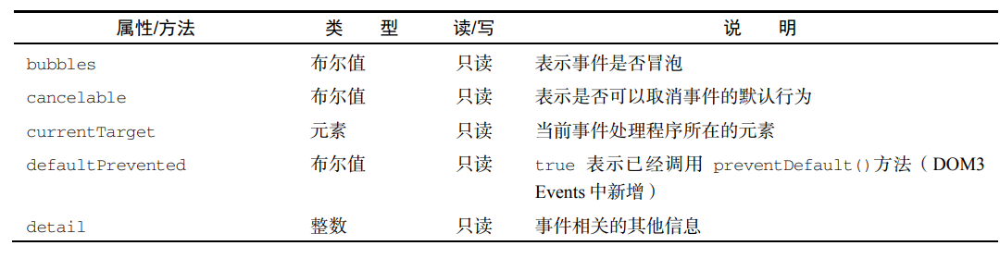
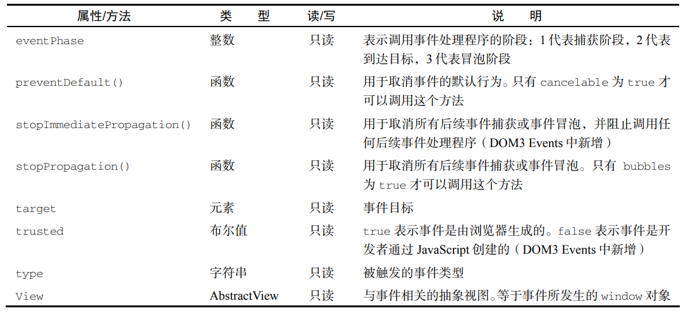

JavaScript 与 HTML 的交互是通过**事件**实现的，**事件代表文档或浏览器窗口中某个有意义的时刻**。 可以使用仅在事件发生时执行的监听器（也叫处理程序）订阅事件。在传统软件工程领域，这个模型叫 “观察者模式”，其能够做到页面行为（在 JavaScript 中定义）与页面展示（在 HTML 和 CSS 中定义）的 分离

`事件意味着用户或浏览器执行的某种动作。比如，单击（click）、加载（load）、鼠标悬停 （mouseover）。为响应事件而调用的函数被称为事件处理程序（或事件监听器）。事件处理程序的名字 以"on"开头，因此 click 事件的处理程序叫作 onclick，而 load 事件的处理程序叫作 onload。有 很多方式可以指定事件处理程序。`

### 事件流

在一张纸上画几个同心圆。把手指放到圆心上，则手指不仅是在一个圆圈里，而且是在所有的圆圈里。

当你点击一个按钮时，实际上不光点击了这个按钮，还点击了它的容器以及整个页面。

**事件流**描述了页面接收事件的顺序

#### 事件冒泡

IE 事件流被称为事件冒泡，这是因为事件被定义为从最具体的元素（文档树中最深的节点）开始触 发，然后向上传播至没有那么具体的元素（文档）

```html
<!DOCTYPE html> 
<html> 
<head> 
 <title>Event Bubbling Example</title> 
</head> 
<body> 
 <div id="myDiv">Click Me</div> 
</body> 
</html>
```

在点击页面中的`<div>`元素后，click 事件会以如下顺序发生：div、body、html、document。

现代浏览器中的事件会一直冒泡到 window 对象

#### 事件捕获

事件捕获的意思是最不具体的节点应该最先收到事件，而**最具体的节点应该最后收到事件**。事件捕获实际上是为了在事件到达最终目标 前拦截事件。如果前面的例子使用事件捕获，则点击div元素会以下列顺序触发 click 事件:

document、html、body、div

通常建议使用事件冒泡，特殊情 况下可以使用事件捕获

#### DOM 事件流

DOM2 Events 规范规定事件流分为 3 个阶段：**事件捕获、到达目标和事件冒泡**。事件捕获最先发生， 为提前拦截事件提供了可能。然后，实际的目标元素接收到事件。最后一个阶段是冒泡，最迟要在这个 阶段响应事件。仍以前面那个简单的 HTML 为例，点击div元素会以如图 所示的顺序触发事件



在 DOM 事件流中，实际的目标（div元素）在捕获阶段不会接收到事件。这是因为捕获阶段从 document 到html再到body就结束了。下一阶段，即会在div元素上触发事件的“到达目标” 阶段，通常在事件处理时被认为是冒泡阶段的一部分（稍后讨论）。然后，冒泡阶段开始，事件反向传播至文档。

 大多数支持 DOM 事件流的浏览器实现了一个小小的拓展。虽然 DOM2 Events 规范明确捕获阶段不 命中事件目标，**但现代浏览器都会在捕获阶段在事件目标上触发事件。最终结果是在事件目标上有两个 机会来处理事件**

### 事件处理程序

**事件意味着用户或浏览器执行的某种动作。**比如，单击（click）、加载（load）、鼠标悬停 （mouseover）。**为响应事件而调用的函数被称为事件处理程序（或事件监听器）**。事件处理程序的名字 以"on"开头，因此 click 事件的处理程序叫作 onclick，而 load 事件的处理程序叫作 onload。有很多方式可以指定事件处理程序。

#### HTML 事件处理程序

特定元素支持的每个事件都可以使用事件处理程序的名字以 HTML 属性的形式来指定。此时属性的值必须是能够执行的 JavaScript 代码。例如，要在按钮被点击时执行某些 JavaScript 代码，可以使用以 下 HTML 属性：

`<input type="button" value="Click Me" onclick="console.log('Clicked')"/>`

点击这个按钮后，控制台会输出一条消息。这种交互能力是通过为 onclick 属性指定 JavaScript 代码值来实现的

**作为事件处理程序执行的代码可以访问全局作用域中的 一切。**（this指向window？）

with??????????

在 HTML 中指定事件处理程序有一些问题。第一个问题是时机问题。有可能 HTML 元素已经显示在页面上，用户都与其交互了，而事件处理程序的代码还无法执行。比如在前面的例子中，如果 showMessage()函数是在页面后面，在按钮中代码的后面定义的，那么**当用户在 showMessage()函数被定义之前点击按钮时，就会发生错误**。为此，大多数 HTML 事件处理程序会封装在 try/catch 块中， 以便在这种情况下静默失败

另一个问题是 HTML 与 JavaScript 强耦合。如果需要修改事件处 理程序，则必须在两个地方，即 HTML 和 JavaScript 中，修改代码

#### DOM0 事件处理程序

在 JavaScript 中指定事件处理程序的传统方式是把一个函数赋值给（DOM 元素的）一个事件处理程序属性。要使用 JavaScript 指定事件处理程序，必须先取得要操作对象的引用。

每个元素（包括 window 和 document）都有通常小写的事件处理程序属性，比如 onclick。只要把这个属性赋值为一个函数即可： 

```js
let btn = document.getElementById("myBtn"); 
btn.onclick = function() { 
 console.log("Clicked"); 
};
```

这里先从文档中取得按钮，然后给它的 onclick 事件处理程序赋值一个函数。注意，前面的代码在运行之后才会给事件处理程序赋值。因此**如果在页面中上面的代码出现在按钮之后，则有可能出现用户点击按钮没有反应的情况。**

像这样**使用 DOM0 方式为事件处理程序赋值**时，**所赋函数被视为元素的方法。**因此，**事件处理程序会在元素的作用域中运行，即 this 等于元素。**

```js
let btn = document.getElementById("myBtn"); 
btn.onclick = function() { 
 console.log(this.id); // "myBtn" 
};
```

通过将事件处理程序属性的值设置为 null，可以移除通过 DOM0 方式添加的事件处理程序

`btn.onclick = null; // 移除事件处理程序`

#### DOM2 事件处理程序

DOM2 Events 为事件处理程序的赋值和移除定义了两个方法：`addEventListener()`和 `remove-EventListener()`。这两个方法暴露在所有 DOM 节点上，它们接收 3 个参数：事件名、事件处理函 数和一个布尔值，**true 表示在捕获阶段调用事件处理程序，false（默认值）表示在冒泡阶段调用事 件处理程序**。

```JS
let btn = document.getElementById("myBtn"); 
btn.addEventListener("click", () => { 
 console.log(this.id); 
}, false);
```

以上代码为按钮添加了会在事件冒泡阶段触发的 onclick 事件处理程序（因为最后一个参数值为 false）。与 DOM0 方式类似，这个事件处理程序同样在被附加到的元素的作用域中运行。使用 DOM2 方式的主要优势是**可以为同一个事件添加多个事件处理程序**。

```JS
let btn = document.getElementById("myBtn"); 
btn.addEventListener("click", () => { 
 console.log(this.id); 
}, false); 
btn.addEventListener("click", () => { 
 console.log("Hello world!"); 
}, false); 
```

这里给按钮添加了两个事件处理程序。**多个事件处理程序以添加顺序来触发**。

通过 `addEventListener()`添加的事件处理程序只能使用 `removeEventListener()`并**传入与添加时同样的参数来移除**。这意味着使用 `addEventListener()`添加的**匿名函数无法移除**

```js
let btn = document.getElementById("myBtn"); 
btn.addEventListener("click", () => { 
 console.log(this.id); 
 }, false); 
// 其他代码
btn.removeEventListener("click", function() { // 没有效果！
 console.log(this.id); 
}, false); 
```

传给 `removeEventListener()`的事件处理函数必须与传给 `addEventListener()` 的是同一个

```js
let btn = document.getElementById("myBtn"); 
let handler = function() { 
 console.log(this.id); 
}; 
btn.addEventListener("click", handler, false); 
// 其他代码
btn.removeEventListener("click", handler, false); // 有效果！
```

大多数情况下，**事件处理程序会被添加到事件流的冒泡阶段，主要原因是跨浏览器兼容性好**。把事件处理程序注册到捕获阶段通常用于在事件到达其指定目标之前拦截事件。**如果不需要拦截，则不要使用事件捕获**

### 事件对象

在 DOM 中发生事件时，所有相关信息都会被收集并存储在一个名为 event 的对象中。这个对象包 含了一些基本信息，比如导致事件的元素、发生的事件类型，以及可能与特定事件相关的任何其他数据。 例如，鼠标操作导致的事件会生成鼠标位置信息，而键盘操作导致的事件会生成与被按下的键有关的信息。

#### DOM 事件对象

在 DOM 合规的浏览器中，event **对象是传给事件处理程序的唯一参数**。不管以哪种方式（DOM0 或 DOM2）指定事件处理程序，都会传入这个 event 对象

```js
let btn = document.getElementById("myBtn"); 
btn.onclick = function(event) { 
 console.log(event.type); // "click" 
}; 
btn.addEventListener("click", (event) => { 
 console.log(event.type); // "click" 
}, false);
```

在通过 HTML 属性指定的事件处理程序中，同样可以使用变量 event 引用事件对象。

`<input type="button" value="Click Me" onclick="console.log(event.type)">`

事件对象包含与特定事件相关的属性和方法。不同的事件生成的事件对象也会包含不同 的属性和方法。不过，所有事件对象都会包含下表列出的这些公共属性和方法





在事件处理程序内部，this 对象始终等于 currentTarget 的值，而 target 只包含事件的实际 目标。如果事件处理程序直接添加在了意图的目标，则 this、currentTarget 和 target 的值是一样 的。

```js
let btn = document.getElementById("myBtn"); 
btn.onclick = function(event) { 
 console.log(event.currentTarget === this); // true 
 console.log(event.target === this); // true 
}; 
```

上面的代码检测了 currentTarget 和 target 的值是否等于 this。因为 click 事件的目标是按 钮，所以这 3 个值是相等的。如果这个事件处理程序是添加到按钮的父节点（如 document.body）上， 那么它们的值就不一样了。比如下面的例子在 document.body 上添加了单击处理程序

```js
document.body.onclick = function(event) { 
 console.log(event.currentTarget === document.body); // true 
 console.log(this === document.body); // true 
 console.log(event.target === document.getElementById("myBtn")); // true 
}; 
```

这种情况下点击按钮，this 和 currentTarget 都等于 document.body，这是因为它是注册事件 处理程序的元素。而 target 属性等于按钮本身，这是因为那才是 click 事件真正的目标。**由于按钮 本身并没有注册事件处理程序，因此 click 事件冒泡到 document.body，从而触发了在它上面注册的 处理程序**

**也就是说，一个事件处理程序是对应一个元素的，但事件（如click）是冒泡的，点击了div，会依次触发div和body上的事件处理程序**

**preventDefault()**方法用于阻止特定事件的默认动作。比如，链接的默认行为就是在被单击时导 航到 href 属性指定的 URL。如果想阻止这个导航行为，可以在 onclick 事件处理程序中取消

任何可以通过 preventDefault()取消默认行为的事件，其事件对象的 cancelable 属性都会设 置为 true

**stopPropagation()**方法用于立即阻止事件流在 DOM 结构中传播，取消后续的事件捕获或冒泡。 例如，**直接添加到按钮的事件处理程序中调用 stopPropagation()，可以阻止 document.body 上注册的事件处理程序执行**

### 事件类型

#### 用户界面事件（UIEvent）

- load：在 window 上当页面加载完成后触发，在窗套（`<frameset>`）上当所有窗格（`<frame>`） 都加载完成后触发，**在img元素上当图片加载完成后触发**，在`<object>`元素上当相应对象加 载完成后触发
- unload：在 window 上当页面完全卸载后触发，在窗套上当所有窗格都卸载完成后触发，在`<object>`元素上当相应对象卸载完成后触发
- error：在 window 上当 JavaScript 报错时触发，在img元素上当无法加载指定图片时触发
- select：在文本框（input或 textarea）上当用户选择了一个或多个字符时触发
- resize：在 window 或窗格上当窗口或窗格被缩放时触发
- scroll：当用户滚动包含滚动条的元素时在元素上触发。**body元素包含已加载页面的滚动条**

##### load 事件

load 事件可能是 JavaScript 中最常用的事件。在 window 对象上，load 事件会在整个页面（包括 所有外部资源如图片、JavaScript 文件和 CSS 文件）加载完成后触发

```js
window.addEventListener("load", (event) => { 
 console.log("Loaded!"); 
}); 


```

##### unload 事件

与 load 事件相对的是 unload 事件，unload 事件会在文档卸载完成后触发。**unload 事件一般是在从一个页面导航到另一个页面时触发，最常用于清理引用，以避免内存泄漏**。

#### 焦点事件

- blur：当元素失去焦点时触发。这个事件不冒泡，所有浏览器都支持
- focusout：当元素失去焦点时触发。这个事件是 blur 的通用版，可冒泡。
- focus：当元素获得焦点时触发。这个事件不冒泡，所有浏览器都支持。
- focusin：当元素获得焦点时触发。这个事件是 focus 的冒泡版。

#### 鼠标和滚轮事件

- click：在用户单击鼠标主键（通常是左键）或**按键盘回车键**时触发，键盘和鼠标都可以触发 onclick 事件处理程序
- dblclick：在用户双击鼠标主键（通常是左键）时触发
- mousedown：在用户按下任意鼠标键时触发。这个事件不能通过键盘触发
- mouseenter：在用户把鼠标光标从元素外部移到元素内部时触发。这个事件不冒泡，也不会在光标经过后代元素时触发
- mouseleave：在用户把鼠标光标从元素内部移到元素外部时触发。这个事件不冒泡，也不会在 光标经过后代元素时触发
- mousemove：在鼠标光标在元素上移动时反复触发。
- mouseout：在用户把鼠标光标从一个元素移到另一个元素上时触发。移到的元素可以是原始元素的外部元素，也可以是原始元素的子元素。
- mouseover：在用户把鼠标光标从元素外部移到元素内部时触发。
- mouseup：在用户释放鼠标键时触发。
- mousewheel：滚轮的交互

除了 mouseenter 和 mouseleave，所有鼠标事件都会冒泡

##### 客户端坐标

鼠标事件都是在浏览器视口中的某个位置上发生的。这些信息被保存在 event 对象的 clientX 和clientY 属性中。这两个属性表示事件发生时鼠标光标在视口中的坐标

##### 页面坐标

客户端坐标是事件发生时鼠标光标在客户端视口中的坐标，而页面坐标是事件发生时鼠标光标在页 面上的坐标，通过 event 对象的 pageX 和 pageY 可以获取。这两个属性表示鼠标光标在页面上的位置， 因此反映的是光标到页面而非视口左边与上边的距离。（**主要区别在页面滚动时**）

**在页面没有滚动时，pageX 和 pageY 与 clientX 和 clientY 的值相同**

##### 屏幕坐标

鼠标事件不仅是在浏览器窗口中发生的，也是在整个屏幕上发生的。可以通过 event 对象的 screenX 和 screenY 属性获取鼠标光标在屏幕上的坐标

#### 键盘与输入事件

- keydown，用户按下键盘上某个键时触发，而且持续按住会重复触发。
- keyup，用户释放键盘上某个键时触发。
- textInput，在文本被插入到文本框之前触发。**用于在文本显示给用 户之前更方便地截获文本输入**
  - 因为 textInput 事件主要关注字符，所以在 event 对象上提供了一个 data 属性，包含要插入的 字符（不是字符编码）。data 的值始终是要被插入的字符，因此如果在按 S 键时没有按 Shift 键，data 的值就是"s"，但在按 S 键时同时按 Shift 键，data 的值则是"S"。

### 内存与性能

在 JavaScript 中，页面中事件处理程序的数量与页面整体性能直接相关。原 因有很多。首先，每个函数都是对象，都占用内存空间，对象越多，性能越差。其次，为指定事件处理程序所需访问 DOM 的次数会先期造成整个页面交互的延迟。解决方案：

#### 事件委托

“过多事件处理程序”的解决方案是使用事件委托。事件委托利用事件冒泡，可以只使用一个事件处理程序来管理一种类型的事件。例如，click 事件冒泡到 document。这意味着**可以为整个页面指定 一个 onclick 事件处理程序，而不用为每个可点击元素分别指定事件处理程序**

只要可行，就应该考虑只给 document 添加一个事件处理程序，通过它处理页面中所有某种类型的事件

优点：

- document 对象随时可用，任何时候都可以给它添加事件处理程序（不用等待 DOMContentLoaded 或 load 事件）。这意味着只要页面渲染出可点击的元素，就可以无延迟地起作用
- 节省花在设置页面事件处理程序上的时间。只指定一个事件处理程序既可以节省 DOM 引用，也 可以节省时间
- 减少整个页面所需的内存，提升整体性能

#### 删除事件处理程序

把事件处理程序指定给元素后，在浏览器代码和负责页面交互的 JavaScript 代码之间就建立了联系。 这种联系建立得越多，页面性能就越差。除了通过事件委托来限制这种连接之外，还应该及时删除不用 的事件处理程序。很多 Web 应用性能不佳都是由于无用的事件处理程序长驻内存导致的。 导致这个问题的原因主要有两个。

第一个是**删除**带有事件处理程序的**元素**。比如通过真正的 DOM方法 removeChild()或 replaceChild()删除节点。最常见的还是使用 innerHTML 整体替换页面的 某一部分。这时候，被 innerHTML 删除的元素上如果有事件处理程序，就不会被垃圾收集程序正常清理

解决方法就是在删除元素前先删除事件处理程序

事件委托也有助于解决这种问题

另一个可能导致内存中残留引用的问题是页面卸载

如果在页面卸载后事件处理程序没有被清理，则它们仍然会残留在内存中。之后，**浏览器每次加载和卸载页面（比如通过前进、后退或刷新），内存中残留对象的数量都会增加，这是因为事件处理程序不会被回收**

一般来说，最好在 onunload 事件处理程序中趁页面尚未卸载先删除所有事件处理程序。这时候也 能体现使用事件委托的优势，因为事件处理程序很少，所以很容易记住要删除哪些。关于卸载页面时的 清理，可以记住一点：onload 事件处理程序中做了什么，最好在 onunload 事件处理程序中恢复。

### 模拟事件

可以通过 JavaScript 在任何时候触发任意事件，而这些事件会被当成浏览器创建 的事件。这意味着同样会有事件冒泡，因而也会触发相应的事件处理程序

#### DOM 事件模拟

任何时候，都可以使用 `document.createEvent()`方法创建一个 event 对象。这个方法接收一个 参数，此参数是一个表示要创建事件类型的字符串

创建 event 对象之后，需要使用事件相关的信息来初始化。每种类型的 event 对象都有特定的方法， 可以使用相应数据来完成初始化。

事件模拟的最后一步是触发事件。为此要使用 `dispatchEvent()`方法，这个方法存在于所有支持 事件的 DOM 节点之上。dispatchEvent()方法接收一个参数，即表示要触发事件的 event 对象。调 用 dispatchEvent()方法之后，事件就“转正”了，接着便冒泡并触发事件处理程序执行

#####  模拟鼠标事件

模拟鼠标事件需要先创建一个新的鼠标 event 对象，然后再使用必要的信息对其进行初始化。要 创建鼠标 event 对象，可以调用 createEvent()方法并传入"MouseEvents"参数。这样就会返回一 个 event 对象，这个对象有一个 initMouseEvent()方法，用于为新对象指定鼠标的特定信息

event 对象的 target 属性会自动设置为调用 dispatchEvent()方法时传入的节点

```js
let btn = document.getElementById("myBtn"); 
// 创建 event 对象
let event = document.createEvent("MouseEvents"); 
// 初始化 event 对象
event.initMouseEvent("click", true, true, document.defaultView, 
 0, 0, 0, 0, 0, false, false, false, false, 0, null); 
// 触发事件
btn.dispatchEvent(event); 
```

