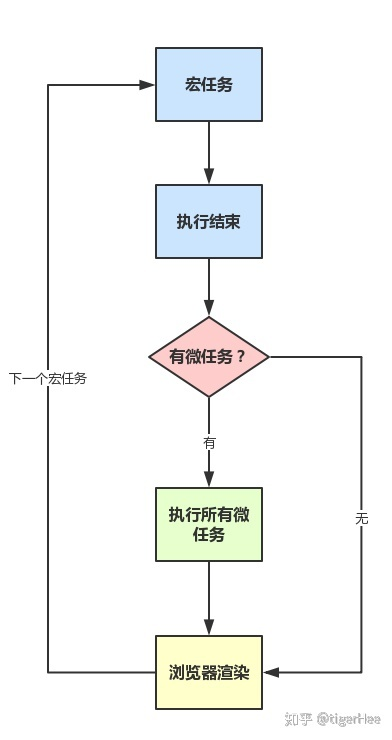

- JavaScript是单线程的语言
- Event Loop是javascript的执行机制

## Event Loop

### 任务队列

根据规范，Event Loop是通过任务队列的机制来进行协调的。

一个 Event Loop 中，可以有一个或者多个任务队列(task queue)，一个任务队列便是一系列有序任务(task)的集合（集合由set实现而非queue，因为每次取出的是第一个可执行的任务，而不一定是头尾的任务。这句话出自whatwg，但根据es6实现来看，可能用queue也行）；

每个任务都有一个任务源(task source)，源自同一个任务源的 task 必须放到同一个任务队列，从不同源来的则被添加到不同队列。setTimeout/Promise 等API便是任务源，而进入任务队列的是他们指定的具体执行任务。

*The* [microtask queue](https://html.spec.whatwg.org/#microtask-queue) *is not a* [task queue](https://html.spec.whatwg.org/#task-queue)*.*

### 一次循环发生的事情

- 同步任务都在主线程上执行，形成一个执行栈
- 主线程之外，事件触发线程管理着一个任务队列，只要异步任务有了运行结果，就在任务队列之中放置一个事件。
- 一旦执行栈中的所有同步任务执行完毕（检查是否存在 Microtasks，如果存在则不停地执行，直至清空 Microtasks Queue）（此时JS引擎空闲），系统就会读取任务队列，将可运行的异步任务添加到可执行栈中，开始执行
- 开始循环。。。。


### 整体流程

- 执行一个宏任务（整体script作为第一个宏任务进入主线程）（栈中没有就从事件队列中获取）
- 执行过程中如果遇到微任务，就将它添加到微任务的任务队列中
- 宏任务执行完毕后，立即执行当前微任务队列中的所有微任务（依次执行，微任务执行过程中添加的微任务会立即执行）
- 当前宏任务执行完毕，开始检查渲染，然后GUI线程接管渲染
- 渲染完毕后，JS线程继续接管，开始下一个宏任务（从事件队列中获取）



### 宏任务

(macro)task，**可以理解是每次执行栈执行的代码就是一个宏任务**（包括每次从事件队列中获取一个事件回调并放到执行栈中执行）。

浏览器为了能够使得JS内部(macro)task与DOM任务能够有序的执行，会在一个(macro)task执行结束后，在下一个(macro)task 执行开始前，对页面进行重新渲染，流程如下：

```text
(macro)task->渲染->(macro)task->...
```

宏任务包含：

```text
script(整体代码)
setTimeout
setInterval
I/O
UI交互事件
postMessage
MessageChannel
setImmediate(Node.js 环境)
```

### 微任务

microtask,可以理解是在当前 task 执行结束后立即执行的任务。也就是说，在当前task任务后，下一个task之前，在渲染之前。

所以它的响应速度相比setTimeout（setTimeout是task）会更快，因为无需等渲染。也就是说，在某一个macrotask执行完后，就会将在它执行期间产生的所有microtask都执行完毕（在渲染前）。

### 微任务包含：

```text
Promise.then（这里注意下，promise的执行函数属于同步代码，then里的才是异步代码，也就是这里说的微任务）
Object.observe
MutationObserver
process.nextTick(Node.js 环境)
```


https://html.spec.whatwg.org/#event-loops

https://zhuanlan.zhihu.com/p/78113300
