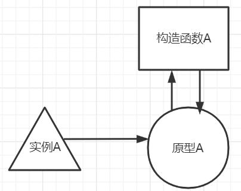
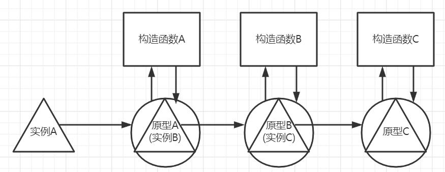

# 构造函数

## 什么是构造函数

其实就是普通的函数。当函数被new操作符调用时，就可以称其为构造函数

## 构造函数有什么用

快速创建具有相同属性、方法的对象，而不用像字面量对象那样每次都编写一堆重复的代码

## 构造函数的写法

```js
function Person(name){ 
 this.name = name; 

 this.sayName = function() { 
   console.log(this.name); 
 }; 
} 

const person1 = new Person('p');
person1.sayName(); // p
```

不是说构造函数就是普通的函数吗？这段代码不符合逻辑啊，根本就没return对象出来

构造函数确实是普通的函数，上述代码执行的奥秘在于`new`操作符上

 以`new`操作符调用构造函数会执行如下操作

- 在内存中创建一个新对象。 
- 这个新对象内部的[[Prototype]]特性被赋值为构造函数的 prototype 属性
- 构造函数内部的 this 被赋值为这个新对象（即 this 指向新对象）。
- 执行构造函数内部的代码（给新对象添加属性）。
- 如果构造函数返回非空对象，则返回该对象；否则，返回刚创建的新对象。

任何函数只要使用 new 操作符调用就是构造函数，而不使用 new 操作符调用的函数就是普通函数

为了方便开发过程中区分一个函数是构造函数还是普通函数。按照惯例，构造函数以大写字母开头， 非构造函数则以小写字母开头。

## 构造函数返回的对象有什么要注意的？

构造函数返回的对象，通常是构造函数类型的。

如上方例子中，person1就是Person类型的对象。

```js
person1 instanceof Person // true
```

为什么？因为person1和Person共享一个原型对象

```js
Object.getPrototypeOf(person1) === Person.prototype // true
```

但为什么这俩共享原型对象？因为以`new`操作符调用构造函数时的第二步进行了赋值操作，将构造函数的原型对象赋值给新对象的原型对象。

实际上，原型对象是对象与构造函数之间的纽带，是他俩关系的唯一证明，对象与构造函数之间并没有直接的关联。

```js
person1.__proto__.constructor === Person // true
```

## 构造函数的缺点

我们都知道，在js中函数也是对象，每次定义函数时，都会创建一个新对象。

```js
const person1 = new Person('p1');
person1.sayName(); // p1

const person2 = new Person('p2');
person2.sayName(); // p2

person1.sayName === person2.sayName // false
```

如果创建了100个Person的实例对象，就会有创建100个Person里的sayName函数，这显然是不必要的

有什么方法能将sayName函数复用起来呢？

答案是：**将函数放在构造函数的原型上**。（**在原型上面定义的属性和方法可以被对象实例访问，并在实例间共享**）

```js
function Person(name){ 
 this.name = name; 
} 

Person.prototype.sayName = function() { 
   console.log(this.name); 
}; 

const person1 = new Person('p1');
person1.sayName(); // p1

const person2 = new Person('p2');
person2.sayName(); // p2

person1.sayName === person2.sayName // true
```

## 构造函数的属性类型

两种，第一种是实例属性，在函数内部通过this设置的都是实例属性，每个实例对象都有自己的一份实例数据，不会相互影响。第二种是原型属性，在函数外部通过 `.prototype`设置的都是原型属性，是所有实例对象共享的，如果是引用值，那么一个实例修改会导致所有实例都受到影响。

# 继承

现在我们已经有了一个Person构造函数，可以随时创建Person对象。但如果有一天，我是说如果，我们需要一个Student构造函数，它比Person多了一个age字段。如果Person有100给字段，这时候我们肯定希望能复用Person的代码，也就是继承。

对于构造函数而言，js共有六种使用较广泛的继承方式（说是继承方式，不如说是六种设计思想，因为这些继承方式并没有用到专门的继承函数或关键字，不像java那样用一个extends关键字就实现了，这六种方式都是通过普通的js代码实现的，可以理解为手写继承）

（到了es6，有了正式的class类概念后，就原生支持了类继承机制，有专门的关键字extends，但其背后的实现也是用此处提到的几种继承方式）

## 原型链

顾名思义，这个继承方式是通过原型来实现的。

首先，重温下实例对象、原型对象、构造函数之间的联系：实例内部有个内部指针指向原型，原型有一个属性指向构造函数，构造函数有一个属性指向原型。



如果原型对象是另一个构造函数的实例，那么会发生什么呢？



我们都知道，实例A能够访问原型A上的属性，如果原型A是另一个类型B的实例，那么原型A就可以访问原型B的属性，因此实例A也可以访问原型B的属性，同理也能访问原型C、D、F……的属性

这就是原型链的基本思路。代码奉上

```js
function Person(address) {
    this.name = 'mc';
    this.address = address;
    this.nameList = ['mc'];
};
Person.prototype.sayName = function() {
    console.log(this.name);
}

function Student(age) {
    this.age = age;
}
Student.prototype = new Person();

const student1 = new Student();
student1.sayName(); // mc
```

确认下student1是否同时是Person和Student类型

```js
student1 instanceof Person // true
student1 instanceof Student // true
```

**原型链的问题**

1、在构造函数那节我们知道，同一类型的实例共享同一个原型对象，因此当原型中包含引用值时（对象、数组等），**不同实例之间会互相干扰**。如果是不使用原型链的单个构造函数，我们可以通过将引用值放在构造函数内部而非原型上来规避这种情况，上方的Person内的nameList就是这样做的。

```js
// 接上方代码
const person1 = new Person();
const person2 = new Person();
person1.nameList.push['jm'];

person1.nameList // ['mc', 'jm']
person2.nameList // ['mc']
```

但在原型链中，类型A的实例对象可能会作为类型B的原型对象，这就导致了实例B之间共享同一个实例A

```js
// 接上方代码
const student1 = new Student();
const student2 = new Student();
student1.nameList.push('jm');

student1.nameList // ['mc', 'jm']
student2.nameList // ['mc', 'jm']
```

2、子类型在实例化时不能给父类型的构造函数传参。因为将`父类实例设为子类原型`这一步操作，从语义上来说是在定义子类构造函数时执行的，而非子类实例化时。

如果在定义子类构造函数时给父类构造函数传递参数（例如上方的Person的address），那么所有子类实例都会具有相同的值，如果是引用值，那么就会出现问题1的情况，相互影响。

## 盗用构造函数（略看）

基本思路很简单：在子类构造函数中调用父类构造函数。开头我们说过，构造函数就是个普通函数，直接调用时和普通函数没有区别，所以可以使用 apply()和 call()方法以新创建的对象（即new操作符调用子构造函数创建的那个对象）为上下文执行父类构造函数（以普通函数的形式）。

```js
function Person(address) {
    this.name = 'mc';
    this.address = address;
    this.nameList = ['mc'];
};
Person.prototype.sayName = function() {
    console.log(this.name);
}

function Student(age, address) {
    Person.call(this, address);
    this.age = age;
}

const student1 = new Student(18, 'CN');
const student2 = new Student();
student1.nameList.push('jm')

student1.nameList // ['mc', 'jm']
student2.nameList // ['mc']

student1.address // 'CN'
```

不错，这样就解决了引用值相互影响的问题，还顺带解决了无法给父类传参的问题，原型链的两个问题都解决了！

欸不对啊，这样写没有把子类和父类的原型关联起来，子类没法使用父类的原型方法，子类实例也不是父类类型了

```js
student1.sayName() // Uncaught TypeError: student1.sayName is not a function
student1 instanceof Person // false
```

解决这些问题的方法就是——组合继承

## 组合继承

组合继承，综合了原型链和盗用构造函数的优点。

基本思路是使用原型链继承原型上的属性和方法，而通过盗用构造函数继承实例属性。这样既可以把方法定义在原型上以实现重用，又可以让每个实例都有自己的属性。

```js
function Person(address) {
    this.name = 'mc';
    this.address = address;
    this.nameList = ['mc'];
};
Person.prototype.sayName = function() {
    console.log(this.name);
}

function Student(age, address) {
    Person.call(this, address);
    this.age = age;
}
// 与盗用构造函数相比，就加了这一行代码~
Student.prototype = new Person();

const student1 = new Student(18, 'CN');
const student2 = new Student();
student1.nameList.push('jm')

student1.nameList // ['mc', 'jm']
student2.nameList // ['mc']

student1.address // 'CN'

student1.sayName(); // mc
student1 instanceof Person // true
```

## 原型式继承（略看）

这是一种不涉及严格意义上构造函数的继承方法，目的是实现：不需要自定义类型就可以通过原型实现对象之间的信息共享

```js
function object(o) { 
 function F() {} 
 F.prototype = o; 
 return new F(); 
}
```

这个 object()函数会创建一个临时构造函数，将传入的对象赋值给这个构造函数的原型，然后返 回这个临时类型的一个实例。本质上，object()是对传入的对象执行了一次浅复制（就是将传入的对象o作为新对象的原型，这样可以通过新对象访问到o的属性，此时这些属性都属于原型属性）

> ECMAScript 5 通过增加 Object.create()方法将原型式继承的概念规范化了。这个方法接收两个 参数：作为新对象原型的对象，以及给新对象定义额外属性的对象（可选）。在只有一个参数时， Object.create()与这里的 object()方法效果相同。
>
> Object.create()的第二个参数与 Object.defineProperties()的第二个参数一样：每个新增 属性都通过各自的描述符来描述。以这种方式添加的属性会遮蔽原型对象上的同名属性

原型式继承属性中包含的引用值始终会在相关对象间共享，跟使用原型链是一样的

## 寄生式继承（略看）

思路：创建一个实现继承的函数，以某种方式增强对象，然后返回这个对象。

```js
function createAnother(original){ 
 let clone = object(original); // 通过调用函数创建一个新对象
 clone.sayHi = function() { // 以某种方式增强这个对象
 console.log("hi"); 
 }; 
 return clone; // 返回这个对象
} 
```

object()函数不是寄生式 继承所必需的，任何返回新对象的函数都可以在这里使用

## 寄生式组合继承

组合继承存在的问题：父类构造函数始终会被调用两次：一次在是创建子类原型时调用，另一次是在子类构造函数中调用。

组合模式代码如下：

```js
function Person(address) {
    this.name = 'mc';
    this.address = address;
    this.nameList = ['mc'];
};
Person.prototype.sayName = function() {
    console.log(this.name);
}

function Student(age, address) {
    Person.call(this, address);
    this.age = age;
}

Student.prototype = new Person();
```

Person类的构造函数会在11行和15行分别调用一次

11行调用时，会将Person的实例属性添加到Student实例中，这是我们需要的。

15行调用时，会将Person的实例属性添加到Student原型中，这是不必要的，虽然这些属性会被实例属性所覆盖，不会出现bug，但还是造成了不必要的性能损耗。

寄生式组合继承就是用来解决这个问题的。

思路：优化上方的第15行，改为只取父类的原型对象赋值给子类的原型对象

```js
function object(o) { 
 	function F() {} 
 	F.prototype = o; 
 	return new F(); 
}

function inheritPrototype(subType, superType) { 
 	let prototype = object(superType.prototype); // 创建对象
 	prototype.constructor = subType; // 增强对象 
 	subType.prototype = prototype; // 赋值对象
} 

// 替换原第15行：Student.prototype = new Person();
inheritPrototype(Student, Person); 
```

这里的 `inheritPrototype`方法，相当于创建了一个干净的继承了父类原型的原型对象，并赋值给子类原型

为什么要 `prototype.constructor = subType; // 增强对象 `？

因为原型对象默认有一个constructor属性指向构造函数，而我们之前修改了Student的默认原型对象后，一直都没有给新的原型对象设置constructor的值，属于一个漏洞，这里算是补上了。

为什么不直接 `Student.prototype = Person.prototype;`？

因为每个构造函数都有自己的原型对象，粗暴地使用同一个原型，容易导致混乱，例如在Student上新增一个原型方法，会干扰到Person类型的原型，这是不应该的。