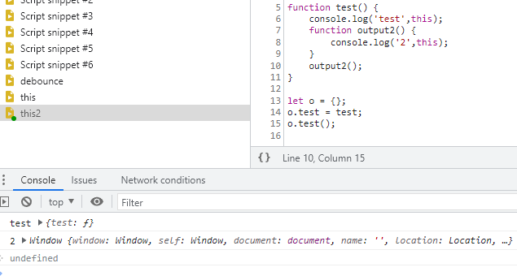
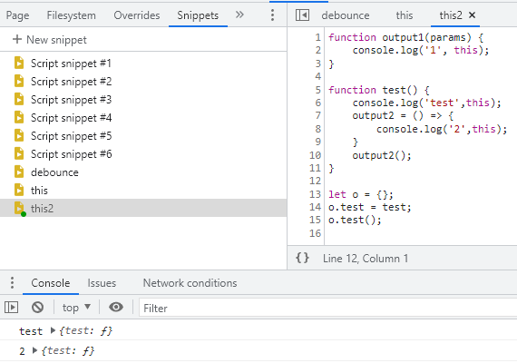

### 定义

函数实际上是对象。每个函数都是Function 类型的实例，而 Function 也有属性和方法，跟其他引用类型一样。

### 函数名

因为函数是对象，所以**函数名就是指向函数对象的指针**，而且不一定与函数本身紧密绑定。

因为函数名就是指向函数的指针，所以它们跟其他包含对象指针的变量具有相同的行为。这意味着 **一个函数可以有多个名称**

```js
function sum(num1, num2) { 
 return num1 + num2; 
} 

let anotherSum = sum; 
console.log(anotherSum(10, 10)); // 20 
sum = null; 
console.log(anotherSum(10, 10)); // 20 
```

注意，**使用不带括号的函数名会访问函数指针，而不会执行函数**

ECMAScript 6 的所有函数对象都会暴露一个只读的 name 属性，其中包含关于函数的信息。多数情 况下，这个属性中保存的就是一个函数标识符，或者说是一个字符串化的变量名。

```js
function foo() {} 
let bar = function() {}; 
let baz = () => {}; 
console.log(foo.name); // foo 
console.log(bar.name); // bar 
console.log(baz.name); // baz 
console.log((() => {}).name); //（空字符串）
console.log((new Function()).name); // anonymous 
```

如果函数是一个获取函数、设置函数，或者使用 bind()实例化，那么标识符前面会加上一个前缀:bound/get/set

### 参数

ECMAScript 函数既不关心传入的参数个数，也不 关心这些参数的数据类型

因为 ECMAScript 函数的参数在内部表现为一个数组。函数被调用时总会接 收一个数组，但函数并不关心这个数组中包含什么。

ECMAScript 函数的参数只是为了方便才写出来的，并不是必须写出来的（即声明函数时不写参数，调用函数时传递参数，这个参数也会被传到函数中）

在使用 function 关键字定义函数时，可以在函数内部访问 arguments 对象，从中取得传进来的每个参数值。如果函数是使用箭头语法定义的，那么传给函数的参数将不能使用 arguments 关键字访问，而只能通过定义的命名参数访问。

 ECMAScript 中的**所有参数都是按值传递**。不可能按引用传递参数。如果把对象作为参数传递，那么传递的值就是这个对象的引用（地址）。

### 没有重载

ECMAScript 函数不能像传统编程那样重载。在其他语言比如 Java 中，一个函数可以有两个定义， 只要签名（接收参数的类型和数量）不同就行。如前所述，ECMAScript 函数没有签名，因为参数是由包含零个或多个值的数组表示的。

如果在 ECMAScript 中定义了两个同名函数，则**后定义的会覆盖先定义的**。

```js
function addSomeNumber(num) { 
 return num + 100; 
} 
function addSomeNumber(num) { 
 return num + 200; 
} 
let result = addSomeNumber(100); // 300 
```

**可以通过检查参数的类型和数量，然后分别执行不同的逻辑来模拟函数重载**

**把函数名当成指针**也有助于理解为什么 ECMAScript 没有函数重载。在前面的例子中，定义两个同名的函数显然会导致后定义的重写先定义的，如下

```js
let addSomeNumber = function(num) { 
 return num + 100; 
}; 
addSomeNumber = function(num) { 
 return num + 200; 
}; 
let result = addSomeNumber(100); // 300
```

### 默认值

要在函数定义中的参数后面用=就可以为参数赋一个默认值

**给参数传 undefined 相当于没有传值，不过这样可以利用多个独立的默认值**

调用函数时，若想给第二个参数传值，第一个参数想用默认值，则第一个参数可用undefined

```js
function makeKing(name = 'Henry', numerals = 'VIII') { 
 return `King ${name} ${numerals}`; 
} 
console.log(makeKing()); // 'King Henry VIII' 
console.log(makeKing('Louis')); // 'King Louis VIII' 
console.log(makeKing(undefined, 'VI')); // 'King Henry VI' 
```

tip：关于function定义函数的独有arguments 对象，在使用默认参数时，arguments 对象的值不反映参数的默认值，只反映传给函数的参数。

默认参数值并不限于原始值或对象类型，**也可以使用调用函数返回的值**

`function makeKing(name = 'Henry', numerals = getNumerals()) { }`

函数的默认参数只有在函数被调用时才会求值，不会在函数定义时求值。而且，计算默认值的函数 只有在调用函数但未传相应参数时才会被调用

### 默认参数作用域与暂时性死区

给多个参数定义默认值实际上跟使用 let 关键字**顺序**声明变量一样

```js
function makeKing(name = 'Henry', numerals = 'VIII') { 
 return `King ${name} ${numerals}`; 
}
```

这里的默认参数会按照定义它们的顺序依次被初始化。可以依照如下示例想象一下这个过程

```js
function makeKing() { 
 let name = 'Henry'; 
 let numerals = 'VIII'; 
 return `King ${name} ${numerals}`; 
} 
```

因为参数是按顺序初始化的，所以后定义默认值的参数可以引用先定义的参数`function makeKing(name = 'Henry', numerals = name) {}`

参数初始化顺序遵循“暂时性死区”规则，即前面定义的参数不能引用后面定义的

因为在求值默认参数时可以定义对象，也可以动态调用函数，所以函数参数肯定是在某个作用域中求值的。参数存在于自己的作用域中，它们不能引用函数体的作用域

```js
// 调用时不传第二个参数会报错
function makeKing(name = 'Henry', numerals = defaultNumeral) { 
 let defaultNumeral = 'VIII'; 
 return `King ${name} ${numerals}`; 
} 
```

### 扩展参数

在给函数传参时，有时候可能不需要传一个数组，而是要分别传入数组的元素。

假设有如下函数定义，它会将所有传入的参数累加起来：

```js
let values = [1, 2, 3, 4]; 
function getSum() { 
 let sum = 0; 
 for (let i = 0; i < arguments.length; ++i) { 
 sum += arguments[i]; 
 } 
 return sum; 
} 
```

如果不使用扩 展操作符，想把定义在这个函数里面的数组拆分，那么就得求助于 apply()方法： console.log(getSum.apply(null, values)); // 10

在 ECMAScript 6 中，可以通过扩展操作符极为简洁地实现这种操作。对可迭代对象应用扩展操 作符，并将其作为一个参数传入，可以将可迭代对象拆分，并将迭代返回的每个值单独传入。

`console.log(getSum(...values)); // 10 `

因为数组的长度已知，所以在使用扩展操作符传参的时候，并不妨碍在其前面或后面再传其他的值， 包括使用扩展操作符传其他参数

```js
console.log(getSum(-1, ...values)); // 9 
console.log(getSum(...values, 5)); // 15 
console.log(getSum(-1, ...values, 5)); // 14 
console.log(getSum(...values, ...[5,6,7])); // 28 
```

### 收集参数

在构思函数定义时，可以使用扩展操作符把不同长度的独立参数组合为一个数组。这有点类似 arguments 对象的构造机制，只不过收集参数的结果会得到一个 Array 实例。

```js
function getSum(...values) { 
 // 顺序累加 values 中的所有值
 // 初始值的总和为 0 
 return values.reduce((x, y) => x + y, 0); 
} 
console.log(getSum(1,2,3)); // 6
```

收集参数的前面如果还有命名参数，则只会收集其余的参数；如果没有(其余参数)，则会得到空数组。**因为收集参数的结果可变，所以只能把它作为最后一个参数**

```js
// 不可以
function getProduct(...values, lastValue) {} 
// 可以
function ignoreFirst(firstValue, ...values) { 
 console.log(values); 
} 
ignoreFirst(); // [] 
ignoreFirst(1); // [] 
ignoreFirst(1,2); // [2] 
ignoreFirst(1,2,3); // [2, 3]
```

另外，使用收集参数并不影响 arguments 对象，它仍然反映调用时传给函数的参数

```js
function getSum(...values) { 
 console.log(arguments.length); // 3 
 console.log(arguments); // [1, 2, 3] 
 console.log(values); // [1, 2, 3] 
} 
console.log(getSum(1,2,3));
```

### 函数声明与函数表达式

JavaScript 引擎在加载数据时对它们是区别对待的。

JavaScript 引擎在任何代码执行之前，会先读取函数声明，并在执行上下文中 生成函数定义。(为函数声明会在任何代码执行之前先被读取并添加到执行上下文。这个过程叫作**函数声明提升**（function declaration hoisting）。在执行代码时，JavaScript 引擎会先执行一遍扫描， 把发现的函数声明提升到源代码树的顶部。)

而函数表达式必须等到代码执行到它那一行，才会在执行上下文中生成函数定义。

```js
// 没问题 
console.log(sum(10, 10)); 
function sum(num1, num2) { 
 return num1 + num2; 
} 

// 会出错
console.log(sum(10, 10)); 
let sum = function(num1, num2) { 
 return num1 + num2; 
}; 
```

除了函数什么时候真正有定义这个区别之外，这两种语法是等价的。

函数表达式看起来就像一个普通的变量定义和赋值，即创建一个函数再把它赋值给一个变量 functionName。这样创建的函数叫作**匿名函数**（anonymous funtion），因为 function 关键字后面没有 标识符。（匿名函数有也时候也被称为兰姆达函数）。未赋值给其他变量的匿名函数的 name 属性是空字 符串。

### 函数作为值

因为函数名在 ECMAScript 中就是变量，所以**函数可以用在任何可以使用变量的地方**。这意味着不仅可以把函数作为参数传给另一个函数，而且还可以在一个函数中返回另一个函数

```js
function callSomeFunction(someFunction, someArgument) { 
 return someFunction(someArgument); 
} 
function add10(num) { 
 return num + 10; 
} 
let result1 = callSomeFunction(add10, 10); 
console.log(result1); // 20 
function getGreeting(name) { 
 return "Hello, " + name; 
} 
```

如果是访问函数而不是调用函数，那就必须不带括号

### 函数内部

在 ECMAScript 5 中，函数内部存在两个特殊的对象：arguments 和 this。ECMAScript 6 又新增 了 new.target 属性

#### **arguments** 

**arguments** 是一个类数组对象，包含调用函数时传入的所有参数。这 个对象只有以 function 关键字定义函数（相对于使用箭头语法创建函数）时才会有。虽然主要用于包 含函数参数，但 arguments 对象其实还有一个 **callee** 属性，是一个指向 arguments 对象所在函数的指针。

来看下面这个经典的阶乘函数

```js
function factorial(num) { 
 if (num <= 1) { 
 return 1; 
 } else { 
 return num * factorial(num - 1); 
 } 
} 
```

这个函数要正确执行必须保证函数名是 factorial，从而导致了紧密耦合。使用 arguments.callee 就可以让函数逻辑与函数名解耦

```js
function factorial(num) { 
 if (num <= 1) { 
 return 1; 
 } else { 
 return num * arguments.callee(num - 1); 
 } 
} 
```

考虑下面的情况，arguments.callee立大功

```js
let trueFactorial = factorial; 
factorial = function() { 
 return 0; 
}; 
console.log(trueFactorial(5)); // 120 
console.log(factorial(5)); // 0 
```

不过，在严格模式下运行的代码是不能访问 arguments.callee 的，因为访问会出错。此时，可 以使用命名函数表达式（named function expression）达到目的。

```js
const factorial = (function f(num) { 
 if (num <= 1) { 
 return 1; 
 } else { 
 return num * f(num - 1); 
 } 
}); 
```

这里创建了一个命名函数表达式 f()，然后将它赋值给了变量 factorial。即使把函数赋值给另 一个变量，函数表达式的名称 f 也不变，因此递归调用不会有问题。这个模式在严格模式和非严格模式 下都可以使用。

#### **this**

**this**在标准函数和箭头函数中有不同的行为

1、在标准函数中，this 引用的是把函数当成方法调用的上下文对象，这时候通常称其为 this 值（在网页的全局上下文中调用函数时，非严格模式下，this 指向 windows，严格模式下，this指向undefined）(匿名函数，即`const test = function() {}`在这里属于标准函数)

```js
window.color = 'red'; 
let o = { 
 color: 'blue' 
}; 
function sayColor() { 
 console.log(this.color); 
} 
sayColor(); // 'red' 
o.sayColor = sayColor; 
o.sayColor(); // 'blue'

const one = function() { console.log(this); } // window
const two = function() { 'use strict'; console.log(this); } // undefined
const three = () => { console.log(this); } // window
const four = () => { 'use strict'; console.log(this); } // window
```

定义在全局上下文中的函数 sayColor()引用了 this 对象。**这个 this 到底引用哪个对象必须到 函数被调用时才能确定**。

2、在**箭头函数**中，this引用的是定义箭头函数的上下文。下面的例子演示了这一点。在对sayColor() 的两次调用中，this 引用的都是 window 对象，因为这个箭头函数是在 window 上下文中定义的

```js
window.color = 'red'; 
let o = { 
 color: 'blue' 
}; 
let sayColor = () => console.log(this.color); 
sayColor(); // 'red' 
o.sayColor = sayColor; 
o.sayColor(); // 'red'
```

**注意**

```js
function funOut1(params) {
    console.log('1', this);
}

let o = {};
o.output2 = function () {
    console.log('2',this);
    funOut1();
}
o.output2();
```

==这里最终输出 2的this是o，1的this是window==

**在o的作用域里调用funout1不算o调用funout1**

这也是为什么要用apply，call



凡是涉及函数内部的函数调用，或者定义，都要注意this的指向，最好直接用箭头函数，或者用apply



**在事件回调或定时回调中调用某个函数时，this 值指向的并非想要的对象。**此时将 回调函数写成箭头函数就可以解决问题。这是因为**箭头函数中的 this 会保留定义该函数时的上下文**

```js
function King() { 
 this.royaltyName = 'Henry'; 
 // this 引用 King 的实例
 setTimeout(() => console.log(this.royaltyName), 1000); 
} 

function Queen() { 
 this.royaltyName = 'Elizabeth'; 
 // this 引用 window 对象
 setTimeout(function() { console.log(this.royaltyName); }, 1000); 
} 
new King(); // Henry 
new Queen(); // undefined
```

#### new.target

ECMAScript 中的函数始终可以作为构造函数实例化一个新对象，也可以作为普通函数被调用。 ECMAScript 6 新增了检测函数是否使用 new 关键字调用的 new.target 属性。如果函数是正常调用的，则 new.target 的值是 undefined；如果是使用 new 关键字调用的，则 new.target 将引用被调用的 构造函数。

```js
function King() { 
 if (!new.target) { 
 throw 'King must be instantiated using "new"' 
 } 
 console.log('King instantiated using "new"'); 
} 
new King(); // King instantiated using "new" 
King(); // Error: King must be instantiated using "new"
```

### 函数属性与方法

ECMAScript 中的函数是对象，因此有属性和方法。每个函数都有两个属性：length 和 prototype。

#### **length** 

**length** 保存**函数定义的命名参数的个数**

```js
function sayName(name) { 
 console.log(name); 
} 
function sum(num1, num2) { 
 return num1 + num2; 
} 
function sayHi() { 
 console.log("hi"); 
} 
console.log(sayName.length); // 1 
console.log(sum.length); // 2 
console.log(sayHi.length); // 0 
```

#### **prototype** 

**prototype** 保存引用类型所有实例 方法的地方，这意味着 toString()、valueOf()等方法实际上都保存在 prototype 上，进而由所有实例共享。

函数还有两个方法：apply()和 call()。这两个方法都会以指定的 this 值来调用函数，即会设 置调用函数时函数体内 this 对象的值。

#### apply()和 call()

函数还有两个方法：apply()和 call()。这两个方法都会以指定的 this 值来调用函数，即会设置调用函数时函数体内 this 对象的值。

apply()方法接收两个参数：函数内 this 的值和一个参数数组。

`在严格模式下，调用函数时如果没有指定上下文对象，则 this 值不会指向 window。 除非使用 apply()或 call()把函数指定给一个对象，否则 this 的值会变成 undefined。`

call()方法与 apply()的作用一样，只是传参的形式不同。第一个参数跟 apply()一样，也是 this 值，而剩下的要传给被调用函数的参数则是逐个传递的。换句话说，通过 call()向函数传参时，必须 将参数一个一个地列出来

apply()和 call()真正强大的地方并不是给函数传参，而是**控制函数调用上下文即函数体内 this 值的能力**。

```js
window.color = 'red'; 
let o = { 
 color: 'blue' 
}; 
function sayColor() { 
 console.log(this.color); 
} 
sayColor(); // red 
sayColor.call(this); // red 
sayColor.call(window); // red 
sayColor.call(o); // blue
```

ECMAScript 5 出于同样的目的定义了一个新方法：**bind()**。bind()方法会创建一个新的函数实例， 其 this 值会被绑定到传给 bind()的对象。

```js
window.color = 'red'; 
var o = { 
 color: 'blue' 
}; 
function sayColor() { 
 console.log(this.color); 
} 
let objectSayColor = sayColor.bind(o); 
objectSayColor(); // blue
```

####  toLocaleString()\toString()\valueOf()

对函数而言，继承的方法 toLocaleString()和 toString()始终返回函数的代码。返回代码的 具体格式因浏览器而异。有的返回源代码，包含注释，而有的只返回代码的内部形式，会删除注释，甚 至代码可能被解释器修改过。由于这些差异，因此不能在重要功能中依赖这些方法返回的值，而只应在 调试中使用它们。继承的方法 valueOf()返回函数本身。

#### name

ECMAScript 6 的所有函数对象都会暴露一个只读的 name 属性，其中包含关于函数的信息。多数情 况下，这个属性中保存的就是一个函数标识符，或者说是一个字符串化的变量名。

### 尾调用优化

ECMAScript 6 规范新增了一项内存管理优化机制，让 JavaScript 引擎在满足条件时可以重用栈帧。 具体来说，这项优化非常适合“尾调用”，即外部函数的返回值是一个内部函数的返回值。

```js
function outerFunction() { 
 return innerFunction(); // 尾调用
} 
```

在 ES6 优化之前，执行这个例子会在内存中发生如下操作。

 (1) 执行到 outerFunction 函数体，第一个栈帧被推到栈上。

 (2) 执行 outerFunction 函数体，到 return 语句。计算返回值必须先计算 innerFunction。

 (3) 执行到 innerFunction 函数体，第二个栈帧被推到栈上。 

(4) 执行 innerFunction 函数体，计算其返回值。

 (5) 将返回值传回 outerFunction，然后 outerFunction 再返回值。

 (6) 将栈帧弹出栈外。

 在 ES6 优化之后，执行这个例子会在内存中发生如下操作。

 (1) 执行到 outerFunction 函数体，第一个栈帧被推到栈上。

 (2) 执行 outerFunction 函数体，到达 return 语句。为求值返回语句，必须先求值 innerFunction。

 (3) 引擎发现把第一个栈帧弹出栈外也没问题，**因为 innerFunction 的返回值也是 outerFunction 的返回值**。 

(4) 弹出 outerFunction 的栈帧。

 (5) 执行到 innerFunction 函数体，栈帧被推到栈上。

 (6) 执行 innerFunction 函数体，计算其返回值。

 (7) 将 innerFunction 的栈帧弹出栈外。 

很明显，**第一种情况下每多调用一次嵌套函数，就会多增加一个栈帧。而第二种情况下无论调用多 少次嵌套函数，都只有一个栈帧**。这就是 ES6 尾调用优化的关键：如果函数的逻辑允许基于尾调用将其 销毁，则引擎就会那么做

#### 尾调用优化的条件

尾调用优化的条件就是确定外部栈帧真的没有必要存在了。涉及的条件如下

- 代码在严格模式下执行
- 外部函数的返回值是对尾调用函数的调用
- 尾调用函数返回后不需要执行额外的逻辑
- 尾调用函数不是引用外部函数作用域中自由变量的闭包

违反条件示例：

```js
"use strict"; 
// 无优化：尾调用没有返回 
function outerFunction() { 
 innerFunction(); 
} 
// 无优化：尾调用没有直接返回
function outerFunction() { 
 let innerFunctionResult = innerFunction(); 
 return innerFunctionResult; 
} 
// 无优化：尾调用返回后必须转型为字符串
function outerFunction() { 
 return innerFunction().toString(); 
} 
// 无优化：尾调用是一个闭包
function outerFunction() { 
 let foo = 'bar'; 
 function innerFunction() { return foo; } 
 return innerFunction(); 
} 
```

差异化尾调用和递归尾调用是容易让人混淆的地方。**无论是递归尾调用还是非递归尾调用，都可以应用优化**。**引擎并不区分尾调用中调用的是函数自身还是其他函数**。不过，**这个优化在递归场景下的效果是最明显的，因为递归代码最容易在栈内存中迅速产生大量栈帧**。

### 立即调用的函数表达式

立即调用的匿名函数又被称作立即调用的函数表达式（IIFE，Immediately Invoked Function  Expression）。

紧跟在第一组括号后面的第二组括号会立即调用前面的函数表达式。

```js
(function() { 
 // 块级作用域 
})(); 
```

使用 IIFE 可以模拟块级作用域，即在一个函数表达式内部声明变量，然后立即调用这个函数。这样位于函数体作用域的变量就像是在块级作用域中一样。ECMAScript 5 尚未支持块级作用域，使用 IIFE 模拟块级作用域是相当普遍的。

```js
// IIFE 
(function () { 
 for (var i = 0; i < count; i++) { 
 console.log(i); 
 } 
})(); 
console.log(i); // 抛出错误
```

前面的代码在执行到 IIFE 外部的 console.log()时会出错，因为它访问的变量是在 IIFE 内部定义 的，在外部访问不到。在 ECMAScript 5.1 及以前，为了防止变量定义外泄，IIFE 是个非常有效的方式。 这样也不会导致闭包相关的内存问题，因为不存在对这个匿名函数的引用。为此，只要函数执行完毕， 其作用域链就可以被销毁。

在 ECMAScript 6 以后，IIFE 就没有那么必要了，（因为新增了let），因为块级作用域中的变量无须 IIFE 就可以实现同样的隔离。下面展示了两种不同的块级作用域形式

```js
{ 
 let i; 
 for (i = 0; i < count; i++) { 
 console.log(i); 
 } 
} 
console.log(i); // 抛出错误

// 循环的块级作用域
for (let i = 0; i < count; i++) { 
 console.log(i); 
} 
console.log(i); // 抛出错误
```

注意，上方两个写法的重点在于let，如果是用var就不会抛出错误了

ES6 新增的 let 关键字跟 var 很相似，但它的作用域是块级的

### 私有变量

严格来讲，JavaScript 没有私有成员的概念，所有对象属性都公有的。不过，倒是有私有变量的概 念。任何定义在函数或块中的变量，都可以认为是私有的，因为在这个函数或块的外部无法访问其中的 变量。私有变量包括函数参数、局部变量，以及函数内部定义的其他函数。

**如果在函数中创建了一个闭包，则这个闭包能通过其作用域链访问其外部的私有变量。基于这一点，就可以创建出能够访问私有变量的公有方法。**

**特权方法（privileged method）**是能够访问函数私有变量（及私有函数）的公有方法。在对象上有两种方式创建特权方法。

1、在构造函数中实现

```js
function MyObject() { 
 // 私有变量和私有函数 
 let privateVariable = 10; 
 function privateFunction() { 
 return false; 
 } 
 // 特权方法
 this.publicMethod = function() { 
 privateVariable++; 
 return privateFunction(); 
 }; 
} 
```

这个模式是把所有私有变量和私有函数都定义在构造函数中。然后，再创建一个能够访问这些私有成员的特权方法。这样做之所以可行，是因为**定义在构造函数中的特权方法其实是一个闭包**，它具有访问构造函数中定义的所有变量和函数的能力。在这个例子中，变量 privateVariable 和函数 privateFunction()**只能通过** publicMethod()方法来访问。在创建 MyObject 的实例后，没有办法 直接访问 privateVariable 和 privateFunction()，**唯一的办法**是使用 publicMethod()。

```js
function Person(name) { 
 // 私有变量包括函数参数!、局部变量，以及函数内部定义的其他函数
 this.getName = function() { 
 return name; 
 }; 
 this.setName = function (value) { 
 name = value; 
 }; 
} 
let person = new Person('Nicholas'); 
console.log(person.getName()); // 'Nicholas' 
person.setName('Greg'); 
console.log(person.getName()); // 'Greg'
```

这段代码中的构造函数定义了两个特权方法：getName()和 setName()。每个方法都可以构造函数外部调用，并通过它们来读写私有的 name 变量。在 Person 构造函数外部，没有别的办法访问 name。 **因为两个方法都定义在构造函数内部，所以它们都是能够通过作用域链访问 name 的闭包。私有变量 name 对每个 Person 实例而言都是独一无二的，因为每次调用构造函数都会重新创建一套变量和方法。** 不过这样也有个问题：必须通过构造函数来实现这种隔离。正如第 8 章所讨论的，构造函数模式的缺点 是每个实例都会重新创建一遍新方法。使用静态私有变量实现特权方法可以避免这个问题。

2、特权方法也可以通过使用私有作用域定义私有变量和函数来实现。

有点难 以后看