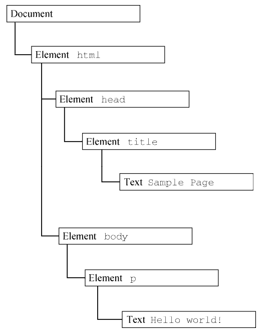
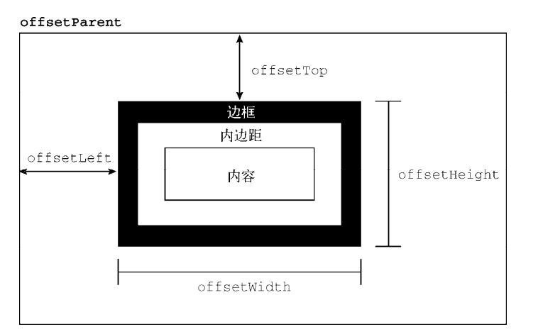
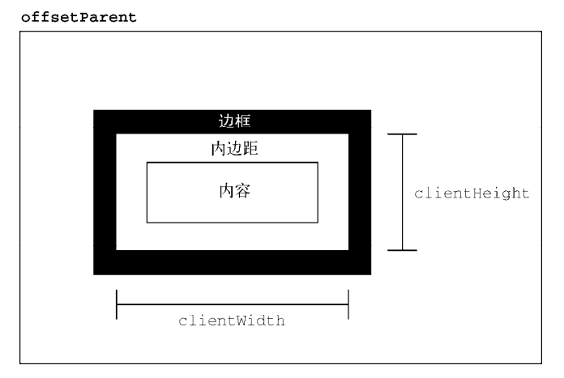
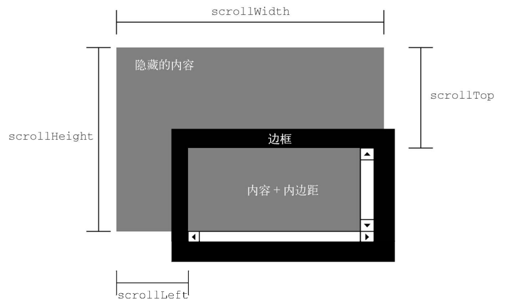
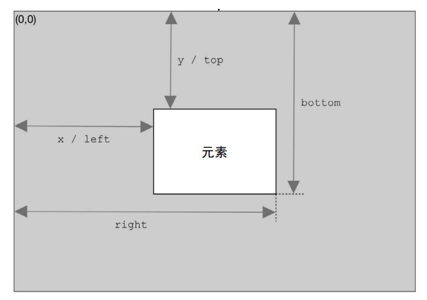

### 什么是DOM

文档对象模型（DOM，Document Object Model）是 HTML 和 XML 文档的编程接口。DOM 表示由多层节点构成的文档，通过它开发者可以添加、删除和修改页面的各个部分。

DOM与浏览器中的 HTML 网页相关，并且在 JavaScript 中提供了 DOM API

### 节点层级

任何 HTML 或 XML 文档都**可以用 DOM 表示为一个由节点构成的、以特定节点为根的树形结构**。节点分很多类型，每种类型对应着文档中不同的信息和（或）标记，也都有自己不同的特性、数据和方法，而且与其他类型有某种关系。这些关系构成了树形结构的层级。

```html
<html> 
 <head> 
 <title>Sample Page</title> 
 </head> 
 <body> 
 <p>Hello World!</p> 
 </body> 
</html> 
```

上述如果表示为层级结构，则：



其中，**document 节点表示每个文档的根节点**。在这里，根节点的唯一子节点是<html>元素，我们称之为**文档元素（documentElement）**。文档元素是文档最外层的元素，所有其他元素都存在于这个元素之 内。**每个文档只能有一个文档元素**。在 **HTML 页面中，文档元素始终是<html>元素**。在 XML 文档中， 则没有这样预定义的元素，任何元素都可能成为文档元素。

### Document 类型

Document 类型是 JavaScript 中表示文档节点的类型。在浏览器中，**文档对象 document** 是 HTMLDocument 的实例（HTMLDocument 继承 Document），**表示整个 HTML 页面**。**document 是 window 对象的属性，因此是一个全局对象。**

Document 类型可以表示 HTML 页面或其他 XML 文档，但最常用的还是**通过 HTMLDocument 的实例取得的document 对象**。document 对象可用于获取关于页面的信息以及操纵其外观和底层结构。

#### 文档子节点

1、documentElement 属 性，始终指向 HTML 页面中的<html>元素

2、body 属性，直接指向元素。`let body = document.body; // 取得对的引用`

#### 定位元素

使用 DOM 最常见的情形可能就是获取某个或某组元素的引用，然后对它们执行某些操作。 document 对象上暴露了一些方法，可以实现这些操作

1、getElementById()方法接收一个参数，即要获取元素的 ID，如果找到了则返回这个元素，如果 没找到则返回 null。参数 ID 必须跟元素在页面中的 id 属性值完全匹配，包括大小写。

如果页面中存在多个具有相同 ID 的元素，则 getElementById()返回在文档中出现的第一个元素

2、getElementsByTagName()接收一个参数，即要获取元素的标签名，返回包含零个或多个元素的 NodeList。

HTMLCollection 对象还有一个额外的方法 namedItem()，可通过标签的 name 属性取得某一项 的引用。

要取得文档中的所有元素，可以给 getElementsByTagName()传入`*`。在 JavaScript 和 CSS 中，`*` 一般被认为是匹配一切的字符

3、getElementsByName()。顾名思义，这个 方法会返回具有给定 name 属性的所有元素。getElementsByName()方法也返回 HTMLCollection。不 过在这种情况下，namedItem()方法只会取得第一项（因为所有项的 name 属性都一样）

### Element 类型

除了Document 类型，Element 类型就是Web开发中最常用的类型了。Element 表示XML或HTML 元素，对外暴露出访问元素标签名、子节点和属性的能力

可以通过 nodeName 或 tagName 属性来获取元素的标签名。这两个属性返回同样的值

注意，div.tagName 实际上返回的是"DIV"而不是 "div"。**在 HTML 中，元素标签名始终以全大写表示**

最好将标签名转换为小写形式，以便于比较

`if (element.tagName.toLowerCase() == "div"){}`

#### 1. HTML 元素

所有 HTML 元素都通过 HTMLElement 类型表示，包括其直接实例和间接实例。另外，HTMLElement 直接继承 Element 并增加了一些属性。

#### 2. 取得、设置、删除属性

每个元素都有零个或多个属性，通常用于为元素或其内容附加更多信息。与属性相关的 DOM 方法 主要有 3 个：**getAttribute()、setAttribute()和 removeAttribute()**。这些方法主要用于操纵属性，包括在 HTMLElement 类型上定义的属性(如id，class等)和自定义属性。

#### 3、attributes 属性

Element 类型是唯一使用 attributes 属性的 DOM 节点类型。attributes 属性包含一个 NamedNodeMap 实例，是一个类似 NodeList 的“实时”集合。元素的每个属性都表示为一个 Attr 节 点，并保存在这个 NamedNodeMap 对象中。

#### 4、创建元素

可以使用 document.createElement()方法创建新元素。这个方法接收一个参数，即要创建元素的标签名。可以再为其添加属性、添加更多子元素

在新元素上设置属性只会附加信息。因为这个元素还没有添加到文档树，所以不会影响浏览器显示。要把元素添加到文档树，可以使用 appendChild()、insertBefore()或 replaceChild()。

`document.body.appendChild(div);`

元素被添加到文档树之后，浏览器会立即将其渲染出来。之后再对这个元素所做的任何修改，都会 立即在浏览器中反映出来

### Selectors API

Selectors API 的核心是两个方法：querySelector()和 querySelectorAll()。在兼容浏览器中，Document 类型和 Element 类型的实例上都会暴露这两个方法。

#### querySelector()

querySelector()方法接收 CSS 选择符参数，返回匹配该模式的第一个后代元素，如果没有匹配 项则返回 null。

```js
// 取得<body>元素
let body = document.querySelector("body"); 
// 取得 ID 为"myDiv"的元素
let myDiv = document.querySelector("#myDiv"); 
// 取得类名为"selected"的第一个元素
let selected = document.querySelector(".selected"); 
// 取得类名为"button"的img元素
let img = document.body.querySelector("img.button"); 
```

在 Document 上使用 querySelector()方法时，会从文档元素开始搜索；**在 Element 上使用 querySelector()方法时，则只会从当前元素的后代中查询**

#### querySelectorAll()

querySelectorAll()方法跟 querySelector()一样，也接收一个用于查询的参数，但它会返回 所有匹配的节点，而不止一个。这个方法返回的是一个 NodeList 的**静态实例**，而非“实时”的查询

### HTML5

HTML5 代表着与以前的 HTML 截然不同的方向。在所有以前的 HTML 规范中，从未出现过描述 JavaScript 接口的情形，HTML 就是一个纯标记语言。JavaScript 绑定的事，一概交给 DOM 规范去定义。

 然而，HTML5 规范却包含了与标记相关的大量 JavaScript API 定义。其中有的 API 与 DOM 重合， 定义了浏览器应该提供的 DOM 扩展

#### CSS 类扩展

自 HTML4 被广泛采用以来，Web 开发中一个主要的变化是 class 属性用得越来越多，其用处是为 元素添加样式以及语义信息。自然地，JavaScript 与 CSS 类的交互就增多了，包括动态修改类名，以及 根据给定的一个或一组类名查询元素，等等。为了适应开发者和他们对 class 属性的认可，HTML5 增 加了一些特性以方便使用 CSS 类。

##### getElementsByClassName()

getElementsByClassName()暴露在 document 对象和 所有 HTML 元素上。

中国方法接收一个参数，即包含一个或多个类名的字符串，返回类名中包含相应类的元素的 NodeList。如果提供了多个类名，则顺序无关紧要。

在 document 上调用 getElementsByClassName()返回文档中所有匹配的元素，而在特定元素上调用 getElementsBy-ClassName()则返回该元素后代中匹配的元素

##### classList 属性

要操作类名，可以通过 className 属性实现添加、删除和替换。但 className 是一个字符串， 所以每次操作之后都需要重新设置这个值才能生效，即使只改动了部分字符串也一样。以下面的 HTML 代码为例：

`<div class="bd user disabled">`

这个`<div>`元素有 3 个类名。要想删除其中一个，就得先把 className 拆开，删除不想要的那个， 再把包含剩余类的字符串设置回去。

HTML5 通过给所有元素增加 classList 属性为这些操作提供了更简单也更安全的实现方式

add(value)/contains(value)/remove(value)/toggle(value)

##### 焦点管理

HTML5 增加了辅助 DOM 焦点管理的功能。首先是 document.activeElement，始终包含当前拥 有焦点的 DOM 元素。

页面加载时，可以通过用户输入（按 Tab 键或代码中使用 focus()方法）让某个 元素自动获得焦点。

```js
let button = document.getElementById("myButton"); 
button.focus(); 
console.log(document.activeElement === button); // true 
```

##### scrollIntoView

scrollIntoView()方法存在于所有 HTML 元素上，可以滚动浏览器窗口或容器元素以便包含元 素进入视口。这个方法的参数如下：

###### alignToTop 是一个布尔值。

- true(默认)：窗口滚动后元素的顶部与视口顶部对齐。
- false：窗口滚动后元素的底部与视口底部对齐。

###### scrollIntoViewOptions 是一个选项对象

- behavior：定义过渡动画，可取的值为"smooth"和"auto"，默认为"auto"
- block：定义垂直方向的对齐，可取的值为"start"、"center"、"end"和"nearest"，默 认为 "start"。
- inline：定义水平方向的对齐，可取的值为"start"、"center"、"end"和"nearest"，默 认为 "nearest"。

### 样式（DOM2）

#### 存取元素样式

任何时候，只要获得了有效 DOM 元素的引用，就可以通过 JavaScript 来设置样式

```js
let myDiv = document.getElementById("myDiv"); 
// 设置背景颜色
myDiv.style.backgroundColor = "red"; 
// 修改大小
myDiv.style.width = "100px"; 
myDiv.style.height = "200px";
```

像这样修改样式时，元素的外观会自动更新。

**如果是在标准模式下，把 style.width 设置为"20"会被 忽略，因为没有单位。**

通过 style 属性设置的值也可以通过 style 对象获取

`console.log(myDiv.style.width);`

#### 计算样式

style 对象中包含支持 style 属性的元素为这个属性设置的样式信息，但不包含从其他样式表层叠继承的同样影响该元素的样式信息

DOM2 Style在document.defaultView上增加了getComputedStyle() 方法。这个方法接收两个参数：要取得计算样式的元素和伪元素字符串（如":after"）。如果不需要查 询伪元素，则第二个参数可以传 null。getComputedStyle()方法返回一个 CSSStyleDeclaration 对象（与 style 属性的类型一样），包含元素的计算样式。假设有如下 HTML 页面

```js
<html> 
<head> 
 <title>Computed Styles Example</title> 
 <style type="text/css"> 
 #myDiv { 
 background-color: blue; 
 width: 100px; 
 height: 200px; 
 } 
 </style> 
</head> 
<body> 
 <div id="myDiv" style="background-color: red; border: 1px solid black"></div> 
</body> 
</html> 
```

这里的`<div>`元素从文档样式表（`<style>`元素）和自己的 style 属性获取了样式。此时，这个元 素的 style 对象中包含 backgroundColor 和 border 属性，但不包含（通过样式表规则应用的） width 和 height 属性。下面的代码从这个元素获取了计算样式:

```js
let myDiv = document.getElementById("myDiv"); 
let computedStyle = document.defaultView.getComputedStyle(myDiv, null); 
console.log(computedStyle.backgroundColor); // "red" 
console.log(computedStyle.width); // "100px" 
console.log(computedStyle.height); // "200px" 
console.log(computedStyle.border); // "1px solid black"（在某些浏览器中）
```

在取得这个元素的计算样式时，得到的背景颜色是"red"，宽度为"100px"，高度为"200px"。背 景颜色不是"blue"，因为元素样式覆盖了它

关于计算样式要记住一点，在所有浏览器中计算样式都是只读的，不能修改 getComputedStyle() 方法返回的对象

### 元素尺寸

#### 偏移尺寸

偏移尺寸（offset dimensions），包含元素在屏幕上占用的所有视觉空间。元素在页面上的视觉空间由其高度和宽度决定，**包括所有内边距、滚动条和边框（但不包含外边距）**。以下 4 个 属性用于取得元素的偏移尺寸

- offsetHeight，元素在垂直方向上占用的像素尺寸，包括它的高度、水平滚动条高度（如果可 见）和上、下边框的高度。
- offsetLeft，`元素左边框外侧`距离`包含元素左边框内侧`的像素数。
- offsetTop，`元素上边框外侧`距离`包含元素上边框内侧`的像素数。
- offsetWidth，元素在水平方向上占用的像素尺寸，包括它的宽度、垂直滚动条宽度（如果可 见）和左、右边框的宽度。

其中，offsetLeft 和 offsetTop 是相对于包含元素的，包含元素保存在 offsetParent 属性中。 offsetParent 不一定是 parentNode。比如，`<td>`元素的 offsetParent 是作为其祖先的`<table>`元素，因为`<table>`是节点层级中第一个提供尺寸的元素。



**要确定一个元素在页面中的偏移量，可以把它的 offsetLeft 和 offsetTop 属性分别与 offsetParent 的相同属性相加，一直加到根元素**

所有这些偏移尺寸属性都是只读的，每次访问都会重新计算。因此，应该尽量减少 查询它们的次数。比如把查询的值保存在局量中，就可以避免影响性能。

#### 客户端尺寸

元素的客户端尺寸（client dimensions）包含**元素内容及其内边距所占用的空间**。客户端尺寸只有两个相关属性：clientWidth 和 clientHeight。其中，clientWidth 是内容区宽度加左、右内边距宽 度，clientHeight 是内容区高度加上、下内边距高度。



客户端尺寸实际上就是元素内部的空间，因此不包含滚动条占用的空间。**这两个属性最常用于确定浏览器视口尺寸，即检测 document.documentElement 的 clientWidth 和 clientHeight。这两个属性表示视口（`<html>`或`<body>`元素）的尺寸。**

与偏移尺寸一样，客户端尺寸也是只读的，而且每次访问都会重新计算。

#### 滚动尺寸

滚动尺寸（scroll dimensions）提供了元素内容滚动距离的信息。有些元素，比如`<html>`无须任何代码就可以自动滚动，而其他元素则需要使用 CSS 的 overflow 属性令其滚动。滚动尺寸相关的属性有如下 4 个。

- scrollHeight，没有滚动条出现时，元素内容的总高度
- scrollWidth，没有滚动条出现时，元素内容的总宽度
- scrollLeft，内容区左侧隐藏的像素数，设置这个属性可以改变元素的滚动位置
- scrollTop，内容区顶部隐藏的像素数，设置这个属性可以改变元素的滚动位置



scrollWidth 和 scrollHeight 可以用来确定给定元素内容的实际尺寸。例如，`<html>`元素是浏览器中滚动视口的元素。因此，document.documentElement.scrollHeight 就是整个页面垂直方 向的总高度。

**scrollWidth 和 scrollHeight 与 clientWidth 和 clientHeight 之间的关系在不需要滚动的文档上是分不清的。**如果文档尺寸超过视口尺寸，则在所有主流浏览器中这两对属性都不相等， scrollWidth 和 scollHeight 等于文档内容的宽度，而 clientWidth 和 clientHeight 等于视口 的大小。

scrollLeft 和 scrollTop 属性可以用于确定当前元素滚动的位置，或者用于设置它们的滚动位 置。元素在未滚动时，这两个属性都等于 0。如果元素在垂直方向上滚动，则 scrollTop 会大于 0， 表示元素顶部不可见区域的高度。如果元素在水平方向上滚动，则 scrollLeft 会大于 0，表示元素左 侧不可见区域的宽度。因为这两个属性也是可写的，所以把它们都设置为 0 就可以重置元素的滚动位置。

#### 确定元素尺寸

浏览器在每个元素上都暴露了 getBoundingClientRect()方法，返回一个 DOMRect 对象，包含 6 个属性：left、top、right、bottom、height 和 width。这些属性给出了元素在页面中相对于视 口的位置

