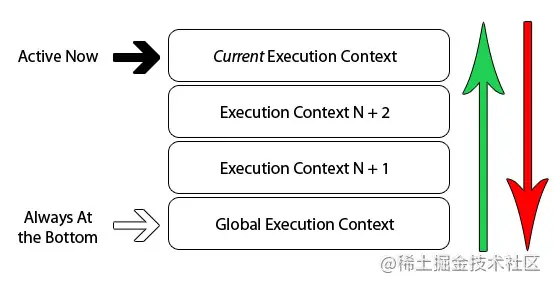
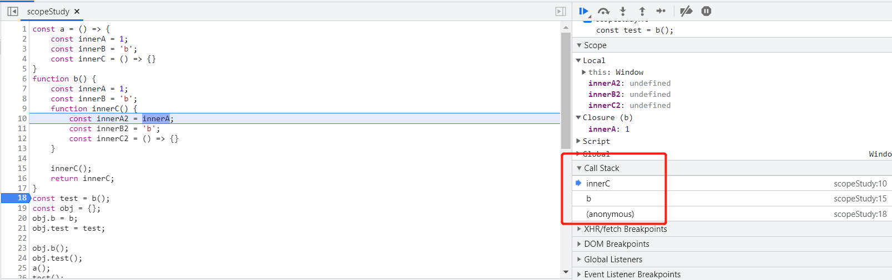

1. **变量或函数**的上下文决定了它们可以访问哪些数据，以及它们的行为。

2. **每个上下文都有一个关联的变量对象**（variable object）， 而这个上下文中定义的所有变量和函数都存在于这个对象上。虽然无法通过代码访问变量对象，但后台 处理数据会用到它

3. **全局上下文是最外层的上下文**。根据 ECMAScript 实现的宿主环境，表示全局上下文的对象可能不一 样。**在浏览器中，全局上下文就是我们常说的 window 对象**，因此所有通过 var 定义的全局变量和函数都会成为 window 对象的属性和方法。使用 let 和 const 的顶级声明不会定义在全局上下文中，但在作用域链解析上效果是一样的。

4. **上下文在其所有代码都执行完毕后会被销毁，包括定义在它上面的所有变量和函数**(全局上下文在应用程序退出前才会被销毁，比如关闭网页或退出浏览器)

5. **每个函数调用都有自己的上下文**。当代码执行流进入函数时，函数的上下文被推到一个上下文栈上。 在函数执行完之后，上下文栈会弹出该函数上下文（然后函数将返回值返回调用上下文。调用上下文是调用这个本地的执行上下文，它可以是全局执行上下文，也可以是另外一个本地的执行上下文。然后销毁该函数的执行上下文）将控制权返还给之前的执行上下文。**ECMAScript 程序的执行流就是通过这个上下文栈进行控制的**

6. 上下文中的代码在执行的时候，会创建一个包含各级变量对象的**作用域链**（scope chain）。这个作用域链决定 了各级上下文中的代码在访问变量和函数时的顺序。**代码正在执行的上下文的变量对象始终位于作用域链的最前端**。如果上下文是函数，则其活动对象（activation object）用作变量对象。活动对象最初只有一个定义变量：arguments。（全局上下文中没有这个变量。）作用域链中的**下一个变量对象来自包含上下文**，再下一个对象来自再下一个包含上下文。以此类推直至全局上下文；**全局上下文的变量对象始终是作用域链的最后一个变量对象**。

7. 标识符解析顺序：代码执行时的标识符解析是通过**沿作用域链逐级搜索标识符名称**完成的。搜索过程始终从作用域链的最前端开始，然后逐级往后，直到找到标识符。（如果没有找到标识符，那么通常会报错。

   ```js
   var color = "blue"; 
   function changeColor() { 
    if (color === "blue") { 
    color = "red"; 
    } else { 
    color = "blue"; 
    } 
   } 
   changeColor();
   ```

   对这个例子而言，函数 changeColor()的作用域链包含两个对象：一个是它自己的变量对象（就 是定义 arguments 对象的那个），另一个是全局上下文的变量对象。**这个函数内部之所以能够访问变量 color，就是因为可以在作用域链中找到它**

   ```js
   var color = "blue"; 
   function changeColor() { 
    let anotherColor = "red"; 
    function swapColors() { 
    let tempColor = anotherColor; 
    anotherColor = color; 
    color = tempColor; 
    // 这里可以访问 color、anotherColor 和 tempColor 
    } 
    // 这里可以访问 color 和 anotherColor，但访问不到 tempColor 
    swapColors(); 
   } 
   // 这里只能访问 color 
   changeColor(); 
   ```

   内部上下文可以通过作用域链访问外部上下文中的一切，但外部上下文无法访问内部上下文中的任何东西。上下文之间的连接是线性的、有序的。**每个上下文都可以到上一级上下文中去搜索变量和函数，但任何上下文都不能到下一级上下文中去搜索。**

   swapColors()的局部上下文首先从自己的变量对象开始搜索变量和函数，搜不到就去搜索 上一级变量对象。

   tip: 函数参数被认为是当前上下文中的变量

8. 虽然执行上下文主要有全局上下文和函数上下文两种（eval()调用内部存在第三种上下文），但有其他方式来**增强作用域链**。某些语句会导致在作用域链前端临时添加一个上下文，这个上下文在代码执 行后会被删除。例如

   1. try/catch 语句的 catch 块
   2. with 语句
   3. 对 with 语句来说，会向作用域链前端添 加指定的对象；对 catch 语句而言，则会创建一个新的变量对象，这个变量对象会包含要抛出的错误 对象的声明。

9. 定义函数时有个作用域链。调用函数时创建上下文，上下文创建作用域链，创建变量对象，置入作用域链

## 深入理解

### 概念

**EC**：*函数执行环境（或执行上下文），Execution Context*
**ECS**：*执行环境栈，Execution Context Stack*
**VO**：*变量对象，Variable Object*
**AO**：*活动对象，Active Object*
**scope chain**：*作用域链*

### EC（执行上下文）

每次当控制器转到ECMAScript可执行代码的时候，就会进入到一个执行上下文。

#### 可执行代码的类型

- 全局代码（Global code）：全局代码不包括任何function体内的代码。 这个是默认的代码运行环境，一旦代码被载入，引擎最先进入的就是这个环境
- 函数代码（Function code）（这里的函数代码`不包括` `函数内部调用的` `其他函数的代码`）
- Eval代码（Eval code）

### ECS（执行环境栈）

浏览器中的JS解释器被实现为单线程，这也就意味着同一时间只能发生一件事情，其他的行为或事件将会被放在`执行栈`里面排队。下面的图是单线程栈的抽象视图



当浏览器首次载入你的脚本，它将默认进入全局执行上下文。**如果，你在你的全局代码中调用一个函数，你程序的时序将进入被调用的函数，并创建一个新的执行上下文，并将新创建的上下文压入执行栈的顶部**。

如果你调用当前函数内部的其他函数，相同的事情会在此上演。代码的执行流程进入内部函数，创建一个新的执行上下文并把它压入执行栈的顶部。**浏览器总会执行位于栈顶的执行上下文，一旦当前上下文函数执行结束，它将被从栈顶弹出，并将上下文控制权交给当前的栈**。这样，堆栈中的上下文就会被依次执行并且弹出堆栈，直到回到全局的上下文

```
(function goo(i){
   if(i === 3){
     return
  }else{
    goo(i+1)
  }
}(0)); // 这里(0)往右移动一位也没问题
```

上述goo被声明后，通过()运算符强制直接运行了。函数代码就是调用了其自身3次，每次是局部变量i增加1。每次goo函数被自身调用时，就会有一个新的执行上下文被创建。每当一个上下文执行完毕，该上下文就被弹出堆栈，回到上一个上下文，直到再次回到全局上下文


关于执行栈，看这图：



### VO（变量对象）/AO（活动对象）

按照字面理解，AO其实就是被激活的VO，两个其实是一个东西

**变量对象（Variable object）:** 执行上下文中定义的所有变量和函数都存在于这个对象上。这个对象是在规范或者说是引擎上实现的，无法通过代码访问

**激活对象（Activation object）:** 函数局部上下文中的变量对象叫活动对象，只在函数执行期间存在。当函数被调用时才创建

