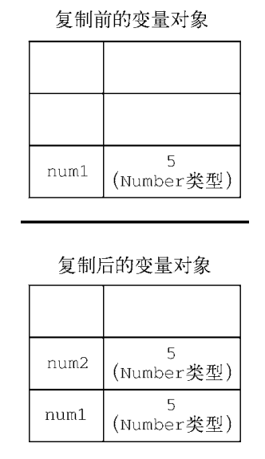
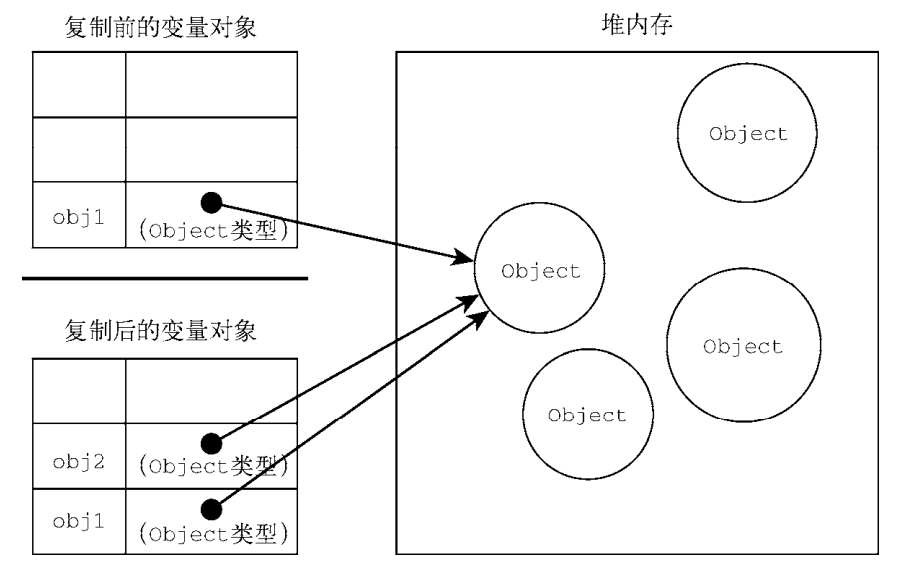

## 原始值与引用值

ECMAScript 变量可以包含两种不同类型的数据：原始值和引用值。原始值（primitive value）就是 最简单的数据，引用值（reference value）则是由多个值构成的对象

在把一个值赋给变量时，JavaScript 引擎必须确定这个值是原始值还是引用值。共有 6 种 原始值：Undefined、Null、Boolean、Number、String 和 Symbol。**保存原始值的变量是按值（by  value）访问的，因为我们操作的就是存储在变量中的实际值**

引用值是**保存在内存**中的对象。与其他语言不同，**JavaScript 不允许直接访问内存位置，因此也就不能直接操作对象所在的内存空间**。在操作对象时，**实际上操作的是对该对象的引用（reference）**而非 实际的对象本身。为此，**保存引用值的变量是按引用（by reference）访问的**

### 动态属性

对于引用值而言，可以随时添加、修改和删除其属性和方法。

```
let person = new Object(); 
person.name = "Nicholas"; 
console.log(person.name); // "Nicholas"
```

原始值不能有属性，尽管尝试给原始值添加属性不会报错

```
let name = "Nicholas"; 
name.age = 27; 
console.log(name.age); // undefined
```

注意，原始类型的初始化可以只使用原始字面量形式。**如果使用的是 new 关键字，则 JavaScript 会 创建一个 Object 类型的实例**

```
let name1 = "Nicholas"; 
let name2 = new String("Matt"); 
name1.age = 27; 
name2.age = 26; 
console.log(name2) // String {'Matt'}
console.log(name1.age); // undefined 
console.log(name2.age); // 26 
console.log(typeof name1); // string 
console.log(typeof name2); // object
console.log(name2) // String {'Matt', age: 1}
```

### 复制值

除了存储方式不同，原始值和引用值在通过变量复制时也有所不同。

在通过变量把一个原始值赋值到另一个变量时，原始值会被复制到新变量的位置。

let num1 = 5;  

let num2 = num1;  

这里，num1 包含数值 5。当把 num2 初始化为 num1 时，num2 也会得到数值 5。这个值跟存储在 num1 中的 5 是**完全独立**的，因为它是那个值的**副本**

这两个变量可以独立使用，互不干扰



在把引用值从一个变量赋给另一个变量时，存储在变量中的值也会被复制到新变量所在的位置。区 别在于，**这里复制的值实际上是一个指针，它指向存储在堆内存中的对象。操作完成后，两个变量实际 上指向同一个对象，因此一个对象上面的变化会在另一个对象上反映出来**

```
let obj1 = new Object(); 
let obj2 = obj1; 
obj1.name = "Nicholas"; 
console.log(obj2.name); // "Nicholas" 
```



### 传递参数

ECMAScript 中所有函数的参数都是**按值传递**的。这意味着函数外的值会被复制到函数内部的参数 中，就像从一个变量复制到另一个变量一样。**如果是原始值，那么就跟原始值变量的复制一样，如果是 引用值，那么就跟引用值变量的复制一样。**对很多开发者来说，这一块可能会不好理解，毕竟变量有按值和按引用访问，而传参则只有按值传递

在按值传递参数时，值会被复制到一个局部变量。**在按引用传递参数时，值在内存中的位置会被保存在一个局部变量，这意味着对本地变量的修改会反映到函数外部。**（这在 ECMAScript 中是不可能的。）

```
function addTen(num) { 
 num += 10; 
 return num; 
} 
let count = 20;
let result = addTen(count); 
console.log(count); // 20，没有变化
console.log(result); // 30
```

**如果 num 是按引用传递的，那么 count 的值也会被修改为 30。这个事实 在使用数值这样的原始值时是非常明显的。**

```
function setName(obj) { 
 obj.name = "Nicholas"; 
} 
let person = new Object(); 
setName(person); 
console.log(person.name); // "Nicholas"
```

这一次，我们创建了一个对象并把它保存在变量 person 中。然后，这个对象被传给 setName() 方法，并被复制到参数 obj 中。在函数内部，obj 和 person 都指向同一个对象。结果就是，即使对象是按值传进函数的，obj 也会通过引用访问对象。当函数内部给 obj 设置了 name 属性时，函数外部的对象也会反映这个变化，因为 obj 指向的对象保存在全局作用域的堆内存上。<u>很多开发者**错误**地认为， 当在局部作用域中修改对象而变化反映到全局时，就意味着参数是按引用传递的</u>。

总而言之，当参数是对象时，传递的就是指针的值，所以属于值传递。

### 确定类型

typeof 操作符最适合用来判断一个变量是否为原始类型，但它对引用值的用处不大

instanceof 操作符可知道引用值是什么类型的对象

`result = variable instanceof constructor`

`console.log(colors instanceof Array); // 变量 colors 是 Array 吗？`

如果用 instanceof 检测原始值，则始终会返回 false， 因为原始值不是对象

