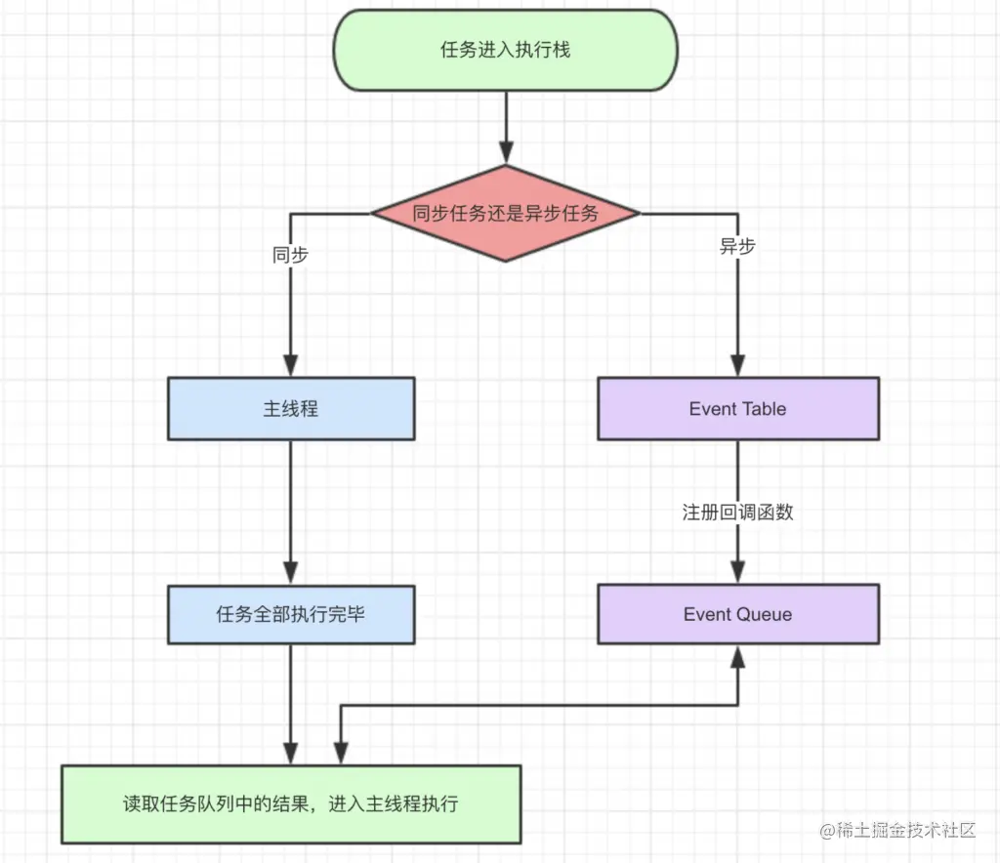

- JavaScript是单线程的语言
- Event Loop是javascript的执行机制

## Event Loop



同步和异步任务分别进入不同的执行"场所"，同步的进入主线程，异步的进入Event Table并注册函数

当指定的事情完成时，Event Table会将这个函数移入Event Queue。

主线程内的任务执行完毕为空，会去Event Queue读取对应的函数，进入主线程执行。

上述过程会不断重复，也就是常说的Event Loop(事件循环)。

怎么知道主线程执行栈为空呢？js引擎存在monitoring process进程，会持续不断的检查主线程执行栈是否为空，一旦为空，就会去Event Queue那里检查是否有等待被调用的函数。

举例：

```
let data = [];
$.ajax({
    url:www.javascript.com,
    data:data,
    success:() => {
        console.log('发送成功!');
    }
})
console.log('代码执行结束');
```

- ajax进入Event Table，注册回调函数success。
- 执行console.log('代码执行结束')。
- ajax事件完成，回调函数success进入Event Queue。
- 主线程从Event Queue读取回调函数success并执行。

## 宏任务与微任务

事件分为同步任务与异步任务

其中同步任务由宏任务组成，异步任务由宏任务和微任务组成

同步任务队列执行完后，执行微任务直到队列清空，然后开始执行异步宏任务队列，每处理一个宏任务，就清空一次微任务队列。

在执行微任务过程中新添加的微任务也会被执行

现在的疑惑是 宏任务的定义是什么？同步任务是宏任务吗？

根据https://whatwg-cn.github.io/html/#task-source   8.1.6节

```
回调
调用一个回调通常是由专用任务来完成的。

使用资源
当一个算法 获取 一个资源时，如果获取发生在一个非阻塞的情况， 那么一旦某个或全部资源可用，对资源的处理由一个任务来执行。

至于它的 source 字段，每个 任务 都来自一个特定的 任务源。 事件循环 中的每个 任务源 必须关联 特定的 任务队列。
```

可知，同步任务和异步任务都有宏任务，他们的区别是，属于不同的任务队列


已知的宏任务类型：

| #                       | 浏览器 | Node |
| ----------------------- | ------ | ---- |
| `I/O`                   | ✅      | ✅    |
| `setTimeout`            | ✅      | ✅    |
| `setInterval`           | ✅      | ✅    |
| `setImmediate`          | ❌      | ✅    |
| `requestAnimationFrame` | ✅      | ❌    |

微任务

| #                            | 浏览器 | Node |
| ---------------------------- | ------ | ---- |
| `process.nextTick`           | ❌      | ✅    |
| `MutationObserver`           | ✅      | ❌    |
| `Promise.then catch finally` | ✅      | ✅    |
