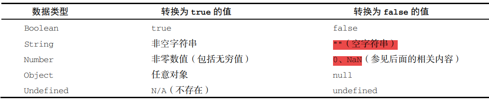

ECMAScript 有 **6 种简单数据类型（也称为原始类型）：Undefined、Null、Boolean、Number、 String 和 Symbol**。Symbol（符号）是 ECMAScript 6 新增的。还**有一种复杂数据类型叫 Object（对 象）**。**Object 是一种无序名值对的集合**。

### typeof 操作符

可确定任意变量的数据类型

对一个值使用 typeof 操作符会返回下列字符串之一：

- "undefined"表示值未定义
- "boolean"表示值为布尔值
- "string"表示值为字符串
- "number"表示值为数值
- "object"表示值**为对象（而不是函数）或 null**（特殊值 null 被认为是一个对空对象的引用）
- "function"表示值为函数
- "symbol"表示值为符号

严格来讲，**函数在 ECMAScript 中被认为是对象，并不代表一种数据类型**。可是， 函数也有自己特殊的属性。为此，就有必要通过 typeof 操作符来区分函数和其他对象

#### Undefined 类型

Undefined 类型只有一个值，就是特殊值 undefined。当使用 var 或 let 声明了变量但没有初始化时，就相当于给变量赋予了 undefined 值

**对未声明的变量**，只能执行一个有用的操作，就是对它调用 typeof，返回的结果是"undefined”

#### Null 类型

逻辑上讲，null 值表示一个空对象指针，这也是给 typeof 传一个 null 会返回"object"的原因

在定义将来要保存对象值的变量时，建议使用 null 来初始化，不要使用其他值。这样，只要检查 这个变量的值是不是 null 就可以知道这个变量是否在后来被重新赋予了一个对象的引用

**任何时候，只要变量要保存对象，而当时又没有那个对象可保存，就要用 null 来填充该变量**。这样就可以保持 null 是空对象指针的语义，并进一步将其 与 undefined 区分开来

`console.log(null == undefined); // true `

#### Boolean 类型

布尔值不同于数值，因此 true 不等于 1，false 不等于 0。（**但可以使用Number()函数转换为数值，true为1，false为0**）

虽然布尔值只有两个，但**所有其他 ECMAScript 类型的值都有相应布尔值的等价形式**。要将一个其他类型的值转换为布尔值，可以调用特定的 **Boolean()**转型函数

Boolean()转型函数可以在任意类型的数据上调用，而且始终返回一个布尔值。



**像 if 等流控制语句会自动执行其他类型值到布尔值的转换**

**所有对象在布 尔表达式中都会自动转换为 true**

#### Number 类型

####  浮点值

要定义浮点值，数值中必须包含小数点，而且小数点后面必须至少有一个数字。虽然**小数点前面不是必须有整数**，但推荐加上。

（`const a = 1.`  是合法的，不过会被自动转换为整数1）

因为**存储浮点值使用的内存空间是存储整数值的两倍**，所以 ECMAScript 总是想方设法把值转换为整数。在小数点后面没有数字的情况下，数值就会变成整数。类似地，**如果数值本身就是整数，只是小数点后面跟着 0（如 1.0），那它也会被转换为整数**

```js
let floatNum1 = .1; // 有效，但不推荐
let floatNum1 = 1.; // 小数点后面没有数字，当成整数 1 处理
let floatNum2 = 10.0; // 小数点后面是零，当成整数 10 处理

// console.log: 0.1, 1，10
```

**永远不要测试某个特定的浮点值**

浮点值的精确度最高可达 17 位小数，但在算术计算中远不如整数精确。例如，0.1 加 0.2 得到的不 是 0.3，而是 0.300 000 000 000 000 04

```js
if (a + b == 0.3) { // 别这么干！ 
 console.log("You got 0.3."); 
} 
```

#### 值的范围

如果某个计算得到的 数值结果超出了 JavaScript 可以表示的范围，那么这个数值会被自动转换为一个特殊的 Infinity（无 穷）值。任何无法表示的负数以`-Infinity`（负无穷大）表示，任何无法表示的正数以 Infinity（正无穷大）表示。

要确定一个值是不是有限大（即介于 JavaScript 能表示的最小值和最大值之间），可以使用 isFinite()函数

#### NaN

有一个特殊的数值叫 NaN，意思是“不是数值”（**Not a Number**），用于表示本来**要返回数值的操作失败了（而不是抛出错误）**。比如，用 0 除任意数值在其他语言中通常都会导致错误，从而中止代码执 行。但在 ECMAScript 中，0、+0 或-0 相除会返回 NaN

```js
console.log(0/0); // NaN 
console.log(-0/+0); // NaN
// 如果分子是非 0 值，分母是有符号 0 或无符号 0，则会返回 Infinity 或-Infinity：
console.log(5/0); // Infinity 
console.log(5/-0); // -Infinity 
```

NaN 有几个独特的属性

1、**任何涉及 NaN 的操作始终返回 NaN**（如 NaN/10），在连续多步计算时这可能是个问题

2、**NaN 不等于包括 NaN 在内的任何值**。

`console.log(NaN == NaN); // false `

为此，ECMAScript 提供了**isNaN()**函数。该函数接收一个参数，可以是任意数据类型，然后判断 这个参数是否“不是数值”

**把一个值传给 isNaN()后，该函数会尝试把它转换为数值**。某些非数值的 值可以直接转换成数值，如字符串"10"或布尔值。**任何不能转换为数值的值都会导致这个函数返回 true。**

```js
console.log(isNaN(NaN)); // true 
console.log(isNaN(10)); // false，10 是数值
console.log(isNaN("10")); // false，可以转换为数值 10 
console.log(isNaN("blue")); // true，不可以转换为数值
console.log(isNaN(true)); // false，可以转换为数值 1 
```

#### 数值转换

有 3 个函数可以将非数值转换为数值：**Number()、parseInt()和 parseFloat()**。Number()是转型函数，可用于任何数据类型。后两个函数主要用于将字符串转换为数值。

Number()函数基于如下规则执行转换

- 布尔值，true 转换为 1，false 转换为 0

- 数值，直接返回

- **null，返回 0**

- **undefined，返回 NaN**

  

在需要得到整数时可以优先使 用 **parseInt()**函数，parseInt()函数更专注于字符串是否包含数值模式

字符串最前面的空格会被 忽略从第一个非空格字符开始转换。如果第一个字符不是数值字符、加号或减号，parseInt()立即 返回 NaN。这意味着空字符串也会返回 NaN（这一点跟 Number()不一样，它返回 0）。如果第一个字符 是数值字符、加号或减号，则继续依次检测每个字符，直到字符串末尾，或碰到非数值字符。比如， "1234blue"会被转换为 1234，因为"blue"会被完全忽略。类似地，"22.5"会被转换为 22，因为小数 点不是有效的整数字符

``console.log(parseInt("  123aa123")) // 123``

不同的数值格式很容易混淆，因此 parseInt()也接收第二个参数，用于指定底数（进制数）。如 果知道要解析的值是十六进制，那么可以传入 16 作为第二个参数，以便正确解析。因为不传底数参数相当于让 parseInt()自己决定如何解析，所以为避免解析出错，**建议始终传给它第二个参数**。

**parseFloat()**函数的工作方式跟 parseInt()函数类似，都是从位置 0 开始检测每个字符。同样， 它也是解析到字符串末尾或者解析到一个无效的浮点数值字符为止。**这意味着第一次出现的小数点是有效的，但第二次出现的小数点就无效了**，此时字符串的剩余字符都会被忽略。因此，"22.34.5"将转换 成 22.34

parseFloat()只解析十进制值，因此不能指定底数

### String 类型

字符串可以使用双引号（"）、 单引号（'）或反引号（`）标示。引号没有区别。不过要注意的是，以某种引号作为字符串开头，必须仍然以该种引号作为字符串结尾

字符串数据类型包含一些字符字面量，如 `\n 换行，\r 回车`。这些字符字面量可以出现在字符串中的任意位置，且**可以作为单个字符被解释**

`let text = "sigma: \u03a3.";`

`console.log(text.length); // 8 `

在这个例子中，**即使包含 6 个字符长的转义序列，变量 text 仍然是 8 个字符长。因为转义序列表 示一个字符，所以只算一个字符**

#### 字符串的特点

ECMAScript 中的字符串是**不可变的（immutable）**，意思是一旦创建，它们的值就不能变了。**要修改某个变量中的字符串值，必须先销毁原始的字符串，然后将包含新值的另一个字符串保存到该变量**

```js
let lang = "Java"; 
lang = lang + "Script";
```

这里，变量 lang 一开始包含字符串"Java"。紧接着，lang 被重新定义为包含"Java"和"Script" 的组合，也就是"JavaScript"。**整个过程首先会分配一个足够容纳 10 个字符的空间，然后填充上 "Java"和"Script"。最后销毁原始的字符串"Java"和字符串"Script"，因为这两个字符串都没有用了**。

#### 转换为字符串

有两种方式把一个值转换为字符串。首先是使用几乎所有值都有的 **toString()**方法。这个方法唯一的用途就是返回当前值的字符串等价物

`let foundAsString = found.toString(); // 字符串"true" `

toString()方法可见于数值、布尔值、对象和字符串值。（没错，字符串值也有 toString()方法， 该方法只是简单地返回自身的一个副本。）**null 和 undefined 值没有 toString()方法。**

多数情况下，toString()不接收任何参数。不过，在对数值调用这个方法时，toString()可接收一个底数参数，即以什么底数来输出数值的字符串表示。**默认情况下，toString()返回数值的十进制字符串表示**。而通过传入参数，可以得到数值的二进制、八进制、十六进制

**如果你不确定一个值是不是 null 或 undefined，可以使用 String()转型函数**，它始终会返回表 示相应类型值的字符串。

- 如果值有 toString()方法，则调用该方法（不传参数）并返回结果
- 如果值是 null，返回"null"
- 如果值是 undefined，返回"undefined"

用加号操作符给一个值加上一个空字符串""也可以将其转换为字符串

`console.log(typeof ("" + undefined)) // string`

#### 模板字面量

与使用单引号或双引号不同，模板字面量**保留换行字符**，可以跨行定义字符串

```js
let myMultiLineTemplateLiteral = `first line 
second line`; 

console.log(myMultiLineTemplateLiteral); 
// first line
// second line 

let myMultiLineString = 'first line\nsecond line'; 
console.log(myMultiLineString === myMultiLinetemplateLiteral); // true
```

#### 字符串插值

技术上讲，模板字面量不是字符串，而是一种特殊的 JavaScript 句法表达式，只不过求值后得到的是字符串。模板字面量**在定义时立即求值并转换为字符串实例**，任何插入的变量也会从它们最接近的作用域中取值

此外，**模板也可以插入自己之前的值**

```js
let value = ''; 
function append() { 
 value = `${value}abc` 
 console.log(value); 
} 
append(); // abc 
append(); // abcabc 
append(); // abcabcabc
```

#### 字符串方法

（方法都是在包装类上的，具体可看下方包装类）

**concat()**，用于将一个或多个字符串拼接成一个新字符串。concat()方法可以接收任意多个参数

ECMAScript 提供了 3 个从字符串中提取子字符串的方法：**slice()、substr()和 substring()**。这 3个方法都返回调用它们的字符串的一个子字符串，而且都接收一或两个参数。第一个参数表示子字符串开 始的位置，第二个参数表示子字符串结束的位置。对 slice()和 substring()而言，第二个参数是提取结 束的位置（即该位置之前的字符会被提取出来）。对 substr()而言，第二个参数表示返回的子字符串数量。 任何情况下，省略第二个参数都意味着提取到字符串末尾。与 concat()方法一样，slice()、substr() 和 substring()也不会修改调用它们的字符串，而只会返回提取到的原始新字符串值

**当某个参数是负值时，这 3 个方法的行为又有不同**。比如，slice()方法将所有负值参数都当成字 符串长度加上负参数值。 而 substr()方法将第一个负参数值当成字符串长度加上该值，将第二个负参数值转换为 0。 substring()方法会将所有负参数值都转换为 0

有两个方法用于在字符串中**定位子字符串**：indexOf()和 lastIndexOf()。这两个方法从字符 串中搜索传入的字符串，并返回位置（如果没找到，则返回-1）。两者的区别在于，indexOf()方法 从字符串开头开始查找子字符串，而 lastIndexOf()方法从字符串末尾开始查找子字符串

这两个方法都可以接收可选的第二个参数，表示开始搜索的位置。这意味着，indexOf()会从这个 参数指定的位置开始向字符串末尾搜索，忽略该位置之前的字符；lastIndexOf()则会从这个参数指 定的位置开始向字符串开头搜索，忽略该位置之后直到字符串末尾的字符。

ECMAScript 6 增加了 3 个用于**判断字符串中是否包含另一个字符串的方法**：startsWith()、 endsWith()和 includes()。这些方法都会从字符串中搜索传入的字符串，并返回一个表示是否包含 的布尔值。它们的区别在于，startsWith()检查开始于索引 0 的匹配项，endsWith()检查开始于索 引(string.length - substring.length)的匹配项，而 includes()检查整个字符串

ECMAScript 在所有字符串上都提供了 **trim()**方法。这个方法会创建字符串的一个副本，删除前、 后所有空格符，再返回结果

ECMAScript 在所有字符串上都提供了 **repeat()**方法。这个方法接收一个整数参数，表示要将字 符串复制多少次，然后返回拼接所有副本后的结果。

**padStart()和 padEnd()方法会复制字符串**，如果小于指定长度，则在相应一边填充字符，直至 满足长度条件。这两个方法的第一个参数是长度，第二个参数是可选的填充字符串，默认为空格 （U+0020）。

### Symbol 类型

Symbol（符号）是 ECMAScript 6 新增的数据类型。符号是原始值，且符号实例是唯一、不可变的。 **符号的用途是确保对象属性使用唯一标识符，不会发生属性冲突的危险**

#### 符号的基本用法

符号需要使用 **Symbol()函数初始化**。因为符号本身是原始类型，所以 typeof 操作符对符号返回 symbol。

```js
let sym = Symbol(); 
console.log(typeof sym); // symbol 
```

调用 Symbol()函数时，也可以传入一个字符串参数作为对符号的描述（description），将来可以通过这个字符串来调试代码。但是，**这个字符串参数与符号定义或标识完全无关**

符号没有字面量语法，这也是它们发挥作用的关键。按照规范，**你只要创建 Symbol()实例并将其用作对象的新属性，就可以保证它不会覆盖已有的对象属性，无论是符号属性还是字符串属性**

```js
let genericSymbol = Symbol(); 
console.log(genericSymbol); // Symbol() 
let fooSymbol = Symbol('foo'); 
console.log(fooSymbol); // Symbol(foo); 
```

最重要的是，Symbol()函数不能与 new 关键字一起作为构造函数使用。这样做是为了避免创建符号包装对象，**像使用 Boolean、String 或 Number 那样，它们都支持构造函数且可用于初始化包含原 始值的包装对象**

```js
let myBoolean = new Boolean(); 
console.log(typeof myBoolean); // "object" 
let myString = new String(); 
console.log(typeof myString); // "object" 
let myNumber = new Number(); 
console.log(typeof myNumber); // "object" 
let mySymbol = new Symbol(); // TypeError: Symbol is not a constructor
```

### Object 类型

ECMAScript 中的对象其实就是一组数据和功能的集合。对象通过 new 操作符后跟对象类型的名称 来创建。

这个语法类似 Java，但 ECMAScript 只要求在给构造函数提供参数时使用括号。如果没有参数，如 上面的例子所示，那么完全可以省略括号（不推荐）

`let o = new Object; // 合法，但不推荐`

严格来讲，ECMA-262 中对象的行为不一定适合 JavaScript 中的其他对象。比如浏 览器环境中的 BOM 和 DOM 对象，都是由宿主环境定义和提供的宿主对象。而宿主对象 不受 ECMA-262 约束，所以它们可能会也可能不会继承 Object

### 原始值包装类型

**每当用 到某个原始值的方法或属性时，后台都会创建一个相应原始包装类型的对象，从而暴露出操作原始值的 各种方法。来看下面的例子**

```
let s1 = "some text"; 
let s2 = s1.substring(2);
```

在这里，s1 是一个包含字符串的变量，它是一个原始值。第二行紧接着在 s1 上调用了 substring() 方法，并把结果保存在 s2 中。我们知道，原始值本身不是对象，因此逻辑上不应该有方法。

而实际上 **这个例子又确实按照预期运行了**。这是因为后台进行了很多处理，从而实现了上述操作。具体来说，当 第二行访问 s1 时，是以读模式访问的，也就是要从内存中读取变量保存的值。**在以读模式访问字符串 值的任何时候，后台都会执行以下 3 步**

(1) 创建一个 String 类型的实例；

(2) 调用实例上的特定方法；

 (3) 销毁实例。 可以把这 3 步想象成执行了如下 3 行 ECMAScript 代码（对应上方代码块的第二行）

```
let s1 = new String("some text"); 
let s2 = s1.substring(2); 
s1 = null;
```

**这种行为可以让原始值拥有对象的行为**。对布尔值和数值而言，以上 3 步也会在后台发生，只不过 使用的是 Boolean 和 Number 包装类型而已

引用类型与原始值包装类型的主要区别在于对象的生命周期。在通过 new 实例化引用类型后，得到 的实例会在离开作用域时被销毁，**而自动创建（这里的自动创建，指类似上方的操作）的原始值包装对象则只存在于访问它的那行代码执行期间**。这意味着不能在运行时给原始值添加属性和方法

```
let s1 = "some text"; 
s1.color = "red"; 
console.log(s1.color); // undefined 
```

这里的第二行代码尝试给字符串 s1 添加了一个 color 属性。可是，第三行代码访问 color 属性时， 它却不见了。**原因就是第二行代码运行时会临时创建一个 String 对象，而当第三行代码执行时，这个对 象已经被销毁了**。实际上，**第三行代码在这里创建了自己的 String 对象**，但这个对象没有 color 属性

可以显式地使用 Boolean、Number 和 String 构造函数创建原始值包装对象。不过**应该在确实必要时再这么做，否则容易让开发者疑惑，分不清它们到底是原始值还是引用值**。在原始值包装类型的实 例上调用 typeof 会返回"object"，所有原始值包装对象都会转换为布尔值 true

另外，Object 构造函数作为一个工厂方法，能够根据传入值的类型返回相应原始值包装类型的实 例。比如： let obj = new Object("some text");  console.log(obj instanceof String); // true  如果传给 Object 的是字符串，则会创建一个 String 的实例。如果是数值，则会创建 Number 的 实例。布尔值则会得到 Boolean 的实例