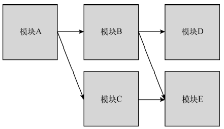
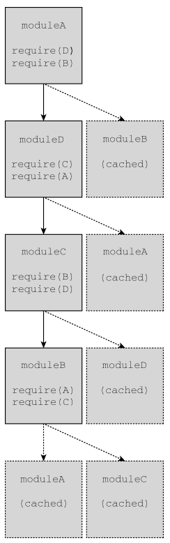
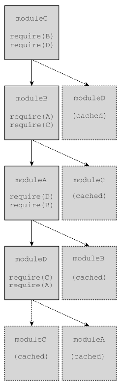

## 理解模块模式

将代码拆分成独立的块，然后再把这些块连接起来可以通过模块模式来实现。这种模式背后的思想 很简单：**把逻辑分块，各自封装，相互独立，每个块自行决定对外暴露什么，同时自行决定引入执行哪 些外部代码**。不同的实现和特性让这些基本的概念变得有点复杂，但这个基本的思想是所有 JavaScript 模块系统的基础。

### 模块标识符

模块标识符是所有模块系统通用的概念。**模块系统本质上是键/值实体，每个模块都会与某个唯一的标识符关联，该标识符可用于检索模块**。这个标识符在模拟模块的系统中可能是字符串，在原生实现的模块系统中可能是模块文件的实际路径

有的模块系统支持明确声明模块的标识，还有的模块系统会隐式地使用文件名作为模块标识符。不管怎样，完善的模块系统一定不会存在模块标识冲突的问题，且系统中的任何模块都应该能够无歧义地引用其他模块

**将模块标识符解析为实际模块的过程要根据模块系统对标识符的实现**。**原生浏览器模块标识符必须 提供实际 JavaScript 文件的路径**。除了文件路径，Node.js 还会搜索 node_modules 目录，用标识符去匹配 包含 index.js 的目录

### 模块依赖

**模块系统的核心是管理依赖**。指定依赖的模块与周围的环境会达成一种契约。本地模块向模块系统声明一组外部模块（依赖），这些外部模块对于当前模块正常运行是必需的。**模块系统检视这些依赖， 进而保证这些外部模块能够被加载并在本地模块运行时初始化所有依赖。**

### 模块加载

加载模块的概念派生自依赖契约。当一个外部模块被指定为依赖时，本地模块期望在执行它时，依赖已准备好并已初始化。 

在浏览器中，加载模块涉及几个步骤。加载模块涉及执行其中的代码，但**必须是在所有依赖都加载并执行之后**。如果浏览器没有收到依赖模块的代码，则必须发送请求并等待网络返回。收到模块代码之 后，浏览器必须确定刚收到的模块是否也有依赖。然后**递归地评估并加载所有依赖**，直到所有依赖模块都加载完成。**只有整个依赖图都加载完成，才可以执行入口模块**

### 入口

相互依赖的模块必须指定一个模块作为入口（entry point），这也是代码执行的起点。这是理所当然的，因为 JavaScript 是顺序执行的，并且是单线程的，所以代码必须有执行的起点。**入口模块也可能依赖其他模块，其他模块同样可能有自己的依赖。于是模块化 JavaScript 应用程序的所有模块会构成依赖图**。 

可以通过有向图来表示应用程序中各模块的依赖关系



因为模块必须在依赖加载完成后才能被加载，所以这个应用程序的入口模块 A 必须在应用程 序的其他部分加载后才能执行。

在 JavaScript 中，“加载”的概念可以有多种实现方式。因为模块是作为包含将立即执行的 JavaScript 代码的文件实现的，所以一种可能是按照依赖图的要求依次请求各个脚本。对于前面的应用程序来说，下面的脚本请求顺序能够满足依赖图的要求

```
<script src="moduleE.js"></script> 
<script src="moduleD.js"></script> 
<script src="moduleC.js"></script> 
<script src="moduleB.js"></script> 
<script src="moduleA.js"></script>
```

**模块加载是“阻塞的”，这意味着前置操作必须完成才能执行后续操作**。每个模块在自己的代码到达浏览器之后完成加载，此时其依赖已经加载并初始化。不过，这个策略存在一些性能和复杂性问题。为 一个应用程序而按顺序加载五个 JavaScript 文件并不理想，并且手动管理正确的加载顺序也颇为棘手

### 异步依赖

因为 JavaScript 可以异步执行，所以如果能按需加载就好了。换句话说，可以让 JavaScript 通知模块系统在必要时加载新模块，并在模块加载完成后提供回调。在代码层面，可以通过下面的伪代码来实现

```
// 在模块 A 里面
load('moduleB').then(function(moduleB) { 
 moduleB.doStuff(); 
}); 
```

模块 A 的代码使用了 moduleB 标识符向模块系统请求加载模块 B，并以模块 B 作为参数调用回调。 模块 B 可能已加载完成，也可能必须重新请求和初始化，但这里的代码并不关心。这些事情都交给了模块加载器去负责。 

如果重写前面的应用程序，只使用动态模块加载，那么使用一个 `<script` 标签即可完成模块 A 的 加载。模块 A 会按需请求模块文件，而不会生成必需的依赖列表。这样有几个好处，其中之一就是性能， 因为在页面加载时只需同步加载一个文件

### 动态依赖

有些模块系统要求开发者在模块开始列出所有依赖，而有些模块系统则允许开发者在程序结构中动 态添加依赖。动态添加的依赖有别于模块开头列出的常规依赖，这些依赖必须在模块执行前加载完毕。

```
if (loadCondition) { 
 require('./moduleA'); 
}
```

在这个模块中，是否加载 moduleA 是运行时确定的。加载 moduleA 时可能是阻塞的，也可能导致 执行，且只有模块加载后才会继续。无论怎样，模块内部的代码在 moduleA 加载前都不能执行，因为 moduleA 的存在是后续模块行为正确的关键。 

动态依赖可以支持更复杂的依赖关系，但代价是增加了对模块进行静态分析的难度。

（这里动态依赖和异步依赖的区别，应该是异步依赖是肯定会加载的，而动态依赖则是根据条件，不一定会加载）

### 静态分析

模块中包含的发送到浏览器的 JavaScript 代码经常会被静态分析，**分析工具会检查代码结构并在不实际执行代码的情况下推断其行为**。**对静态分析友好的模块系统可以让模块打包系统更容易将代码处理为较少的文件**

更复杂的模块行为，例如动态依赖，会导致静态分析更困难。不同的模块系统和模块加载器具有不同层次的复杂度。

至于模块的依赖，额外的复杂度会导致相关工具更难预测模块在执行时到底需要哪些依赖

### 循环依赖

要构建一个没有循环依赖的 JavaScript 应用程序几乎是不可能的，因此包括 CommonJS、AMD 和 ES6 在内的所有模块系统都支持循环依赖。在包含循环依赖的应用程序中，模块加载顺序可能会出人意料。不过，只要恰当地封装模块，使它们没有副作用，加载顺序就应该不会影响应用程序的运行。

在下面的模块代码中，任何模块都可以作为入口模块，即使依赖图中存在循环依赖

```
moduleA
require('./moduleD'); 
require('./moduleB'); 
console.log('moduleA');
----------------------------
moduleB
require('./moduleA'); 
require('./moduleC'); 
console.log('moduleB'); 
----------------------------
moduleC
require('./moduleB'); 
require('./moduleD'); 
console.log('moduleC'); 
----------------------------
moduleD
require('./moduleA'); 
require('./moduleC'); 
console.log('moduleD'); 
```

修改主模块中用到的模块会改变依赖加载顺序。如果 moduleA 最先加载，则会打印如下输出，这 表示模块加载完成时的绝对顺序

moduleB  moduleC  moduleD  moduleA

以上模块加载顺序可以用依赖图来表示，其中加载器会执行深度优先的依赖加载



(加载A，A要D、B，先加载D，D要C、A，先加载C，C要B、D，先加载B，B要A、C，都已经加载了，加载B完成，接着加载D，D已经加载完成了，所以加载C完成。。。。。。。。)

如果 moduleC 最先加载，则会打印如下输出，这表示模块加载的绝对顺序

moduleD  moduleA  moduleB  moduleC

以上模块加载顺序可以用依赖图来表示，其中加载器会执行深度优先的依赖加载



## 凑合的模块系统

为按照模块模式提供必要的封装，ES6 之前的模块有时候会**使用函数作用域和立即调用函数表达式 （IIFE，Immediately Invoked Function Expression）将模块定义封装在匿名闭包中**。模块定义是立即执行的

```
(function() { 
 // 私有 Foo 模块的代码
 console.log('bar'); 
})(); 
// bar
```

如果把这个模块的返回值赋给一个变量，那么实际上就为模块创建了命名空间（就是给了模块一个标识符，对吗？）

```
var Foo = (function() { 
 console.log('bar'); 
})(); 
'bar'
```

为了暴露公共 API，模块 IIFE 会返回一个对象，其属性就是模块命名空间中的公共成员

```
var Foo = (function() { 
 return { 
 bar: 'baz', 
 baz: function() { 
 console.log(this.bar); 
 } 
 }; 
})(); 
console.log(Foo.bar); // 'baz' 
Foo.baz(); // 'baz'
```

在模块内部也可以定义模块，这样可以实现命名空间嵌套

```
var Foo = (function() { 
 return { 
 bar: 'baz' 
 }; 
})(); 
Foo.baz = (function() { 
 return { 
 qux: function() { 
 console.log('baz'); 
 } 
 }; 
})(); 
console.log(Foo.bar); // 'baz' 
Foo.baz.qux(); // 'baz'
```

当然，自己动手写模块系统确实非常有意思，但实际开发中并不建议这么做，因为不够可靠

## CommonJS 

在 ES6 原生支持模块之前，使用模块的 JavaScript 代码本质上是希望使用默认没有的语言特性。因 此，**必须按照符合某种规范的模块语法来编写代码，另外还需要单独的模块工具把这些模块语法与 JavaScript 运行时连接起来**。

CommonJS 规范概述了同步声明依赖的模块定义。这个规范主要用于在服务器端实现模块化代码组织，但也可用于定义在浏览器中使用的模块依赖。CommonJS 模块语法不能在浏览器中直接运行。

CommonJS 模块定义需要使用 require()指定依赖，而使用 exports 对象定义自己的公共 API。 

下面的代码展示了简单的模块定义

moduleA

```
var moduleB = require('./moduleB'); 
module.exports = { 
 stuff: moduleB.doStuff(); 
}; 
```

moduleA 通过使用模块定义的相对路径来指定自己对 moduleB 的依赖。什么是“模块定义”，以及 如何将字符串解析为模块，完全取决于模块系统的实现。比如在 Node.js 中，模块标识符可能指向文件， 也可能指向包含 index.js 文件的目录

请求模块会加载相应模块，而把模块赋值给变量也非常常见，但赋值给变量不是必需的。

调用 require()意味着模块会原封不动地加载进来

moduleA

```
console.log('moduleA'); 
```

`require('./moduleA'); // "moduleA"`

**无论一个模块在 require()中被引用多少次，模块永远是单例**。在下面的例子中，moduleA 只会被打印一次。这是因为无论请求多少次，moduleA 只会被加载一次

```
var a1 = require('./moduleA'); 
var a2 = require('./moduleA');
console.log(a1 === a2); 

// "moduleA"
// true
```

**模块第一次加载后会被缓存，后续加载会取得缓存的模块**。模块加载顺序由依赖图决定

在 CommonJS 中，模块加载是模块系统执行的同步操作。因此 require()可以像下面这样以编程 方式嵌入在模块中

```
console.log('moduleA'); 
if (loadCondition) { 
 require('./moduleA'); 
} 
```

这里，moduleA 只会在 loadCondition 求值为 true 时才会加载。**这个加载是同步的，因此 if() 块之前的任何代码都会在加载 moduleA 之前执行，而 if()块之后的任何代码都会在加载 moduleA 之 后执行**。同样，加载顺序规则也会适用。因此，如果 moduleA 已经在前面某个地方加载过了，这个条 件 require()就意味着只暴露 moduleA 这个命名空间而已