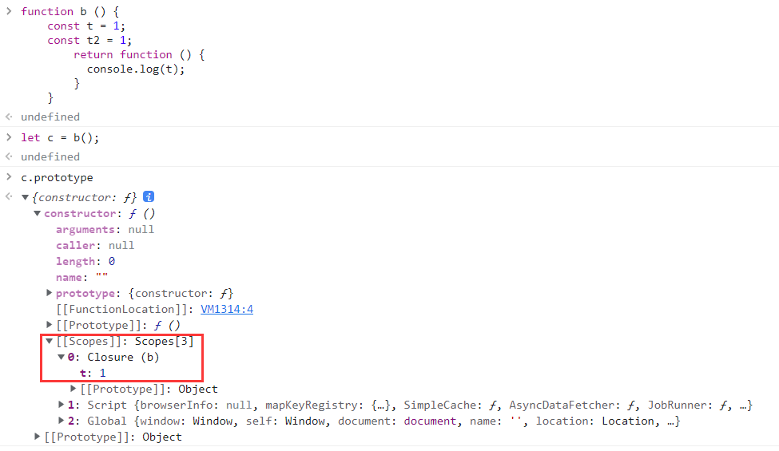
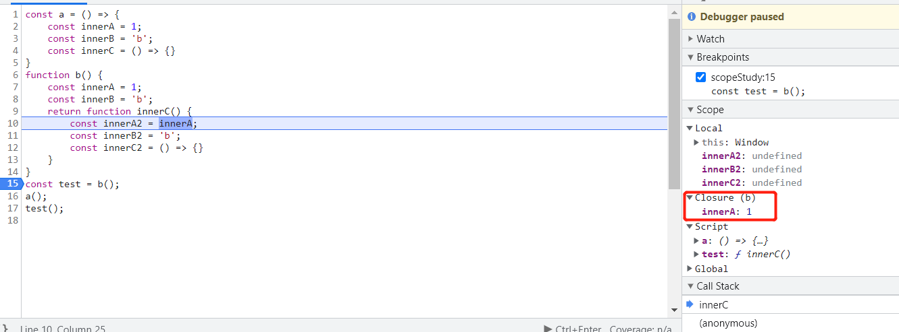
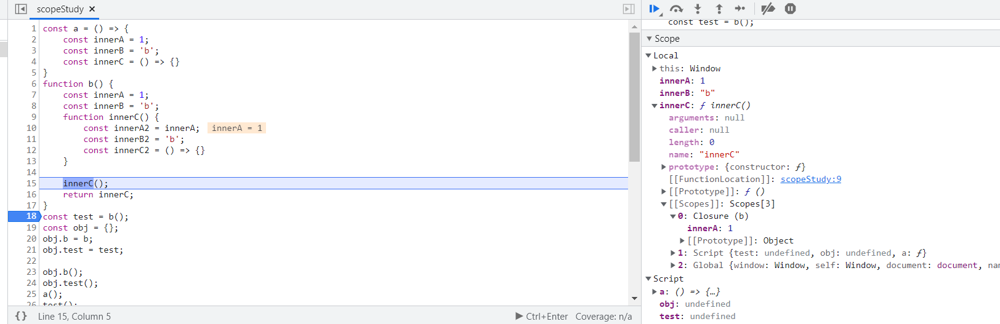
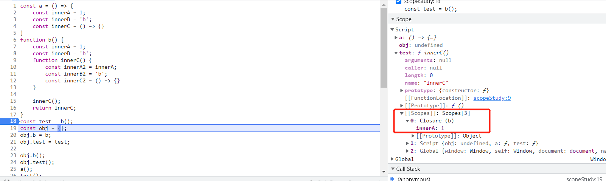

### 定义

闭包指的是那些**引用了另一个函数作用域中变量的函数**，（即便引用const a = 1这种基本类型，也会产生闭包）通常是在嵌套函数中实现的。

```js
function createComparisonFunction(propertyName) { 
 return function(object1, object2) { 
 let value1 = object1[propertyName]; 
 let value2 = object2[propertyName]; 
 if (value1 < value2) { 
 return -1; 
 } else if (value1 > value2) { 
 return 1; 
 } else { 
 return 0; 
 } 
 }; 
} 
```

这里加粗的代码位于内部函数（匿名函数）中，其中引用了外部函数的变量 propertyName。在这 个内部函数被返回并在其他地方被使用后，它仍然引用着那个变量。这是因为内部函数的作用域链包含 createComparisonFunction()函数的作用域。

在调用一个函数时，会为这个函数调用创建一个执行上下文，并创建一个作用域链。然后用 arguments 和其他命名参数来初始化这个函数的活动对象。**外部函数的活动对象是内部函数作用域链上的第二个对象**。这个作用域链一直向外串起了所有包含函数的活动对象，直到全局执行上下文才终止

```js
function compare(value1, value2) { 
 if (value1 < value2) { 
 return -1; 
 } else if (value1 > value2) { 
 return 1; 
 } else { 
 return 0; 
 } 
} 
let result = compare(5, 10); 
```

这里定义的 compare()函数是在全局上下文中调用的。第一次调用 compare()时，会为它创建一 个包含 arguments、value1 和 value2 的活动对象，这个对象是其作用域链上的第一个对象。而全局 上下文的变量对象则是 compare()作用域链上的第二个对象，其中包含 this、result 和 compare

**函数执行时, 每个执行上下文中都会有一个包含其中变量(和函数)的对象**。全局上下文中的叫变量对象，它会在代码执行期间始终存在。而**函数局部上下文中的叫活动对象，只在函数执行期间存在**。在**定义** compare()函数时，就会为它创建作用域链，预装载全局变量对象，并保存在内部的[[Scope]]中。在**调用**这个函数时，**会创建相应的执行上下文，然后通过复制函数的[[Scope]]来创建其作用域链。接着会创建函数的活动对象（用作变量对象）并将其推入作用域链的前端**。在这个例子中(第二段代码)，这意味着 compare() 函数执行上下文的作用域链中有两个变量对象：局部变量对象和全局变量对象。作用域链其实是一个包含指针的列表，每个指针分别指向一个变量对象。函数执行完毕后，执行上下文会销毁，内部声明的所有变量，包括局部活动对象会被销毁，内存中就只剩下全局作用域。


但是，**在一个函数内部定义的函数会把其包含函数的活动对象添加到自己的作用域链中**。因此，在 createComparisonFunction()函数中，匿名函数的作用域链中实际上包含 createComparisonFunction()的活动对象

```js
let compare = createComparisonFunction('name'); 
let result = compare({ name: 'Nicholas' }, { name: 'Matt' }); 
```


在 createComparisonFunction()返回匿名函数后，**它的作用域链被初始化为包含 createComparisonFunction()的活动对象和全局变量对象。这样，匿名函数就可以访问到 createComparisonFunction()可以访问的所有变量**。另一个有意思的副作用就是，createComparisonFunction()的 活动对象并不能在它执行完毕后销毁，因为匿名函数的作用域链中仍然有对它的引用。**在 createComparisonFunction()执行完毕后，其执行上下文的作用域链会销毁，但它的活动对象仍然会保留 在内存中，直到匿名函数被销毁后才会被销毁（因为其活动对象被闭包的作用域链引用了。这里的销毁应该是指语义上的销毁，即表示引用为0，对象可以被垃圾回收）**

`但它的活动对象仍然会保留在内存中`这句话不清楚对不对。设外部函数有a和b两个变量，内部函数引用了a，在内部函数的Closure中只看得到a，看不到b



```js
// 创建比较函数
let compareNames = createComparisonFunction('name'); 
// 调用函数
let result = compareNames({ name: 'Nicholas' }, { name: 'Matt' }); 
// 解除对函数的引用，这样就可以释放内存了
compareNames = null; 
```

这里，创建的比较函数被保存在变量 compareNames 中。把 compareNames 设置为等于 null 会 **解除对函数的引用，从而让垃圾回收程序可以将内存释放掉。作用域链也会被销毁，其他作用域（除全 局作用域之外）也可以销毁**。图 10-2 展示了调用 compareNames()之后作用域链之间的关系。

总结-闭包出现的原因：

1. 函数**定义时，就会创建作用域链**，装入除了自己的活动对象外的变量对象和活动对象。（闭包定义之后，包含函数的活动对象就无法销毁，这也说明了在函数定义时就会创建作用域链）

2. 调用包含函数，返回内部匿名函数，保存在变量compareNames中，如果不手动解除引用，返回的函数的定义就会一直存在，因此其包含函数的活动对象也会一直存在于返回的函数的作用域链中

3. 如果不使用匿名函数，返回一个function，也是会闭包的，重点不是匿名不匿名，重点是：**返回**一个函数，这个函数**引用**了**另一个函数作用域内的变量**，如下方（无闭包）例子，

   1. ```js
      let val = 7
       function createAdder() {
         function addNumbers(a, b) {
           let ret = a + b
           return ret
         }
        return addNumbers
      }
      let adder = createAdder()
      let sum = adder(val, 8)
      console.log('example of function returning a function: ', sum)
      ```

   2. 在`createAdder`执行上下文中创建一个变量`addNumbers`。`addnumber`只存在于`createAdder`执行上下文中。我们将函数定义存储在名为 ``addNumbers`` 的自有变量中

   3. 返回时，`createAdder`执行上下文将被销毁（注意，这里是没闭包的，单纯返回一个函数定义）。**`addNumbers` 变量不再存在**。**但`addNumbers`函数定义仍然存在**，因为它返回并赋值给了`adder` 变量(这里的销毁，我理解为语义上的销毁，即不再被引用，可以被垃圾回收，所以即使执行上下文销毁了，保存在堆中的函数定义（这里把函数换成对象也说得通）却还能存在，因为它有了新的引用)


### this对象

在闭包中使用 this 会让代码变复杂。

对于内部函数的this，一般情况是这样的：如果没有使用箭头函数定义，则 this 对象会在运行时绑定到执行函数的上下文。如果在全局函数中调用，则 this 在非严格模式下等于 window，在严 格模式下等于 undefined。如果作为某个对象的方法调用，则 this 等于这个对象。

**在某对象上调用包含函数，包含函数返回一个内部标准函数，此时内部函数的this不会指向这个对象**

**如果是箭头函数，就会指向该对象了**

```js
window.identity = 'The Window'; 
let object = { 
 identity: 'My Object', 
 getIdentityFunc() { 
 return function() { 
 return this.identity; 
 }; 
 } 
}; 
console.log(object.getIdentityFunc()()); // 'The Window'

window.identity = 'The Window'; 
let object = { 
 identity: 'My Object', 
 getIdentityFunc() { 
 return () => { 
 return this.identity; 
 }; 
 } 
}; 
console.log(object.getIdentityFunc()()); // 'The Window'
```

==简单地说：==

上方要表达的意思是：**内部函数的this指向与包含函数的指向不一定不同**，返回的函数相当于一个独立的函数，其this指向取决于其声明方式，标准 or 箭头，相当于下方代码

`object.getIdentityFunc()()  相当于`

`const temp = object.getIdentityFunc()`

`temp()`

这里先创建了一个全局变量 identity，之后又创建一个包含 identity 属性的对象。这个对象还 包含一个 getIdentityFunc()方法，返回一个匿名函数。这个匿名函数返回 this.identity。因为 getIdentityFunc()返回函数，所以 **object.getIdentityFunc()()**会立即调用这个返回的函数， 从而得到一个字符串。

前面介绍过，每个函数在被调用时都会自动创建两个特殊变量：this 和 arguments。内部函数永远不可能直接访问外部函数的这两个变量(个人理解：返回的函数是独立的，有自己的作用域，直接访问会访问到自己的this，而且没提供访问外部函数的这两个变量的途径)。但是，**如果把 this 保存到闭包可以访问的另一个变量中， 则是行得通的**

```js
window.identity = 'The Window'; 
let object = { 
 identity: 'My Object', 
 getIdentityFunc() { 
 let that = this; 
 return function() { 
 return that.identity; 
 }; 
 } 
}; 
console.log(object.getIdentityFunc()()); // 'My Object'
```

在定义匿名函数之前，先把外部函数的 this 保存 到变量 that 中。然后在定义闭包时，就可以让它访问 that，**因为这是包含函数中名称没有任何冲突的 一个变量**。

### 内存泄漏

由于 IE 在 IE9 之前对 JScript 对象和 COM 对象使用了不同的垃圾回收机制（第 4 章讨论过），所以 闭包在这些旧版本 IE 中可能会导致问题。在这些版本的 IE 中，把 HTML 元素保存在某个闭包的作用域 中，就相当于宣布该元素不能被销毁。

```js
function assignHandler() { 
 let element = document.getElementById('someElement'); 
 element.onclick = () => console.log(element.id); 
} 
```


### 闭包的应用

#### 定义能够访问私有方法和变量的公有函数（**特权方法**）

任何在函数中定义的变量，都可以认为是私有变量，因为不能在函数外部访问这些变量。私有变量包括函数的参数、局部变量和函数内定义的其他函数。

把有权访问私有变量的公有方法称为**特权方法（privileged method）**。

```
function MyObject() { 
 // 私有变量和私有函数 
 let privateVariable = 10; 
 function privateFunction() { 
 return false; 
 } 
 // 特权方法
 this.publicMethod = function() { 
 privateVariable++; 
 return privateFunction(); 
 }; 
}
```

```
function Person(name) { 
 this.getName = function() { 
 return name; 
 }; 
 this.setName = function (value) { 
 name = value; 
 }; 
} 
let person = new Person('Nicholas'); 
console.log(person.getName()); // 'Nicholas' 
person.setName('Greg'); 
console.log(person.getName()); // 'Greg' 
```

（因为构造函数的原理是，将构造函数内部的this置为新创建的对象，然后执行构造函数内部的代码，因此用this定义的会在新对象上，并返回，而其他的不会出现在新对象上）

#### 给setTimeout传参

IE9 及更早的 IE 浏览器不支持向setTimeout回调函数传递额外参数，这时候可以用闭包来实现

```
function func(param){
    return function(){
        alert(param)
    }
}

setTimeout(func(1),1000);
```

#### 防抖、节流

#### 单例模式

#### 深拷贝

### 闭包的缺点

内存泄漏

## 关于闭包返回的内部函数锁住的是外部函数的所有变量还是仅仅部分变量

根据上方来自高程4的笔记，是外部函数整个活动变量都会在闭包函数的作用域链中

但根据我自己debug，闭包函数的作用域链中，仅有部分变量（不过，就算只是在b()中调用innerC而不返回，在调用时，也能看到和下图一样的效果，即有Closure，其内部也只有InnerA，如下方第二张图。这可不可以说明其实闭包就是包含整个活动对象？）





## 关于在函数定义时就会创建作用域链（除了自身的活动对象外）

例如闭包函数，只有在定义时创建作用域链，才能在还没调用前，保留住包含函数的活动对象不被销毁

