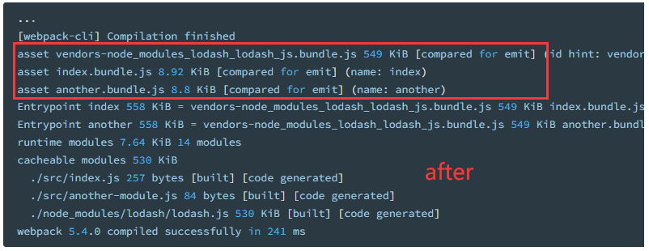

此特性能够把代码分离到不同的 bundle 中，然后可以按需加载或并行加载这些文件。

代码分离可以用于获取更小的 bundle，以及控制资源加载优先级，如果使用合理，会极大影响加载时间

# 代码分离方法

- **入口起点**：使用 [`entry`](https://webpack.docschina.org/configuration/entry-context) 配置手动地分离代码。
- **防止重复**：使用 [Entry dependencies](https://webpack.docschina.org/configuration/entry-context/#dependencies) 或者 [`SplitChunksPlugin`](https://webpack.docschina.org/plugins/split-chunks-plugin) 去重和分离 chunk。
- **动态导入**：通过模块的内联函数调用来分离代码。

## 入口起点(entry point)

缺点：手动配置多，有隐患：

- 如果入口 chunk 之间包含一些重复的模块，那些重复模块都会被引入到各个 bundle 中。
- 这种方法不够灵活，并且不能动态地将核心应用程序逻辑中的代码拆分出来。

## 防止重复(prevent duplication)

### 入口依赖

配置 [`dependOn` option](https://webpack.docschina.org/configuration/entry-context/#dependencies) 选项，这样可以在多个 chunk 之间共享模块

```diff
const path = require('path');

 module.exports = {
   mode: 'development',
   entry: {
-    index: './src/index.js',
-    another: './src/another-module.js',
+    index: {
+      import: './src/index.js',
+      dependOn: 'shared',
+    },
+    another: {
+      import: './src/another-module.js',
+      dependOn: 'shared',
+    },
+    shared: 'lodash',
   },
   output: {
     filename: '[name].bundle.js',
     path: path.resolve(__dirname, 'dist'),
   },
 };
```

尽管可以在 webpack 中允许每个页面使用多入口，应尽可能避免使用多入口的入口：`entry: { page: ['./analytics', './app'] }`。如此，在使用 `async` 脚本标签时，会有更好的优化以及一致的执行顺序

### SplitChunksPlugin

[`SplitChunksPlugin`](https://webpack.docschina.org/plugins/split-chunks-plugin) 插件可以将公共的依赖模块提取到已有的入口 chunk 中，或者提取到一个新生成的 chunk。

```diff
 const path = require('path');

  module.exports = {
    mode: 'development',
    entry: {
      index: './src/index.js',
      another: './src/another-module.js',
    },
    output: {
      filename: '[name].bundle.js',
      path: path.resolve(__dirname, 'dist'),
    },
+   optimization: {
+     splitChunks: {
+       chunks: 'all',
+     },
+   },
  };
```

插件将 `lodash` 分离到单独的 chunk，并且将其从 index bundle 中移除，减轻了大小。执行 `npm run build` 查看效果




## 动态导入(dynamic import)