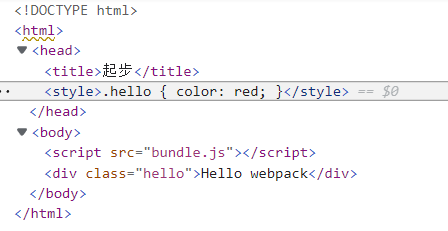

# 什么是webpack

官网：

> 本质上，*webpack* 是一个现代 JavaScript 应用程序的**静态模块打包器**(module bundler)*。当 webpack 处理应用程序时，它会递归地构建一个*依赖关系图(dependency graph)，其中包含应用程序需要的每个模块，然后将所有这些模块打包成一个或多个 *bundle*。

简单地说：webpack是一个模块打包工具，只需要通过简单的配置，便可以完成模块的加载和打包


webpack支持以各种方式表达的模块依赖关系，包括

- [ES2015 `import`](https://developer.mozilla.org/en-US/docs/Web/JavaScript/Reference/Statements/import) 语句
- [CommonJS](http://www.commonjs.org/specs/modules/1.0/) `require()` 语句
- [AMD](https://github.com/amdjs/amdjs-api/blob/master/AMD.md) `define` 和 `require` 语句
- css/sass/less 文件中的 [`@import` 语句](https://developer.mozilla.org/en-US/docs/Web/CSS/@import)。
- 样式(`url(...)`)或 HTML 文件(``)中的图片链接(image url)

也就是说，上方这些都能算是webpack模块

#### 什么是模块？

即js模块，把逻辑分块，各自封装，相互独立，每个块自行决定对外暴露什么，同时自行决定引入执行哪些外部代码

## 入口(entry)

入口起点(entry point)指示 webpack 应该使用哪个模块，来作为**构建其内部依赖图的开始**。进入入口起点后，webpack 会找出有哪些模块和库是**入口起点（直接和间接）依赖的**。

**每个依赖项随即被处理**，最后输出到称之为 *bundles* 的文件中

可以通过在 [webpack 配置](https://www.webpackjs.com/configuration)中配置 `entry` 属性，来指定一个入口起点（或多个入口起点）。默认值为 `./src`。

```
module.exports = {
  entry: './path/to/my/entry/file.js'
};
```

多入口文件，就是会生成多个bundles，比如app.js引用了test.js，只有app作为入口的话，只会生成一个bundles。把test也作为一个入口的话，就会有两个bundles，这样有啥好处？能复用？？

## 出口(output)

**output** 属性告诉 webpack 在哪里输出它所创建的 *bundles*，以及如何命名这些文件，默认值为 `./dist`。基本上，整个应用程序结构，都会被编译到你指定的输出路径的文件夹中。(dist是构建过程产生的代码最小化和优化后的“输出”目录)

可以存在多个`入口`起点，但只能指定一个`输出`配置。

你可以通过在配置中指定一个 `output` 字段，来配置这些处理过程：

```
module.exports = {
  entry: './path/to/my/entry/file.js',
  output: {
    path: '/home/proj/public/assets',
    filename: 'my-first-webpack.bundle.js'
  }
};
```

## loader

*loader* 让 webpack 能够去处理那些非 JavaScript 文件（webpack 自身只理解 JavaScript）。**loader 可以将所有类型的文件转换为 webpack 能够处理的有效[模块](https://www.webpackjs.com/concepts/modules)**，然后你就可以利用 webpack 的打包能力，对它们进行处理。

本质上，webpack loader 将所有类型的文件，转换为应用程序的依赖图（和最终的 bundle）可以直接引用的模块。(将文件从不同的语言（如 TypeScript）转换为 JavaScript，或将内联图像转换为 data URL)

在 webpack 的配置中 **loader** 有两个目标：

1. `test` 属性，用于标识出应该被对应的 loader 进行转换的某个或某些文件。
2. `use` 属性，表示进行转换时，应该使用哪个 loader。

```
{
  output: {
    filename: 'my-first-webpack.bundle.js'
  },
  module: {
    rules: [
      { test: /\.txt$/, use: 'raw-loader' }
    ]
  }
};
```

这告诉 webpack 编译器(compiler) 如下信息：

> “嘿，webpack 编译器，当你碰到「在 `require()`/`import` 语句中被解析为 '.txt' 的路径」时，在你对它打包之前，先**使用** `raw-loader` 转换一下。”

正因为如此，才能在js文件中使用诸如 `import './style.css'`导入css文件或导入图片等资源文件。

（当导入css的js模块运行时，含有 CSS 字符串的 `<style>` 标签，将被插入到 html 文件的 `<head>` 中。可通过检查页面元素（而非页面源代码）来确认）（只要用import引入了，或者是依赖的import引入了，就会插入head中）



若导入了一个图片资源

现在，当你 `import MyImage from './my-image.png'`，该图像将被处理并添加到 `output` 目录，_并且_ `MyImage` 变量将包含**该图像在处理后的最终 url**。当使用 [css-loader](https://www.webpackjs.com/loaders/css-loader) 时，如上所示，你的 CSS 中的 `url('./my-image.png')` 会使用类似的过程去处理。**loader 会识别这是一个本地文件，并将 `'./my-image.png'` 路径，替换为`输出`目录中图像的最终路径**。[html-loader](https://www.webpackjs.com/loaders/html-loader) 以相同的方式处理

## 插件(plugins)

loader 被用于转换某些类型的模块，而插件则可以用于执行范围更广的任务。插件的范围包括，从打包优化和压缩，一直到重新定义环境中的变量。[插件接口](https://www.webpackjs.com/api/plugins)功能极其强大，可以用来处理各种各样的任务。

想要使用一个插件，你只需要 `require()` 它，然后把它添加到 `plugins` 数组中。多数插件可以通过选项(option)自定义。你也可以在一个配置文件中因为不同目的而多次使用同一个插件，这时需要通过使用 `new` 操作符来创建它的一个实例

```js
const HtmlWebpackPlugin = require('html-webpack-plugin'); // 通过 npm 安装
const webpack = require('webpack'); // 用于访问内置插件

const config = {
  module: {
    rules: [
      { test: /\.txt$/, use: 'raw-loader' }
    ]
  },
  plugins: [
    new HtmlWebpackPlugin({template: './src/index.html'}) // 由于插件可以携带参数/选项，你必须在 webpack 配置中，向 plugins 属性传入 new 实
  ]
};

module.exports = config;
```

### 剖析

```javascript
const pluginName = 'ConsoleLogOnBuildWebpackPlugin';

class ConsoleLogOnBuildWebpackPlugin {
    apply(compiler) {
        compiler.hooks.run.tap(pluginName, compilation => {
            console.log("webpack 构建过程开始！");
        });
    }
}
```

compiler hook 的 tap 方法的第一个参数，应该是驼峰式命名的插件名称。建议为此使用一个常量，以便它可以在所有 hook 中复用。

## 模式

通过选择 `development` 或 `production` 之中的一个，来设置 `mode` 参数，你可以启用相应模式下的 webpack 内置的优化

```javascript
module.exports = {
  mode: 'production'
};
```

## manifest

在使用 webpack 构建的典型应用程序或站点中，有三种主要的代码类型：

1. 你或你的团队编写的源码。
2. 你的源码会依赖的任何第三方的 library 或 "vendor" 代码。
3. webpack 的 runtime 和 **manifest**，管理所有模块的交互。

### runtime

runtime，以及伴随的 manifest 数据，主要是指：在浏览器运行过程中，webpack 用来`连接模块化应用程序`所需的所有代码。它包含**在模块交互时，连接模块所需的加载和解析逻辑**。包括：已经加载到浏览器中的`连接模块逻辑`，以及`尚未加载模块`的`延迟加载逻辑`。

### manifest

简单地说：manifest保留所有模块的详细要点，runtime 会通过 manifest 来解析和加载模块（更具体地，通过使用 manifest 中的数据，runtime 将能够检索转换后的模块标识符，找出每个标识符背后对应的模块）

在你的应用程序中，形如 `index.html` 文件、一些 bundle 和各种资源，都必须以某种方式加载和链接到应用程序，一旦被加载到浏览器中。在经过打包、压缩、`为延迟加载而拆分为细小的 chunk` 这些 webpack [`优化`](https://v4.webpack.docschina.org/configuration/optimization/) 之后，你精心安排的 `/src` 目录的文件结构都已经不再存在。所以 webpack 如何管理所有所需模块之间的交互呢？(即webpack如何处理编译后的文件之间的交互)这就是 manifest 数据用途的由来

当 compiler 开始执行、解析和映射应用程序时，它会保留所有模块的详细要点。这个数据集合称为 "manifest"，当完成打包并发送到浏览器时，runtime 会通过 manifest 来解析和加载模块。

无论你选择哪种 [模块语法](https://v4.webpack.docschina.org/api/module-methods)，那些 `import` 或 `require` 语句现在都已经转换为 `__webpack_require__` 方法，此方法指向模块标识符(module identifier)。通过使用 manifest 中的数据，runtime 将能够检索这些标识符，找出每个标识符背后对应的模块