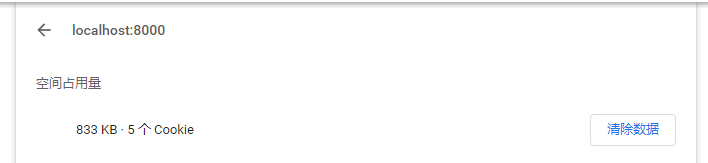

### 什么是cookie

- **HTTP 是无状态的协议（对于事务处理没有记忆能力，每次客户端和服务端会话完成时，服务端不会保存任何会话信息**）：每个请求都是完全独立的，服务端无法确认当前访问者的身份信息，无法分辨上一次的请求发送者和这一次的发送者是不是同一个人。所以服务器与浏览器为了进行会话跟踪（知道是谁在访问我，例如保留登录凭证），就必须主动的去维护一个状态，这个状态用于告知服务端前后两个请求是否来自同一浏览器。而这个状态可以通过 cookie 实现

- cookie是存储在浏览器（即客户端）上的一小段数据，浏览器通过HTTP协议和服务器端进行Cookie交互。

- **cookie 是不可跨域的：** 每个 cookie 都会绑定单一的域名，无法在别的域名下获取使用，**一级域名和二级域名之间是允许共享使用的**（**靠的是 domain）**。

- 第一次访问网站的时候，浏览器发出请求，服务器接收到请求后，会将cookie放在响应信息中返回给浏览器。当客户端再次发送http请求时，浏览器会先检查下是否有对应的cookie。有的话，则**自动**地添加在request header中的cookie字段。注意，每一次的http请求时，如果有cookie，浏览器都会**自动**带上cookie发送给服务端。

  总之，cookie就是用来在服务器和浏览器之间进行信息传递的

### cookie的属性

document.cookie可用于查看cookie。cookie是一个由键值对构成的字符串（name=value），每个键值对之间是“; ”即一个分号和一个空格隔开。

每个cookie都有一定的属性，如什么时候失效，要发送到哪个域名，哪个路径等等。这些属性是通过cookie选项来设置的，cookie选项包括：**expires、domain、path、secure、HttpOnly**。在设置任一个cookie时都可以设置相关的这些属性，当然也可以不设置，这时会使用这些属性的默认值。在设置这些属性时，属性之间由一个分号和一个空格隔开

`"key=name; expires=Sat, 08 Sep 2018 02:26:00 GMT; domain=ppsc.sankuai.com; path=/; secure; HttpOnly"`

#### **expires**:

过期时间，在设置的这个时间点后该 cookie 就会失效。如果没有设置该选项，当关闭浏览器结束这个会话的时候，这个 cookie 也就会被删除。

#### **maxAge**(比expires更常用):

以秒为单位。默认为-1。

Max-Age为正数时，cookie会在Max-Age秒之后被删除。

当Max-Age为负数时，表示是临时储存，不会生出cookie文件，只会存在浏览器内存中，且只会在打开的浏览器窗口或者子窗口有效，一旦浏览器关闭，cookie就会消失。

当Max-Age为0时，会删除cookie，因为cookie机制本身没有设置删除cookie，失效的cookie会被浏览器自动从内存中删除，所以，它实现的就是让cookie失效

#### **Domain**

指cookie绑定的域名，如果没有设置，就会自动绑定到当前域，还有值得注意的点，默认情况下，同一个域名下的二级域名是不可以交换使用cookie的，比如设置`www.baidu.com`和`image.baidu.com`，依旧是不能公用的

如果希望cookie可以在子网站中共享，可以使用该属性。例如设置Domain为 `.bigsite.com` ,则`sub1.bigsite.com`和`sub2.bigsite.com`都可以访问已保存在客户端的cookie，**这时还需要将Path设置为/**

#### **Path**

指定 cookie 在哪个路径（路由）下生效。
如果设置为 `/abc`，**则只有 `/abc` 下的路由可以访问到该 cookie，如：`/abc/read`**

根据 HTTP 标准 RFC6265，没有指定 set-cookie 的 path 属性时，默认为请求 url 的路径。

例如：请求`http://example.com/api?id=1`，那么 path 默认是 "/api"。

Domain是域名，Path是路径，两者加起来就构成了 URL，Domain和Path一起来限制 cookie 能被哪些 URL 访问。即请求的URL是Domain或其子域、**且**URL的路径是Path或子路径，则都可以访问该cookie

#### **secure**

该 cookie 是否仅被使用安全协议传输。安全协议有 HTTPS，SSL等，在网络上传输数据之前先将数据加密。默认为false。
当 secure 值为 true 时，cookie 在 HTTP 中是无效，在 HTTPS 中才有效。

(只保证 cookie 与服务器之间的数据传输过程加密，而保存在本地的 cookie文件并不加密)

#### **httpOnly**

如果给某个 cookie 设置了 httpOnly 属性，则无法通过 JS 脚本 获取到该 cookie 的信息，也不能进行修改，能有效的防止xss攻击。但还是能通过 Application 中手动修改 cookie，所以不是绝对的安全

### js操作cookie

```js
//读取浏览器中的cookie
console.log(document.cookie);
//写入cookie
document.cookie='myname=laihuamin;path=/;domain=.baidu.com';
```

- 关于写入操作，若name不存在，就会新建，若已存在则会覆盖
- 如果name已存在且该cookie是HttpOnly的，则修改无效
- 如果name相同，但path和domain不同，也会创建一个新的cookie
- 无法用js创建一个httponly的cookie
- 要取消cookie的secure属性，再设置一个同名同域同path无secure的cookie即可
- cookie的格式就是name=value开头，后面附加一系列属性，不支持其他自定义参数，将不会生效。也就是说，一次只能创建一个cookie
- 可通过设置**max-age=0**来立即删除cookie：'test5=laihuamin;domain=.bejson.com;Max-Age=0'

### cookie的缺点

- 每个特定域名下的cookie数量有限，当超过单个域名限制之后，再设置cookie，浏览器就会清除以前设置的cookie（最近最少使用）
- 每次HTTP请求都会发送到服务端，影响传输效率
- 需要自己封装获取、设置、删除cookie的方法

### 其他

- cookie是存储在浏览器（即客户端）上的一小段数据，浏览器通过HTTP协议和服务器端进行Cookie交互。
- cookie独立于语言存在，是由浏览器实现和管理的
- cookie的安全性：不安全。因为它对客户端是可见的，cookie 最终都是以文件形式存放在客户端计算机中，所以查看和修改 cookie 都是很方便的。如果要存一些敏感数据，可以用加密的方式存储。
- cookie的数量限制：每个域名下允许的Cookie是有限制的，根据浏览器这个限制也不同（一般是~~20~~ 50个左右）。Cookie不是越多越好，它会增加宽带，增加流量消耗。
- cookie的大小限制：大多数浏览器支持最大为 4096 字节的 Cookie(单条cookie)，如果 cookie 字符串的长度超过最大限制，则该属性将返回空字符串
- Cookie的交互方式：在客户端和服务器端交互过程中，cookie信息被附加在HTTP消息头中传递（字段名：Cookie），cookie保存的信息都是文本信息，由键/值对组成。
- cookie 存在两种类型：①:你浏览的当前网站本身设置的 cookie ②来自在网页上嵌入广告或图片等其他域来源的 第三方 cookie (网站可通过使用这些 cookie 跟踪你的使用信息)
- cookie 有两种清除方式：①:通过浏览器工具清除 cookie  ②通过设置 cookie 的有效期来清除 cookie（max-age=0，立即清除）
- cookie的创建：1、服务器端创建。2、在客户端的浏览器中用客户端脚本(如javascript)创建。客户端创建的cookie的性质和服务器端创建的cookie一样，可以保存在本地，也可以被传送到服务器端被服务器程序读取。
- js操作cookie
  - https://www.cnblogs.com/Darren_code/archive/2011/11/24/Cookie.html
- cookie需要编码，因为在输入cookie信息时不能包含空格，分号，逗号等特殊符号

