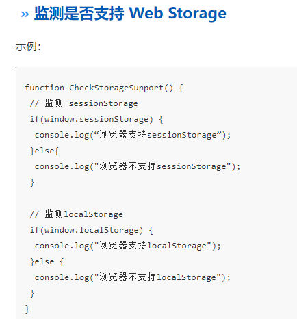

#### 2、Web Storage

Web Storage存储机制是对HTML4中cookie存储机制的一个改善。由于cookie存储机制有很多缺点，HTML5不再使用它，转而使用改良后的Web Storage存储机制。

Web Storage是本地存储，仅在客户端中保存，默认不参与和服务器的通信（cookie每次都会携带在HTTP头中）

共有两种：sessionStorage、localStorage

**生命周期**

- sessionStorage仅在当前会话下有效，关闭页面或浏览器后被清除。会话是指从进入网站到关闭页面或浏览器所经过的这段时间。
- localStorage生命周期是永久，这意味着除非用户显示通过浏览器提供的功能清除localStorage信息，否则这些信息将永远存在。

**作用域**

- 不同浏览器无法共享localStorage或sessionStorage中的信息。
- 相同浏览器的不同页面间可以共享相同的 localStorage（页面属于相同域名和端口），但是不同页面或标签页间无法共享sessionStorage的信息。这里需要注意的是，页面及标签页仅指顶级窗口，如果一个标签页包含多个iframe标签且他们属于同源页面，那么他们之间是可以共享sessionStorage的

**存储大小**：一般都是5MB（总大小，cookie是单条大小）

**存储内容类型：**localStorage和sessionStorage只能存储字符串类型，对于复杂的对象可以使用ECMAScript提供的JSON对象的stringify和parse来处理

**获取方式：**localStorage：window.localStorage;；sessionStorage：window.sessionStorage;

**应用场景：**

localStoragese：适合持久化缓存数据，比如页面的默认偏好配置等

sessionStorage：适合一次性临时数据保存，敏感账号一次性登录

**优点：**

- 存储空间更大：cookie为4KB，而WebStorage是5MB
- 节省网络流量：WebStorage不会传送到服务器，存储在本地的数据可以直接获取，也不会像cookie一样每次请求都会传送到服务器，所以减少了客户端和服务器端的交互，节省了网络流量
- 缓存的优点：获取数据时可以从本地获取会比从服务器端获取快得多
- 安全性：WebStorage不会随着HTTP header发送到服务器端，所以安全性相对于cookie来说比较高一些，不会担心截获，但是**仍然存在伪造问题**
- WebStorage提供了一些方法，数据操作比cookie方便
  - setItem (key, value) —— 保存数据，以键值对的方式储存信息。
  - getItem (key) —— 获取数据，将键值传入，即可获取到对应的value值。
  - removeItem (key) —— 删除单个数据，根据键值移除对应的信息。
  - clear () —— 删除所有的数据
  - key (index) —— 获取某个索引的key

```
localStorage.setItem("name", "value");
localStorage.getItem("name"); // => 'value'
localStorage.removeItem("name");
localStorage.clear(); // 删除所有数据

sessionStorage.setItem("name", "value");
sessionStorage.setItem("name");
sessionStorage.setItem("name");
sessionStorage.clear();
```

localStorage 写入的时候，如果超出容量会报错，但之前保存的数据不会丢失

#### 3、三者之间的区别比较

- cookie在浏览器与服务器之间来回传递，web storage仅在本地保存

- 数据有效期不同

  - cookie在设置的过期时间前一直有效，没设置的话，默认生命周期随浏览器的关闭而结束
  - sessionStorage仅在当前会话期间有效
  - localStorag永远有效，除非手动清除

- 存储大小不同：cookie不超过4kb（单条cookie），web storage可以达到5mb

- cookie有路径等等概念，可以限制cookie只属于某路径下

- 作用域不同

  - cookie在所有同源窗口中共享

- web Storage支持事件通知机制，可以将数据更新的通知发送给监听者

- cookie：需要程序员自己封装，源生的Cookie接口不友好

  localStorage和sessionStorage：源生接口可以接受，亦可再次封装来对Object和Array有更好的支持



