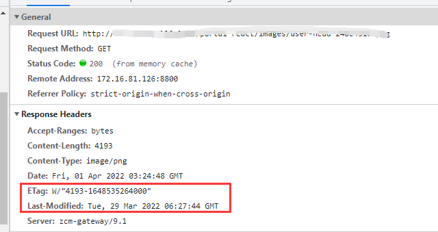

## 浏览器缓存

### 1、概述

浏览器缓存（Browser Caching）是浏览器将网络资源（html、js、css）存储在本地的一种行为。（浏览器将用户最近通过HTTP请求获取的资源存储在本地，当访问者再次访问同一页面时，浏览器就可以直接从本地加载资源）

浏览器缓存一般是缓存html、js、css等资源的，一般是get请求

浏览器缓存也可以叫HTTP缓存

http请求做为影响前端性能极为重要的一环，因为请求受网络影响很大，如果网络很慢的情况下,页面很可能会空白很久。对于**首次进入**网站的用户可能要通过优化接口性能和接口数量来解决。但是，对于**重复进入**页面的用户，除了浏览器本身的缓存，http缓存可以很大程度对已经加载过的页面进行优化。

### 缓存过程

浏览器与服务器通信的方式为应答模式，即是：浏览器发起HTTP请求 – 服务器响应该请求。那么**浏览器第一次向服务器发起该请求后拿到请求结果，会根据响应报文中HTTP头的缓存标识（expires,cache-control,last-modified,etag），决定是否缓存结果**，是则将请求结果和缓存标识存入浏览器缓存中

- 浏览器每次发起请求，都会先在浏览器缓存中查找该请求的结果以及缓存标识

### 2、缓存的位置

从缓存位置上来看，分为4种，**从上往下依次检查是否命中**，如果都没有命中则重新发起请求。

- **Service Worker** 是运行在浏览器背后的独立线程，一般可以用来实现缓存功能。使用 Service Worker的话，传输协议必须为 HTTPS。
- **Memory Cache** 是内存中的缓存，主要包含的是当前中页面中已经抓取到的资源,例如页面上已经下载的样式、脚本、图片等。读取内存中的数据肯定比磁盘快,内存缓存虽然读取高效，可是缓存持续性很短，会随着进程的释放而释放。 一旦我们关闭 Tab 页面，内存中的缓存也就被释放了。
  - 目前Webkit（浏览器引擎）资源分成两类，一类是主资源，比如HTML页面，或者下载项，一类是派生资源，比如HTML页面中内嵌的图片或者脚本链接，分别对应代码中两个类：MainResourceLoader（主）和SubresourceLoader（派）。虽然Webkit支持memoryCache，但是也只是针对派生资源，它对应的类为CachedResource，用于保存原始数据（比如CSS，JS等），以及解码过的图片数据。
- **Disk Cache** 是存储在硬盘中的缓存，读取速度慢点，但是什么都能存储到磁盘中，比之 Memory Cache 胜在容量和存储时效性上。
  - 绝大部分的缓存都来自Disk Cache，在HTTP 的协议头中设置。
  - 它的直接操作对象为CurlCacheManager。
- **Push Cache**（推送缓存）是 HTTP/2 中的内容，当以上三种缓存都没有命中时，它才会被使用。它只在会话（Session）中存在，一旦会话结束就被释放，并且缓存时间也很短暂，在Chrome浏览器中只有5分钟左右，同时它也并非严格执行HTTP头中的缓存指令。

**Memory Cache和Disk Cache的区别**

- 相同点：都只能存储一些派生类资源文件（css、脚本、html内嵌的图片）
- 不同点：
  - memory cache退出进程时数据会被清除，disk cache不会
  - **memory cache一般存储脚本、图片**
  - **disk cache一般存储非脚本，例如css**
  - 因为CSS文件加载一次就可渲染出来,我们不会频繁读取它,所以它不适合缓存到内存中,但是js之类的脚本却随时可能会执行,如果脚本在磁盘当中,我们在执行脚本的时候需要从磁盘取到内存中来,这样IO开销就很大了,有可能导致浏览器失去响应。

### 3、三级缓存原理（访问缓存优先级）

1. 先在内存中查找,如果有,直接加载。
2. 如果内存中不存在,则在硬盘中查找,如果有直接加载。
3. 如果硬盘中也没有,那么就进行网络请求。
4. 请求获取的资源缓存到硬盘和内存。

### 4、浏览器缓存的优点

- 减少了冗余的数据传输
- 减少了服务器的负担，提升了网站的性能
- 加快了客户端加载网页的速度

### 5、浏览器缓存的缺点

- 资源如果有更改但是客户端不及时更新会造成用户获取信息滞后

### 6、用户操作的影响

普通刷新（按f5和点击f5）都会用到memory cache和disk cache

**关于第一条，如果是在同一个标签页内，在地址栏输入地址，是可以用到memory cache的。但如果是新开的标签页，在地址栏输入url，就无法用到memory cache，因为memory cache会随着进程的释放而释放。 一旦我们关闭标签页，内存中的缓存也就被释放了。**

而且，经测试，能用memory cache时，png都是来自memory cache（这时候应该在两个地方都存在，但memory cache优先级更高）。对于新开的标签页，png则来自disk cache。

### 6、浏览器缓存的分类

强缓存和协商缓存。浏览器在向服务器请求资源时,首先判断是否命中强缓存,再判断是否命中协商缓存

#### 1、**强缓存**

浏览器在加载资源时，会先在本地缓存资源中查找是否有该请求的缓存信息，如果有，就看本地缓存资源的 header 中的信息（服务端设置的，expires 和 cache-control）判断是否命中强缓存，如果命中则直接使用缓存中的资源不会再向服务器发送请求。

简单地说，共有三种情况：

- 不存在该缓存结果和缓存标识，强制缓存失效，则直接向服务器发起请求（跟第一次发起请求一致）
- 存在该缓存结果和缓存标识，但该结果已失效，强制缓存失效，则使用协商缓存
- 存在该缓存结果和缓存标识，且该结果尚未失效，强制缓存生效，直接返回该结果

与强缓存相关的header字段有两个：expires 和 cache-control

Cache-Control 与 Expires 可以在服务端配置同时启用，同时启用的时候 **Cache-Control 优先级高**。

**Expires**（基本淘汰）

该字段是 **http1.0** 时的规范，它的值为一个**绝对时间**的 GMT 格式的时间字符串，比如 Expires: Mon,18 Oct 2066 23:59:59 GMT。这个时间代表着这个资源的失效时间，在此时间之前，即命中缓存。这种方式有一个明显的缺点，由于失效时间是一个绝对时间，所以当服务器与客户端时间偏差较大时，就会导致缓存混乱。

**Cache-Control**

Cache-Control 是 **http1.1** 时出现的 header 信息，主要是利用该字段的 **max-age** 值来进行判断，它是一个**相对时间**，例如 Cache-Control:max-age=3600，代表着资源的有效期是 3600 秒。cache-control 除了该字段外，还有下面几个比较常用的设置值：

- **no-cache**：需要进行协商缓存，发送请求到服务器确认是否使用缓存。
- **no-store**：禁止使用缓存，即不使用强制缓存，也不使用协商缓存。
- **public**：可以被所有的用户缓存，包括终端用户和 CDN 等中间代理服务器。
- **private**（默认）：只能被终端用户的浏览器缓存，不允许 CDN 等中继缓存服务器对其缓存。
- **immutable**：表示该资源永远不变，但是实际上该资源并不是永远不变，它这么设置的意思是为了让用户在刷新页面的时候不要去请求服务器。（如果不设置这个参数，当用户手动点击刷新页面时，即使符合缓存规则，浏览器也会直接去请求服务器）（强制刷新 ctrl+f5）

强缓存命中时，会直接从缓存中返回数据，状态码是200，会显示from disk(或 memory) cache。即浏览器没有跟服务器确认，直接用了浏览器缓存；

状态码为灰色的请求则代表使用了强制缓存，请求对应的Size值则代表该缓存存放的位置，分别为from memory cache 和 from disk cache。

from memory cache代表使用内存中的缓存，from disk cache则代表使用的是硬盘中的缓存，**浏览器读取缓存的顺序为memory –> disk。**

**关于强、协商缓存的标识：第一次访问时，http返回的response header里会带有对应缓存的数据，cache-control、 Last-Modified、etag等，下一次请求时（强缓存没命中），会在request header里带上 if-none-matched、if-modified-since（也就是etag、Last-Modified）**

#### **2、协商缓存**

当强缓存没有命中（例如超过设定的时间期限了）的时候，浏览器会携带缓存标识发送一个请求到服务器，服务器根据 header 中的部分信息（if-none-matched、if-modified-since）来判断是否命中缓存（资源是否修改）。如果命中（资源没修改），则返回 304（对应的header标识不变），告诉浏览器资源未更新，可使用本地的缓存。如果没命中（资源修改了），就返回新的数据，并更新对应的header的标识（etag、last-modified）

①、协商缓存生效

②、协商缓存失效

这里与协商缓存有关的 header 中的信息指的是 Last-Modified/If-Modified-Since 和 ETag/If-None-Match

Last-Modified、ETag是服务端设置在header里的，浏览器将其保存下来，当强缓存没命中，发请求到服务端时，request header里会带上这两个值，不过key会修改为if-modified-since、if-none-matched。

**Last-Modified/If-Modified-Since**

浏览器第一次请求一个资源的时候，服务器返回的 header 中会加上 Last-Modified，Last-modified 是一个时间标识，表示该资源的在服务器最后被修改的时间。(精确到秒)

If-Modified-Since则是客户端再次发起该请求时，携带上次请求返回的Last-Modified值，通过此字段值告诉服务器该资源上次请求返回的最后被修改时间。服务器收到该请求，发现请求头含有If-Modified-Since字段，则会根据If-Modified-Since的字段值与该资源在服务器的最后被修改时间做对比，若服务器的资源最后被修改时间大于If-Modified-Since的字段值，则重新返回资源，状态码为200；否则则返回304，代表资源无更新（且不会返回资源内容，也不会返回Last-Modified），可继续使用缓存文件

**缺点:**

- 短时间内资源发生了改变，Last-Modified 并不会发生变化。（修改判定时间只能精确到秒）
- 周期性变化。如果这个资源在一个周期内修改回原来的样子了，我们认为是可以使用缓存的，但是 Last-Modified 可不这样认为,因此便有了 ETag。

**ETag/If-None-Match**

与 Last-Modified/If-Modified-Since 不同的是，Etag/If-None-Match 返回的是一个校验码（每个文件有一个，由服务器生成，改动文件了就变了，可以看似md5）。ETag 可以保证每一个资源是唯一的，资源变化都会导致 ETag 变化。

服务器根据浏览器请求的 If-None-Match 值来判断是否命中缓存。服务器收到该请求后，发现该请求头中含有If-None-Match，则会根据If-None-Match的字段值与该资源在服务器的Etag值做对比，一致则返回304，代表资源无更新，继续使用缓存文件；不一致则重新返回资源文件，状态码为200，如下。

etag是新增的，主要是为了解决几个last-modified比较难解决的问题：

- 一些文件也许会周期性的更改，但是他的内容并不改变(仅仅改变的修改时间)，这个时候我们并不希望客户端认为这个文件被修改了，而重新get
- 某些文件修改非常频繁，比如在秒以下的时间内进行修改，(比方说1s内修改了N次)，if-modified-since能检查到的粒度是秒级的，这种修改无法判断
- 某些服务器不能精确的得到文件的最后修改时间

**Etag / If-None-Match优先级高于Last-Modified / If-Modified-Since，同时存在则只有Etag / If-None-Match生效**

#### **3、总结**

当浏览器再次访问一个已经访问过的资源时，它会这样做：

- 看看是否命中强缓存，如果命中，就直接使用缓存了。
- 如果没有命中强缓存，就发请求到服务器检查是否命中协商缓存。
- 如果命中协商缓存，服务器会返回 304 告诉浏览器使用本地缓存。
- 否则，返回最新的资源。（返回200状态码，客户端如第一次接收该资源一样，记下它的cache-control中的max-age、etag、last-modified等。）

题外话，听说`协商缓存返回304 not modified就代表资源没有更改，可以复用过期资源，此时注意查看304报文中的max-age字段，协商缓存后会刷新过期时间的，在过期时间内再请求就走强制缓存啦。题主刷新后还是304可能是max-age过短又过期了`没验证，不知道真假

