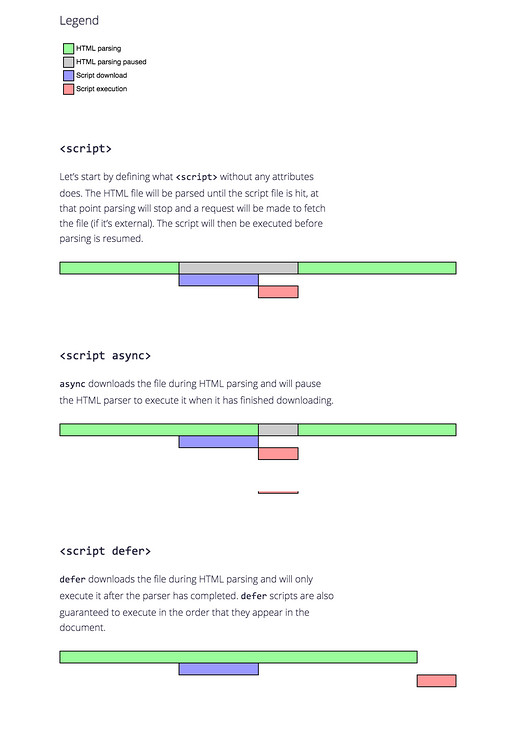

## what

页面的渲染，JS的执行，事件的循环，都在这个渲染进程内进行

## 浏览器的渲染进程是多线程的

GUI渲染线程

- 负责渲染浏览器界面，解析HTML，CSS，构建DOM树和RenderObject树，布局和绘制等。
- 当界面需要重绘（Repaint）或由于某种操作引发回流(reflow)时，该线程就会执行
- 注意，**GUI渲染线程与JS引擎线程是互斥的**，当JS引擎执行时GUI线程会被挂起（相当于被冻结了），GUI更新会被保存在一个队列中**等到JS引擎空闲时**立即被执行。

JS引擎线程

- 也称为JS内核，负责处理Javascript脚本程序。（例如V8引擎）
- JS引擎线程负责解析Javascript脚本，运行代码。
- JS引擎一直等待着任务队列中任务的到来，然后加以处理，一个Tab页（renderer进程）中无论什么时候都只有一个JS线程在运行JS程序
- 同样注意，**GUI渲染线程与JS引擎线程是互斥的**，所以如果JS执行的时间过长，这样就会造成页面的渲染不连贯，导致页面渲染加载阻塞。
- （弄清楚script下载和执行的阻塞）
- https://www.zhihu.com/question/20027966
- 

事件触发线程

- 归属于浏览器而不是JS引擎，用来控制事件循环（可以理解，JS引擎自己都忙不过来，需要浏览器另开线程协助）
- 当JS引擎执行代码块如setTimeOut时（也可来自浏览器内核的其他线程,如鼠标点击、AJAX异步请求等），会将对应任务添加到事件线程中
- 当对应的事件符合触发条件被触发时，该线程会把事件添加到待处理队列的队尾，等待JS引擎的处理
- 注意，由于JS的单线程关系，所以这些待处理队列中的事件都得排队等待JS引擎处理（当JS引擎空闲时才会去执行）

定时触发器线程（就单纯的计时）

- 传说中的`setInterval`与`setTimeout`所在线程
- 浏览器定时计数器并不是由JavaScript引擎计数的,（因为JavaScript引擎是单线程的, 如果处于阻塞线程状态就会影响记计时的准确）
- 因此通过单独线程来计时并触发定时（计时完毕后，添加到事件队列中，等待JS引擎空闲后执行）
- 注意，W3C在HTML标准中规定，规定要求setTimeout中低于4ms的时间间隔算为4ms。

异步http请求线程

- 在XMLHttpRequest在连接后是通过浏览器新开一个线程请求
- 将检测到状态变更时，如果设置有回调函数，异步线程就**产生状态变更事件**，将这个回调再放入事件队列中。再由JavaScript引擎执行。

## 各线程之间的关系

### GUI渲染线程与JS引擎线程互斥

由于JavaScript是可操纵DOM的，如果在修改这些元素属性同时渲染界面（即JS线程和UI线程同时运行），那么渲染线程前后获得的元素数据就可能不一致了。

因此为了防止渲染出现不可预期的结果，浏览器设置GUI渲染线程与JS引擎为互斥的关系，当JS引擎执行时GUI线程会被挂起， GUI更新则会被保存在一个队列中等到JS引擎线程空闲时立即被执行。

### JS阻塞页面加载

从上述的互斥关系，可以推导出，JS如果执行时间过长就会阻塞页面。

譬如，假设JS引擎正在进行巨量的计算，此时就算GUI有更新，也会被保存到队列中，等待JS引擎空闲后执行。 然后，由于巨量计算，所以JS引擎很可能很久很久后才能空闲，自然会感觉到巨卡无比。

所以，要尽量避免JS执行时间过长，这样就会造成页面的渲染不连贯，导致页面渲染加载阻塞的感觉。

### css加载是否会阻塞dom树渲染？

这里说的是头部引入css的情况

首先，我们都知道：**css是由单独的下载线程异步下载的。**

然后再说下几个现象：

- css加载不会阻塞DOM树解析（异步加载时DOM照常构建）
- 但会阻塞render树渲染（渲染时需等css加载完毕，因为render树需要css信息）

这可能也是浏览器的一种优化机制。

因为你加载css的时候，可能会修改下面DOM节点的样式， 如果css加载不阻塞render树渲染的话，那么当css加载完之后， render树可能又得重新重绘或者回流了，这就造成了一些没有必要的损耗。 所以干脆就先把DOM树的结构先解析完，把可以做的工作做完，然后等你css加载完之后， 在根据最终的样式来渲染render树，这种做法性能方面确实会比较好一点。

## chrome的优化

js文件或者css文件的下载会阻塞html文挡的解析，但是chrome做了优化：预解析，会在解析文档之前查看有没有外部文件，如果有就交给下载进程同步下载

当渲染引擎收到字节流之后，会开启一个预解析线程，用来分析 HTML 文件中包含的 JavaScript、CSS 等相关文件，解析到相关文件之后，预解析线程会提前下载这些文件。

**预解析和 async 的区别：**

1. 下载时机

- - 预解析线程可以在**解析文档线程**之前就解析到HTML页面是否有引用外部资源，如果有的话，就立即交给下载进程下载
  - *async* 只有在解析文档线程解析到有外部资源，才去发起下载

1. 作用对象

- - 预解析对js文件，和css文件都有效
  - *async* 只能用于js资源

1. 预解析存在的意义

- - 当文档解析到js资源的时候，解析文档的工作会被阻塞。如果js资源是外部引入的，阻塞的时间就包括js资源下载的时间
  - 而预解析就是对于没有添加 *async 属性的script的标签，做的优化*

**预解析和** ***async\*** **的相同点：**

1. 下载js资源的时候，不会阻塞文档的解析

## html页面生命周期

1. DOMContentLoaded - 浏览器已经加载了 Html, DOM 树已经构建完毕，但是 img 和外部样式表等资源可能还没有下载完毕。
2. load - 浏览器已经完全加载了所有资源。
3. beforeunload - 用户即将离开页面。
4. unload - 用户离开页面。