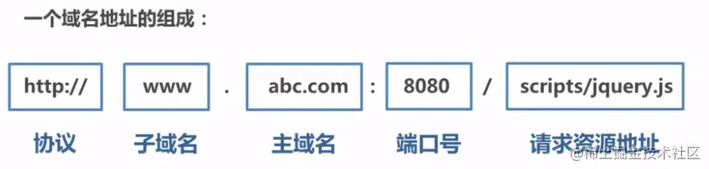

## 1.什么是同源策略及其限制内容？

同源策略是一种约定，它是浏览器最核心也最基本的安全功能，如果缺少了同源策略，浏览器很容易受到XSS、CSRF等攻击。

所谓同源是指"协议+域名+端口"三者相同，即便两个不同的域名指向同一个ip地址，也非同源。



**同源策略限制内容有：**

- Cookie、LocalStorage、IndexedDB 等存储性内容
- DOM 节点
- AJAX 请求

但是有三个标签是允许跨域加载资源：

- ``
- `<link href=XXX>`
- `<script src=XXX>`

### 请求跨域了，那么请求到底发出去没有？

**跨域并不是请求发不出去，请求能发出去，服务端能收到请求并正常返回结果，只是结果被浏览器拦截了**。你可能会疑问明明通过表单的方式可以发起跨域请求，为什么 Ajax 就不会?因为归根结底，跨域是为了阻止用户读取到另一个域名下的内容，Ajax 可以获取响应，浏览器认为这不安全，所以拦截了响应。但是表单并不会获取新的内容，所以可以发起跨域请求。同时也说明了跨域并不能完全阻止 CSRF，因为请求毕竟是发出去了。

## 二、跨域解决方案

### 1.jsonp

#### 1) JSONP原理

**利用 `<script>` 标签没有跨域限制的漏洞，网页可以得到从其他来源动态产生的 JSON 数据。JSONP请求一定需要对方的服务器做支持才可以。**

#### 2) JSONP和AJAX对比

JSONP和AJAX相同，都是客户端向服务器端发送请求，从服务器端获取数据的方式。但AJAX属于同源策略，JSONP属于非同源策略（跨域请求）

#### 3) JSONP优缺点

JSONP优点是简单兼容性好，可用于解决主流浏览器的跨域数据访问的问题。**缺点是仅支持get方法具有局限性,不安全可能会遭受XSS攻击。**且不好确定 JSONP 请求是否失败，可设定定时器来放弃等待

#### 4) JSONP的实现流程

- 在本地声明一个函数，将其函数名(如show)作为参数值，传递给跨域请求数据的服务器。该函数形参为希望从服务器获取的目标数据(服务器返回的data)。
- 创建一个`<script>`标签，把那个跨域的API数据接口地址，赋值给script的src，在这个地址中还要加上第一步中提到的参数名（可以通过问号传参:?callback=show）。
- 服务器接收到请求后，需要进行特殊的处理：把传递进来的函数名和它需要给你的数据拼接成一个字符串,例如：传递进去的函数名是show，原本要返回的数据是test，则最终返回`show('test')`。
- 最后服务器把准备的数据通过HTTP协议返回给客户端，客户端再调用执行之前声明的回调函数（show），对返回的数据进行操作。

总而言之，就是利用`<script>`加载完成后会自动执行的机制，在本地声明该函数，同时将函数名传给服务器，这样当服务器返回后，就会执行script内容，即执行我们声明的函数，同时能够把新的数据作为函数参数传递给函数

```js
// index.html
function jsonp({ url, params, callback }) {
  return new Promise((resolve, reject) => {
    let script = document.createElement('script')
    window[callback] = function(data) {
      resolve(data)
      document.body.removeChild(script)
    }
    params = { ...params, callback } // wd=b&callback=show
    let arrs = []
    for (let key in params) {
      arrs.push(`${key}=${params[key]}`)
    }
    script.src = `${url}?${arrs.join('&')}`
    document.body.appendChild(script)
  })
}
jsonp({
  url: 'http://localhost:3000/say',
  params: { wd: 'Iloveyou' },
  callback: 'show'
}).then(data => {
  console.log(data)
})
```

### 2.cors（）

Cross-Origin Resource Sharing

**CORS 需要浏览器和后端同时支持。IE 8 和 9 需要通过 XDomainRequest 来实现**。

浏览器会自动进行 CORS 通信，实现 CORS 通信的关键是后端。**只要后端实现了 CORS，就实现了跨域**。

服务端设置 Access-Control-Allow-Origin 就可以开启 CORS。 该属性表示哪些域名可以访问资源，如果设置通配符则表示所有网站都可以访问资源。

虽然设置 CORS 和前端没什么关系，但是通过这种方式解决跨域问题的话，对**简单请求**和**复杂请求**需要进行不同的设置。

#### 1) 简单请求

只要同时满足以下两大条件，就属于简单请求

条件1：使用下列方法之一：

- GET
- HEAD
- POST

条件2：Content-Type 的值仅限于下列三者之一：

- text/plain
- multipart/form-data
- application/x-www-form-urlencoded

请求中的任意 XMLHttpRequestUpload 对象均没有注册任何事件监听器； XMLHttpRequestUpload 对象可以使用 XMLHttpRequest.upload 属性访问。

**当满足简单请求时，就算后端没开启CORS，后端也是能收到完整请求并返回的，只是浏览器将返回拦截了**

**但如果是复杂请求，后端就收不到了，因为浏览器会自动先发送OPTION请求进行预检，只有预检通过了，才会发送后续请求**（在浏览器中看不到这个option请求，但可以在服务端捕获到）

**预检请求如果没通过，就会返回跨域的错误信息**

**对于预检请求，后端可以设置诸如Access-Control-Allow-Methods等来控制是否通过预检**

**另外要注意下，简单请求、复杂请求本来就存在，就算后端什么都不设置，浏览器也会在复杂请求前发送OPTION进行预检**

**另外，关于跨域cookie，fetch需要设置credentials: 'include'，同时服务端要设置 `('Access-Control-Allow-Credentials', 'true')`并且 `Access-Control-Allow-Origin`要设置为对应的origin，不能使用*号**

#### 2) 复杂请求

不符合以上条件的请求就肯定是复杂请求了。 复杂请求的CORS请求，会在正式通信之前，增加一次HTTP查询请求，称为"预检"请求,该请求是 option 方法的，通过该请求来知道服务端是否允许跨域请求。

我们用`PUT`向后台请求时，属于复杂请求，后台需做如下配置：

```
// 允许哪个方法访问我
res.setHeader('Access-Control-Allow-Methods', 'PUT')
// 预检的存活时间
res.setHeader('Access-Control-Max-Age', 6)
// OPTIONS请求不做任何处理
if (req.method === 'OPTIONS') {
  res.end() 
}
// 定义后台返回的内容
app.put('/getData', function(req, res) {
  console.log(req.headers)
  res.end('我不爱你')
})
```

完整的后端配置项如下：

```
    // 设置哪个源可以访问我
    res.setHeader('Access-Control-Allow-Origin', origin)
    // 允许携带哪个头访问我
    res.setHeader('Access-Control-Allow-Headers', 'name')
    // 允许哪个方法访问我
    res.setHeader('Access-Control-Allow-Methods', 'PUT')
    // 允许携带cookie
    res.setHeader('Access-Control-Allow-Credentials', true)
    // 预检的存活时间
    res.setHeader('Access-Control-Max-Age', 6)
    // 允许返回的头
    res.setHeader('Access-Control-Expose-Headers', 'name')
    if (req.method === 'OPTIONS') {
      res.end() // OPTIONS请求不做任何处理
    }
  }
```

### 3.postMessage

postMessage是HTML5 XMLHttpRequest Level 2中的API，且是为数不多可以跨域操作的window属性之一，它可用于解决以下方面的问题：

- 页面和其打开的新窗口的数据传递
- 多窗口之间消息传递
- 页面与嵌套的iframe消息传递
- 上面三个场景的跨域数据传递

### 4.websocket

Websocket是HTML5的一个持久化的协议，它实现了浏览器与服务器的全双工通信，同时也是跨域的一种解决方案。WebSocket和HTTP都是应用层协议，都基于 TCP 协议。但是 **WebSocket 是一种双向通信协议，在建立连接之后，WebSocket 的 server 与 client 都能主动向对方发送或接收数据**。同时，WebSocket 在建立连接时需要借助 HTTP 协议，连接建立好了之后 client 与 server 之间的双向通信就与 HTTP 无关了。

原生WebSocket API使用起来不太方便，我们使用`Socket.io`，它很好地封装了webSocket接口，提供了更简单、灵活的接口，也对不支持webSocket的浏览器提供了向下兼容。

### 5. Node中间件代理(两次跨域)

实现原理：**同源策略是浏览器需要遵循的标准，而如果是服务器向服务器请求就无需遵循同源策略。** 代理服务器，需要做以下几个步骤：

- 接受客户端请求 。
- 将请求 转发给服务器。
- 拿到服务器 响应 数据。
- 将 响应 转发给客户端。

### 6.nginx反向代理

> 正向代理：代理端代理的是客户端，服务端认代理端不认客户端。
> 反向代理：代理端代理的服务端，客户端认代理端不认服务端

实现原理类似于Node中间件代理，需要你搭建一个中转nginx服务器，用于转发请求。

使用nginx反向代理实现跨域，是最简单的跨域方式。只需要修改nginx的配置即可解决跨域问题，支持所有浏览器，支持session，不需要修改任何代码，并且不会影响服务器性能。

实现思路：通过nginx配置一个代理服务器（域名与domain1相同，端口不同）做跳板机，反向代理访问domain2接口，并且可以顺便修改cookie中domain信息，方便当前域cookie写入，实现跨域登录。

原理：代理服务器设置cros之类的，浏览器发送请求到代理服务器，代理服务器转发到真实服务器，服务器之间是没有同源策略的

验证下