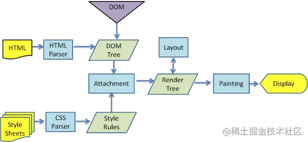
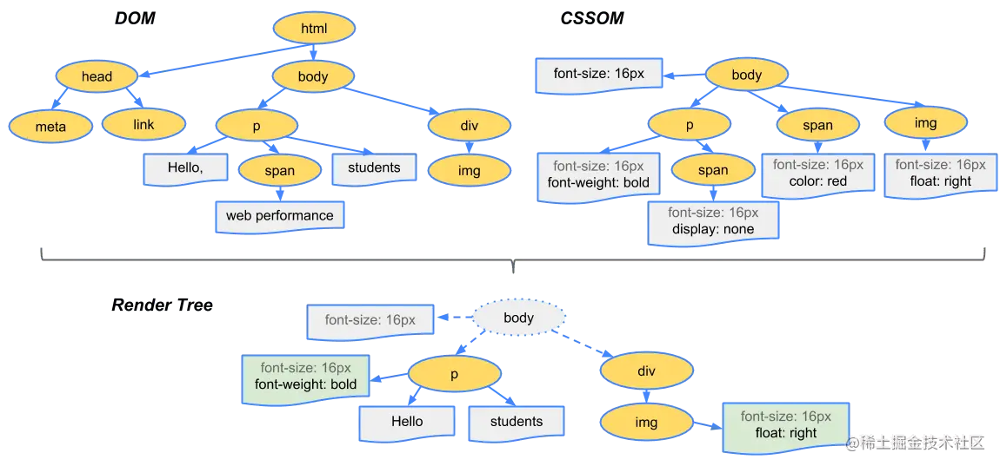
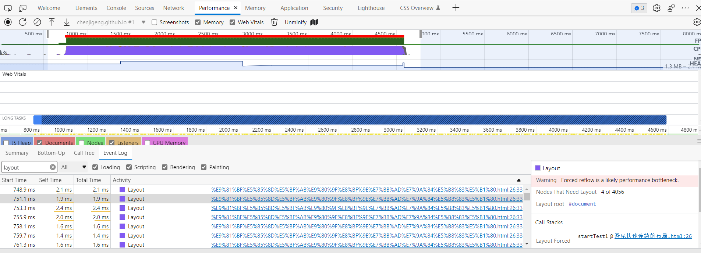
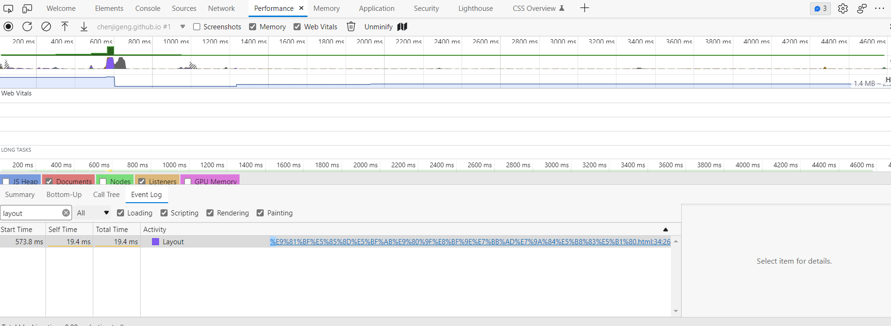
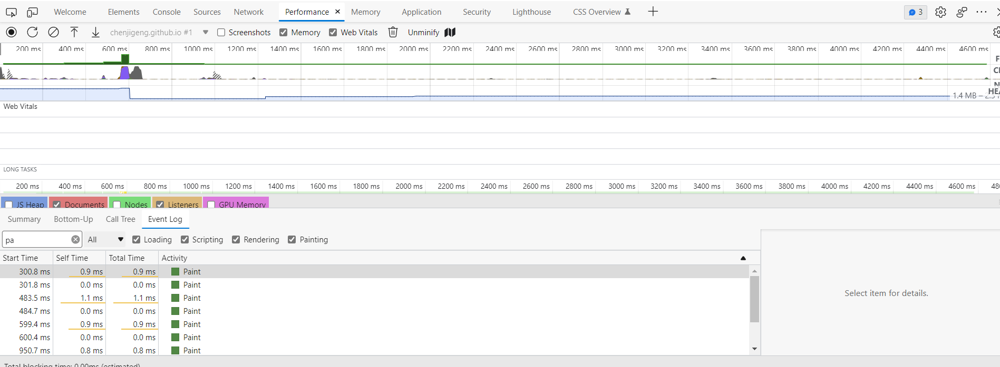
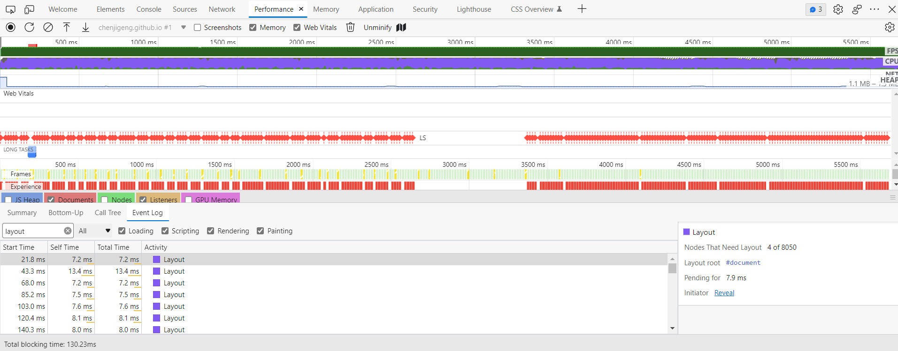
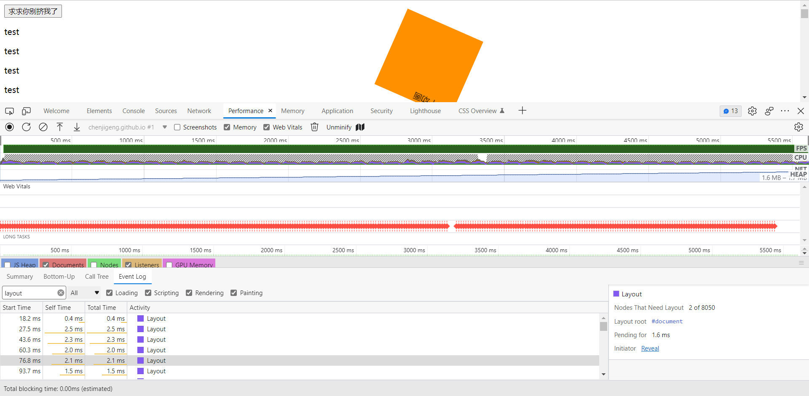
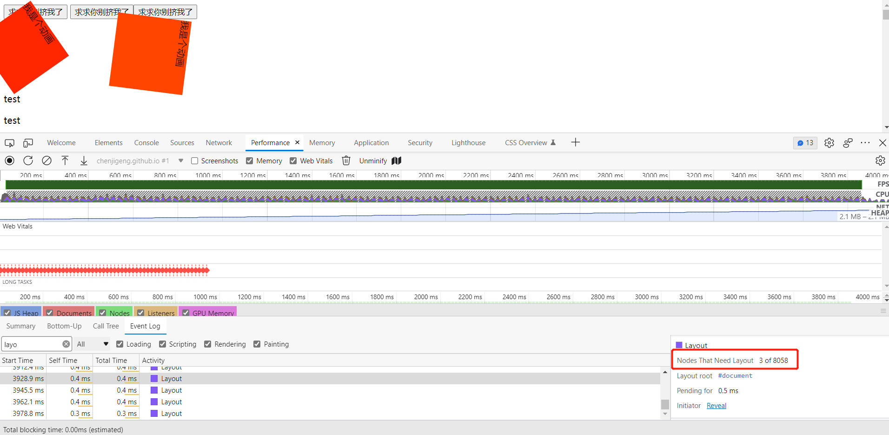
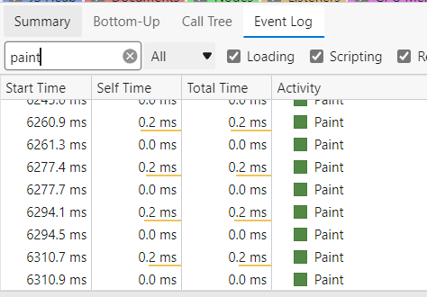

[Render-tree Construction, Layout, and Paint (web.dev)](https://web.dev/critical-rendering-path-render-tree-construction/)

## 浏览器的渲染过程




1. 解析HTML，生成DOM树，解析CSS，生成CSSOM树
2. 将DOM树和CSSOM树结合，生成渲染树(Render Tree)
   1. `we've calculated which nodes should be visible and their computed styles, but we have not calculated their exact position and size within the viewport of the device`
   2. 第二步只是计算了哪些元素要被展示以及他们的样式，但还没计算它们的确切位置以及在屏幕上的大小
3. layout（浏览器中就是这个名字！） ：计算渲染树中每个元素的位置和大小
   1. `The output of the layout process is a "box model," which precisely captures the exact position and size of each element within the viewport: all of the relative measurements are converted to absolute pixels on the screen.`
   2. 在这个环节（layout process）中，百分比值都会转换为屏幕中对应的像素绝对值
4. Painting：将每个元素转换为真实的像素并展示在屏幕上
   1. `converts each node in the render tree to actual pixels on the screen`


个人理解：

渲染 = layout+paint

重新渲染=reflow+repaint

### 生成渲染树



为了构建渲染树，浏览器主要完成了以下工作：（对应上方的1、2、3步）

1. 从DOM树的根节点开始遍历每个**可见节点**。
2. 对于每个可见的节点，找到CSSOM树中对应的规则，并应用它们。
3. 根据每个可见节点以及其对应的样式，组合生成渲染树。


不可见的节点包括：

- 一些不会渲染输出的节点，比如script、meta、link等。
- 一些通过css进行隐藏的节点。比如display:none。注意，利用visibility和opacity隐藏的节点，还是会显示在渲染树上的（`the element still occupies space in the layout (that is, it's rendered as an empty box)`）。只有display:none的节点才不会显示在渲染树上。

#### 渲染：

**网页生成的时候，至少会渲染一次**。

**在用户访问的过程中，还会不断重新渲染**

重新渲染需要重复之前的第四步(重新生成布局)+第五步(重新绘制)或者只有第五个步(重新绘制)

### 重排(reflow，也叫回流)：

前面我们通过构造渲染树，我们将可见DOM节点以及它对应的样式结合起来，可是我们还需要**计算它们在设备视口(viewport)内的确切位置和大小**

为了弄清每个对象在网站上的确切大小和位置，浏览器从渲染树的根节点开始遍历

当DOM的变化影响了元素的几何信息(DOM对象的位置和尺寸大小)，浏览器需要重新计算元素的几何属性，将其安放在界面中的正确位置，这个过程叫做重排。

#### 重排影响的范围

由于浏览器渲染界面是基于流失布局模型的，所以触发重排时会对周围DOM重新排列，影响的范围有两种：

- 全局范围：从根节点`html`开始对整个渲染树进行重新布局。
- 局部范围：对渲染树的某部分或某一个渲染对象进行重新布局
  - 把一个dom的宽高之类的几何信息定死，然后在dom内部触发重排，就只会重新渲染该dom内部的元素，而不会影响到外界

这不确定是真的假的，英文博客是这样写的

`The time required to perform render tree construction, layout and paint varies based on the size of the document, the applied styles, and the device it is running on: the larger the document, the more work the browser has; the more complicated the styles, the more time taken for painting also (for example, a solid color is "cheap" to paint, while a drop shadow is "expensive" to compute and render).`

#### 何时发生重排

回流这一阶段主要是计算节点的位置和几何信息，那么当页面布局和几何信息发生变化的时候，就需要回流。比如以下情况：

1. 添加或删除可见的DOM元素
2. 元素的位置发生变化
3. 元素的尺寸发生变化（包括外边距、内边框、边框大小、高度和宽度等）
4. 内容发生变化，比如文本变化或图片被另一个不同尺寸的图片所替代。
5. 页面一开始渲染的时候（这肯定避免不了）
6. 浏览器的窗口尺寸变化（因为回流是根据视口的大小来计算元素的位置和大小的）
7. 设置 style 属性的值

**注意：回流一定会触发重绘，而重绘不一定会回流**

根据改变的范围和程度，渲染树中或大或小的部分需要重新计算，有些改变会触发整个页面的重排，比如，滚动条出现的时候或者修改了根节点（见上方重排影响的范围）

### 重绘(repaint):

当一个元素的外观发生改变，但没有改变布局,重新把元素外观绘制出来的过程，叫做重绘

**常见的引起重绘的属性**:

|                 |                  |                     |                   |
| --------------- | ---------------- | ------------------- | ----------------- |
| color           | border-style     | visibility          | background        |
| text-decoration | background-image | background-position | background-repeat |
| outline-color   | outline          | outline-style       | border-radius     |
| outline-width   | box-shadow       | background-size     |                   |

大概有：

- 元素颜色发生变化
- 元素背景颜色发生变化
- 元素边框半径变化
- 元素阴影变化

## 浏览器的优化机制

由于每次重排都会造成额外的计算消耗，因此大多数浏览器都会通过队列化修改并批量执行来**优化重排**过程。（浏览器的**渲染队列机制**）浏览器会将修改操作放入到队列里，直到过了一段时间或者操作达到了一个阈值，才清空队列。但是！**当你获取布局信息的操作的时候，会强制队列刷新**

```
offsetTop、offsetLeft、offsetWidth、offsetHeight

scrollTop、scrollLeft、scrollWidth、scrollHeight

clientTop、clientLeft、clientWidth、clientHeight

getComputedStyle()

getBoundingClientRect
```

以上属性和方法都需要返回最新的布局信息，因此浏览器不得不清空队列，触发回流重绘来返回正确的值。因此，我们在修改样式的时候，**最好避免使用上面列出的属性，他们都会刷新渲染队列。**如果要使用它们，最好将值缓存起来

## 如何减少回流和重绘

### 最小化重绘和重排

由于重绘和重排可能代价比较昂贵，因此最好就是可以减少它的发生次数。为了减少发生次数，我们可以合并多次对DOM和样式的修改，然后一次处理掉。考虑这个例子

```
const el = document.getElementById('test');
el.style.padding = '5px';
el.style.borderLeft = '1px';
el.style.borderRight = '2px';
```

例子中，有三个样式属性被修改了，每一个都会影响元素的几何结构，引起回流。当然，**大部分现代浏览器都对其做了优化，因此，只会触发一次重排**。但是如果在旧版的浏览器或者在上面代码执行的时候，有其他代码访问了布局信息(上文中的会触发回流的布局信息)，那么就会导致三次重排

因此，我们可以合并所有的改变然后依次处理，比如我们可以采取以下的方式：

**使用cssText**

```
const el = document.getElementById('test');
el.style.cssText += 'border-left: 1px; border-right: 2px; padding: 5px;';
```

**修改CSS的class**

```
const el = document.getElementById('test');
el.className += ' active';
```

### 批量修改DOM

当我们需要对DOM对一系列修改的时候，可以通过以下步骤减少回流重绘次数：

1. 使元素脱离文档流
2. 对其进行多次修改
3. 将元素带回到文档中。

该过程的第一步和第三步可能会引起回流，但是**经过第一步之后，对DOM的所有修改都不会引起回流重绘，因为它已经不在渲染树了**

有三种方式可以让DOM脱离文档流：

- 隐藏元素，应用修改，重新显示（这个会在展示和隐藏节点的时候，产生两次回流）

  - ```
    function appendDataToElement(appendToElement, data) {
        let li;
        for (let i = 0; i < data.length; i++) {
        	li = document.createElement('li');
            li.textContent = 'text';
            appendToElement.appendChild(li);
        }
    }
    const ul = document.getElementById('list');
    ul.style.display = 'none';
    appendDataToElement(ul, data);
    ul.style.display = 'block';
    ```

- 使用文档片段(document fragment)在当前DOM之外构建一个子树，再把它拷贝回文档。

  - ```
    const ul = document.getElementById('list');
    const fragment = document.createDocumentFragment();
    appendDataToElement(fragment, data);
    ul.appendChild(fragment);
    ```

- 将原始元素拷贝到一个脱离文档的节点中，修改节点后，再替换原始的元素。

  - ```
    const ul = document.getElementById('list');
    const clone = ul.cloneNode(true);
    appendDataToElement(clone, data);
    ul.parentNode.replaceChild(clone, ul);
    ```

对于上面这三种情况，实验结果不是很理想。

**原因：其实上面也说过了，现代浏览器会使用队列来储存多次修改，进行优化，所以对这个优化方案，我们其实不用优先考虑。**

### 避免触发同步布局事件

上文我们说过，当我们访问元素的一些属性的时候，会导致浏览器强制清空队列，进行强制同步布局。举个例子，比如说我们想将一个p标签数组的宽度赋值为一个元素的宽度，我们可能写出这样的代码：

```
function initP() {
    for (let i = 0; i < paragraphs.length; i++) {
        paragraphs[i].style.width = box.offsetWidth + 'px';
    }
}
```

这段代码看上去是没有什么问题，可是其实会造成很大的性能问题。在每次循环的时候，都读取了box的一个offsetWidth属性值，然后利用它来更新p标签的width属性。这就导致了每一次循环的时候，浏览器都必须先使上一次循环中的样式更新操作生效，才能响应本次循环的样式读取操作。**每一次循环都会强制浏览器刷新队列**。我们可以优化为:

```
const width = box.offsetWidth;
function initP() {
    for (let i = 0; i < paragraphs.length; i++) {
        paragraphs[i].style.width = width + 'px';
    }
}
```

### 对于复杂动画效果,使用绝对定位让其脱离文档流

对于复杂动画效果，由于会经常的引起回流重绘，因此，我们可以使用绝对定位，让它脱离文档流。否则会引起父元素以及后续元素频繁的回流。

### css3硬件加速（GPU加速）

比起考虑如何减少回流重绘，我们更期望的是，根本不要回流重绘。这个时候，css3硬件加速就闪亮登场啦！！

**划重点：**

**1. 使用css3硬件加速，可以让transform、opacity、filters这些动画不会引起回流重绘 。**

**2. 对于动画的其它属性，比如background-color这些，还是会引起回流重绘的，不过它还是可以提升这些动画的性能。**

#### 如何使用

常见的触发硬件加速的css属性：

- transform
- opacity
- filters
- Will-change

#### 重点

- 使用css3硬件加速，可以让transform、opacity、filters这些动画不会引起回流重绘
- 对于动画的其它属性，比如background-color这些，还是会引起回流重绘的，不过它还是可以提升这些动画的性能。

#### css3硬件加速的坑

当然，任何美好的东西都是会有对应的代价的，过犹不及。css3硬件加速还是有坑的:

- 如果你为太多元素使用css3硬件加速，会导致内存占用较大，会有性能问题。
- 在GPU渲染字体会导致抗锯齿无效。这是因为GPU和CPU的算法不同。因此如果你不在动画结束的时候关闭硬件加速，会产生字体模糊。


## 测试！！！！！

### 测试读取offsetWidth的影响

1、使用源码

```
function initP() {
    for (let i = 0; i < paragraphs.length; i++) {
        paragraphs[i].style.width = box.offsetWidth + 'px';
    }
}
```

在浏览器中执行，可在控制台中看到layout（重排）环节重复了很多次



2、使用优化后的代码

```
const width = box.offsetWidth;
function initP() {
    for (let i = 0; i < paragraphs.length; i++) {
        paragraphs[i].style.width = width + 'px';
    }
}
```

在浏览器中执行，可在控制台中看到layout（重排）环节只进行了一次，paint（重绘）多次。（这里是被浏览器优化了，短时间内多次设置width，被浏览器优化为1次layout，这里设置每次延迟1s，就会每次都layout了）





### 测试layout的范围

制作一个动画，放在文档流中，查看layout情况，看上方绿、紫线，绿色表示paint，紫色表示layout，疯狂重排、重绘



将动画设为绝对布局，脱离文档流，看不懂，以后研究，和nodes that need layout 有关吗？



添加了几个元素后，这几个数字发生了变化



根据实验结果看，layout影响的元素数量变化很少，但是页面在默认布局情况下，明显帧数很低

只改变颜色时，layout没有，paint一直有

