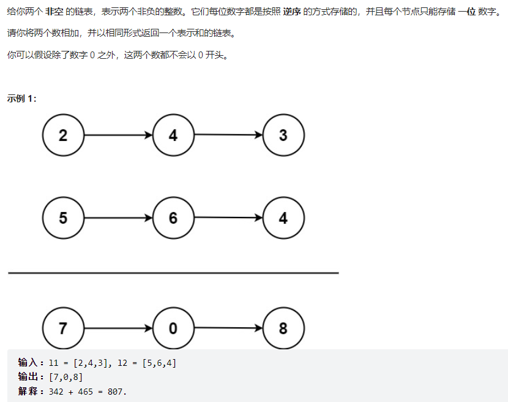
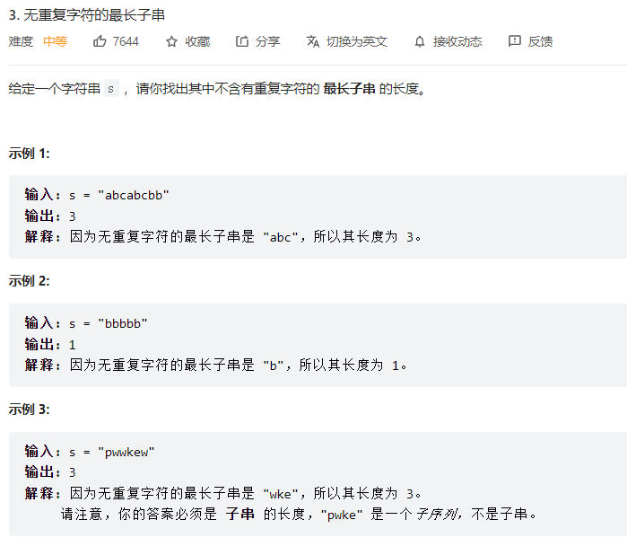
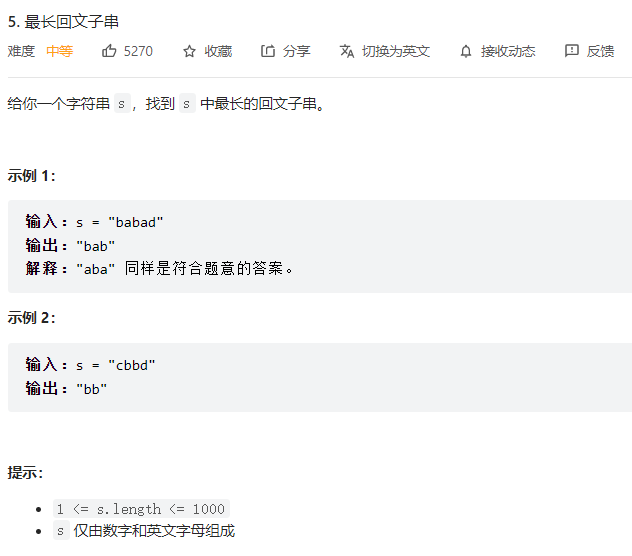
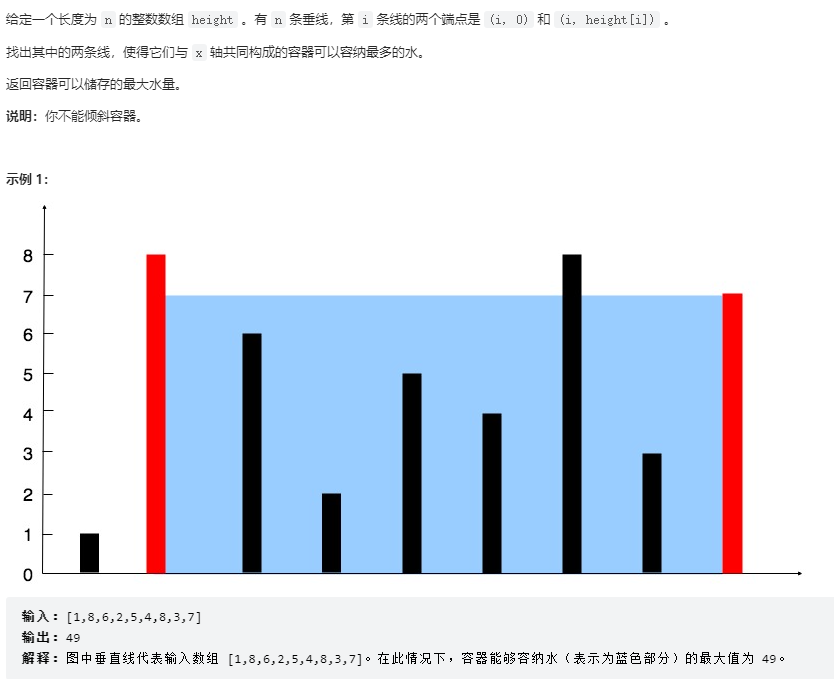
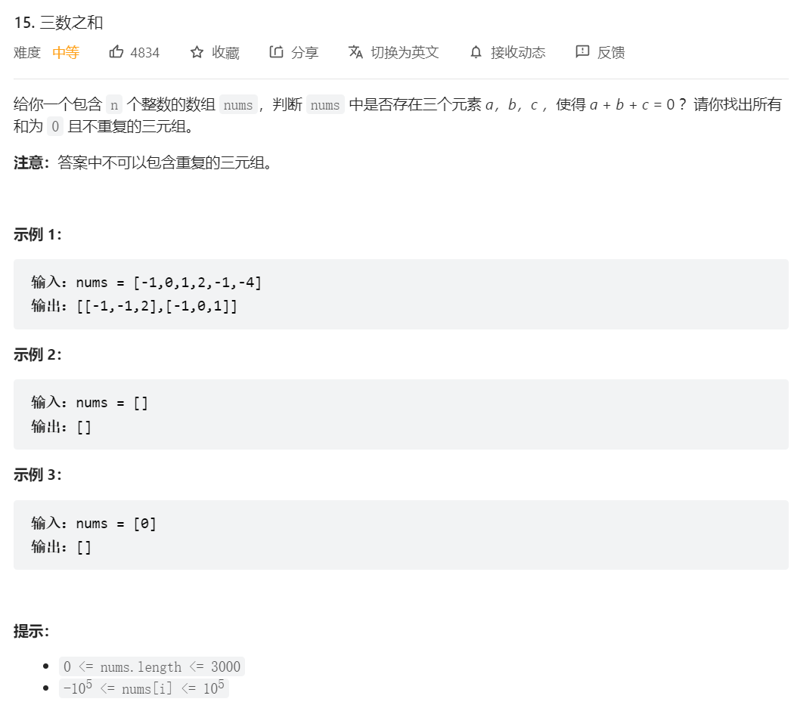
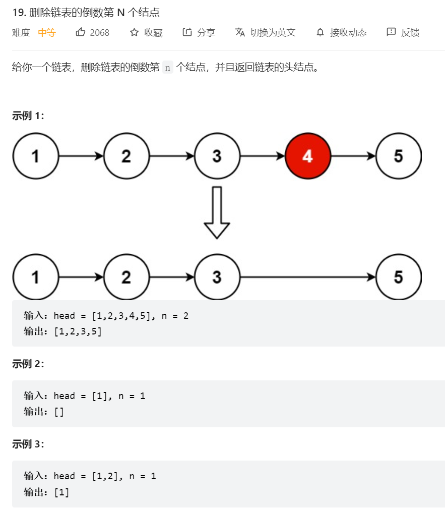

## 二叉树的中序遍历

迭代解法：

1. 使用一个栈来存储已遍历的节点，使用一个resList数组存储最终结果
2. 从根节点开始，一直往左节点移动，将遍历到的节点入栈，直到底部，这时候就走到了整棵树的最左下方，将其置入resList
3. 接下来，开始倒车，一个一个地从栈中取出节点，并置入resList（相当于取出上一个处理的节点的父节点）
4. 将指针移到当前节点的右节点，同时并开始下一个循环
5. 如果这个右节点有值，那就相当于执行第二步（将这个右节点视作根节点）
6. 如果右节点没值，那就可以继续出栈了

```js
/**
 * Definition for a binary tree node.
 * function TreeNode(val, left, right) {
 *     this.val = (val===undefined ? 0 : val)
 *     this.left = (left===undefined ? null : left)
 *     this.right = (right===undefined ? null : right)
 * }
 */
/**
 * @param {TreeNode} root
 * @return {number[]}
 */
var inorderTraversal = function(root) {
    if (root === null) {
        return [];
    }
    const res = [];
    const stack = [];
    let node = root;
    while (node || stack.length > 0) { 
        while(node) { 
            stack.push(node);
            node = node.left;
        }
        // 遍历左节点直到尽头，出栈就是‘左节点、父节点、父节点、父节点...’顺序，此时再看每个出栈元素的右节点
        node = stack.pop();
        res.push(node.val);

        node = node.right; // 很重要，这里无论存不存在right，都要移动指针，防止倒车时又重新遍历出栈节点的左子树
    } 
    return res;
};
```

## 二叉树的先序遍历

迭代解法：

思路很简单，准备一个栈和一个resList

将想要输出的元素按照逆序入栈即可

1. 将根节点入栈，开始循环
2. 出栈，置入resList，如果存在右节点，右节点入栈，如果存在左节点，左节点也入栈
3. 开始第二轮循环，出栈，此时就是上一个节点的左元素，置入resList
4. 对于这个元素，如果存在右节点，右节点入栈，如果存在左节点，左节点也入栈
5. 如此循环往复

```js
/**
 * Definition for a binary tree node.
 * function TreeNode(val, left, right) {
 *     this.val = (val===undefined ? 0 : val)
 *     this.left = (left===undefined ? null : left)
 *     this.right = (right===undefined ? null : right)
 * }
 */
/**
 * @param {TreeNode} root
 * @return {number[]}
 */
var preorderTraversal = function(root) {
    if (!root) {
        return [];
    }
    const res = [];
    let node = root;
    const stack = [node];
    while (stack.length > 0) {
        node = stack.pop();
        res.push(node.val);

        if (node.right) {
            stack.push(node.right);
        }
        if (node.left) {
            stack.push(node.left);
        }
    }
    return res;
};
```

## 二叉树的后序遍历

迭代解法：

简略思路：将先序遍历的中左右改成中右左，即先压入右子树再压入左子树，然后将所得的数组逆序排列，即是答案

```js
/**
 * Definition for a binary tree node.
 * function TreeNode(val, left, right) {
 *     this.val = (val===undefined ? 0 : val)
 *     this.left = (left===undefined ? null : left)
 *     this.right = (right===undefined ? null : right)
 * }
 */
/**
 * @param {TreeNode} root
 * @return {number[]}
 */
var postorderTraversal = function(root) {
    if (!root) {
        return [];
    }
    const res = [];
    const stack = [root];
    let node = root;
    while (stack.length > 0) {
        node = stack.pop();
        res.push(node.val);

        if(node.left) {
            stack.push(node.left);
        }
        if(node.right) {
            stack.push(node.right);
        }
    }
    return res.reverse();
};
```

## 二叉树三种遍历统一解法

可看leetcode后序遍历的评论

## 两数相加



解题思路：

不能转为数字，因为可能会溢出

将两个链表从头开始，每两个节点相加，进位数保留到下两个节点一起相加，短的链表不够加时补0，边计算边获取结果

```js
/**
 * Definition for singly-linked list.
 * function ListNode(val, next) {
 *     this.val = (val===undefined ? 0 : val)
 *     this.next = (next===undefined ? null : next)
 * }
 */
/**
 * @param {ListNode} l1
 * @param {ListNode} l2
 * @return {ListNode}
 */
var addTwoNumbers = function(l1, l2) {
    let add = 0;
    let res;
    let node;
    let tempSum;
    let sum;
    while(l1 || l2 || add !== 0) {
        val1 = l1?.val ?? 0;
        val2 = l2?.val ?? 0;
        tempSum = Number(val1) + Number(val2) + Number(add);
        sum = tempSum % 10;
        
        if (tempSum >= 10) {
            add = String(tempSum)[0];
        } else {
            add = 0;
        }

        if (res === undefined) {
            res = new ListNode(sum);
            node = res;
        } else {
            node.next = new ListNode(sum);
            node = node.next;
        }
        l1 = l1?.next;
        l2 = l2?.next;
    }
    return res;
};
```

## 无重复字符的最长子串



解题思路：

创建一个list，逐字符遍历字符串s，对遍历到的字符char进行判断，如果list包含char，就**获取list中重复的char在s中的index，截取s从index + 1到当前字符char的内容作为list**，同时判断是否为最长。如果不包含，就将char置入list。

```js
var lengthOfLongestSubstring = function(s) {
    let list = '';
    let res = 0;
    for (let i = 0; i < s.length; i += 1) {
        if (!list.includes(s[i])) {
            list = `${list}${s[i]}`;
        } else {
            const index = s.slice(0, i).lastIndexOf(s[i]);
            list = s.slice(index + 1, i + 1);
        }
        if (list.length > res) {
            res = list.length;
        }
    }
    return res;
};
```

这里比较复杂的地方就是加粗部分了。

评论题解都提到了滑动窗口，用双指针实现，这确实更优雅。每次右指针左移一格，就判定两个指针直接是否有重复元素，有的话，就将左指针移动到重复元素之后，并计算两指针之间字串长度

```js
var lengthOfLongestSubstring = function(s) {
    if (s.length === 1) {
        return 1;
    }
    let res = 0;
    for (let i = 1, j = 0; i < s.length; i += 1) {
        const index = s.slice(j, i).indexOf(s[i]);
        if (index !== -1) {
            j = j + index + 1;
        }
        res = (i - j + 1) > res ? i - j + 1 : res;
    }
    return res;
};
```

## 最长回文子串



解题思路：

无论是动态规划还是中心拓展，时间复杂度都是O(n^2)

中心拓展：

1. 对每个元素，依次判定其两侧字符是否相等，若相等，继续往外扩展
2. 除了对每单个元素进行判定，还需要对每两个元素进行判定，因为回文可能是单数也可能是双数

```js
/**
 * @param {string} s
 * @return {string}
 */
var longestPalindrome = function(s) {
    let res = s[0];
    
    for(let i = 0; i < s.length; i += 1) {
        let j = 1;
        while(i - j >= 0) {
            if (s[i - j] === s[i + j]) {
                if (j * 2 + 1 > res.length) {
                    res = s.slice(i - j, i + j + 1);
                }
                j += 1;
            } else {
                break;
            }
        }
        j = 0;
        if (s[i] === s[i + 1]) {
            while(i - j >= 0) {
                if (s[i - j] === s[i + j + 1]) {
                    if (j * 2 + 2 > res.length) {
                        res = s.slice(i - j, i + j + 2);
                    }
                    j += 1;
                } else {
                    break;
                }
            }
        }
    }
    return res;
};
```

动态规划：（在这题中效率极差）

1. 对每个元素s[n]，都从s[0]开始判定是否与s[n]相等，若相等，就将两边指针往中间缩，判定中间是否为回文
2. 若不相等，移动左指针到s[1]，继续判定
3. 判定期间，可以用二维数组保存结果，例如标识s(2 -> 5)不是回文，当后面判定s(1 -> 6)时，若s[1]==s[6]，可通过已存储的数直接否决

```js
/**
 * @param {string} s
 * @return {string}
 */
var longestPalindrome = function(s) {
    let res = s[0];
    const list = new Array(s.length).fill(0).map(() => new Array(s.length));
    for (let i = 0; i < s.length; i += 1) {
        for (let j = 0; j < i; j += 1) {
            let _i = i;
            let _j = j;
            while (s[_j] === s[_i] && _j < _i) {
                if (list[_i][_j] === 1) {
                    _i = 0;
                    _j = 0;
                    break;
                }
                _j += 1;
                _i -= 1;
            }
            if (_j === _i || _j > _i) {
                if (res.length < i - j + 1) {
                    res = s.slice(j, i + 1);
                }

                list[i][j] = 1;
            }
        }
    }
    
    return res;
};
```

## 盛最多水的容器



双指针法。这题的难点在于找出一定的规则，没做过的话较难看出双指针法

具体可看leetcode题解

解题思路：

设两个指针在头部和尾部。

在每个状态下，无论长板或短板向中间收窄一格，都会导致水槽 底边宽度 −1，即变短：

若向内 移动短板 ，水槽的短板 min(h[i], h[j])min(h[i],h[j]) 可能变大，因此下个水槽的面积 可能增大 。
若向内 移动长板 ，水槽的短板 min(h[i], h[j])min(h[i],h[j]) 不变或变小，因此下个水槽的面积可能不变或变小，总之不可能增大。
因此，初始化双指针分列水槽左右两端，循环每轮将短板向内移动一格，并更新面积最大值，直到两指针相遇时跳出；即可获得最大面积

> 无论是移动短板或者长板，我们都只关注移动后的新短板会不会变长，而每次移动的木板都只有三种情况，比原短板短，比原短板长，与原短板相等；如向内移动长板，对于新的木板：1.比原短板短，则新短板更短。2.与原短板相等或者比原短板长，则新短板不变。所以，向内移动长板，一定不能使新短板变长。

> 每次都移动自己最差的一边，虽然可能变得更差，但是总比不动（或者减小）强，动最差的部分可能找到更好的结果，但是动另一边总会更差或者不变

```js
/**
 * @param {number[]} height
 * @return {number}
 */
var maxArea = function(height) {
    let left = 0;
    let right = height.length -1;
    let res = 0;
    while (right - left >= 1) {
        let newRes = Math.min(height[left], height[right]) * (right - left);
        if (newRes > res) {
            res = newRes;
        }

        if (height[left] > height[right]) {
            right = right - 1;
        } else {
            left = left + 1;
        }

    }
    return res;
};
```

## 三数之和



解题思路：

排序 + 双指针

`降维处理, 由三维降到二维, 针对任意索引i的nums[i] 求[i+1,size]范围内不重复的twoSum target = - nums[i];`

特判，对于数组长度 n，如果数组为 null 或者数组长度小于 3，返回 [][]。
对数组进行排序。
遍历排序后数组：
以nums[i]作为三元组的第一个元素若 nums[i]>0：因为已经排序好，所以后面不可能有三个数加和等于 0，直接返回结果。
对于重复元素：跳过，避免出现重复解
令左指针 L=i+1，右指针 R=n-1，当 L<R 时，执行循环：
当 nums[i]+nums[L]+nums[R] == 0 ，执行循环，判断左界和右界是否和下一位置重复，去除重复解。并同时将 L,R移到下一位置，寻找新的解
若和大于 0，说明 nums[R]太大，R 左移
若和小于 0，说明 nums[L]太小，L右移

```js
var threeSum = function(nums) {
    const res = [];
    nums.sort((a, b) => a - b);

    // 按照从小到大排序数组后，就可以遵循每次都选比上次更大的数的规则
    for (let i = 0; i < nums.length - 2; i += 1) {
        // 每次都以nums[i]作为三元组中的第一个数
        // 如果nums[i]大于0，则后续选择之和必不为0
        if (nums[i] > 0) {
            continue;
        }
        // 去除重复项
        if (nums[i] === nums[i - 1]) {
            continue;
        }
        let left = i + 1;
        let right = nums.length - 1;
        let sum;
        const target = -nums[i];

        while (left < right) {
            sum = nums[left] + nums[right];
            if (sum === target) {
                res.push([nums[i], nums[left], nums[right]]);
                left = left + 1;
                right = right - 1;
                // 每次双指针移动完之后，都要和移动之前比较下，如果值相等，说明是重复的
                while (nums[right] === nums[right + 1]) {
                    right = right - 1;
                }
                while (nums[left] === nums[left - 1]) {
                    left = left + 1;
                }    
            } else if (sum > target) {
                right = right - 1;
            } else {
                left = left + 1;
            }
        }
    }
    return res;
};
```

## 删除链表的倒数n个节点



解题思路：

快慢指针，快指针比慢指针多走n步，当快指针遍历结束时，慢指针就在倒数第n+1个节点上

1. 注意用哨兵节点，用于处理需要删除头节点的情况

```js
var removeNthFromEnd = function(head, n) {
    let pre = new ListNode(-1, head);
    let fast = pre;
    let slow = pre;
    let count = 0;
    while (fast.next !== null) {
        count += 1;
        fast = fast.next;
        // 慢指针晚走n步，遍历结束时正好处在倒数n+1个结点
        if (count > n) {
            slow = slow.next;
        } 
    }

    slow.next = slow.next.next;
    return pre.next;
};
```

还有一种思路：

递归。因为链表的递归是天然逆序的（从尾元素开始返回），因此，可方便得到倒数第n个节点
