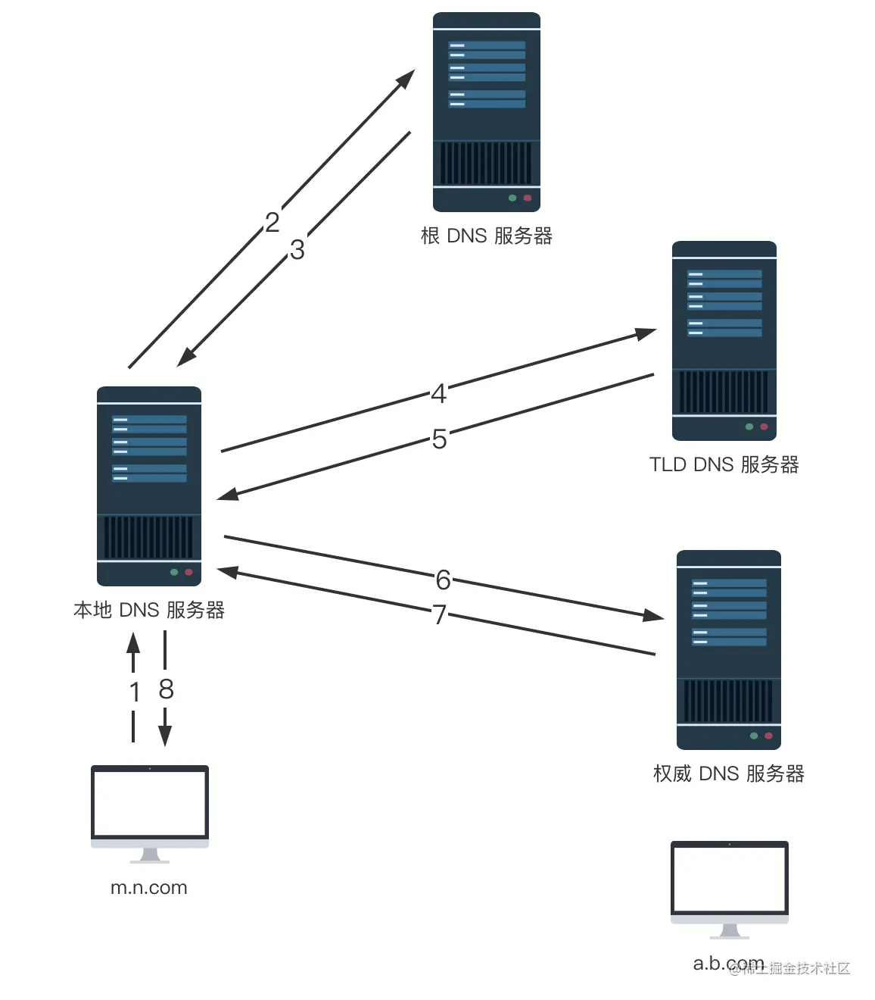
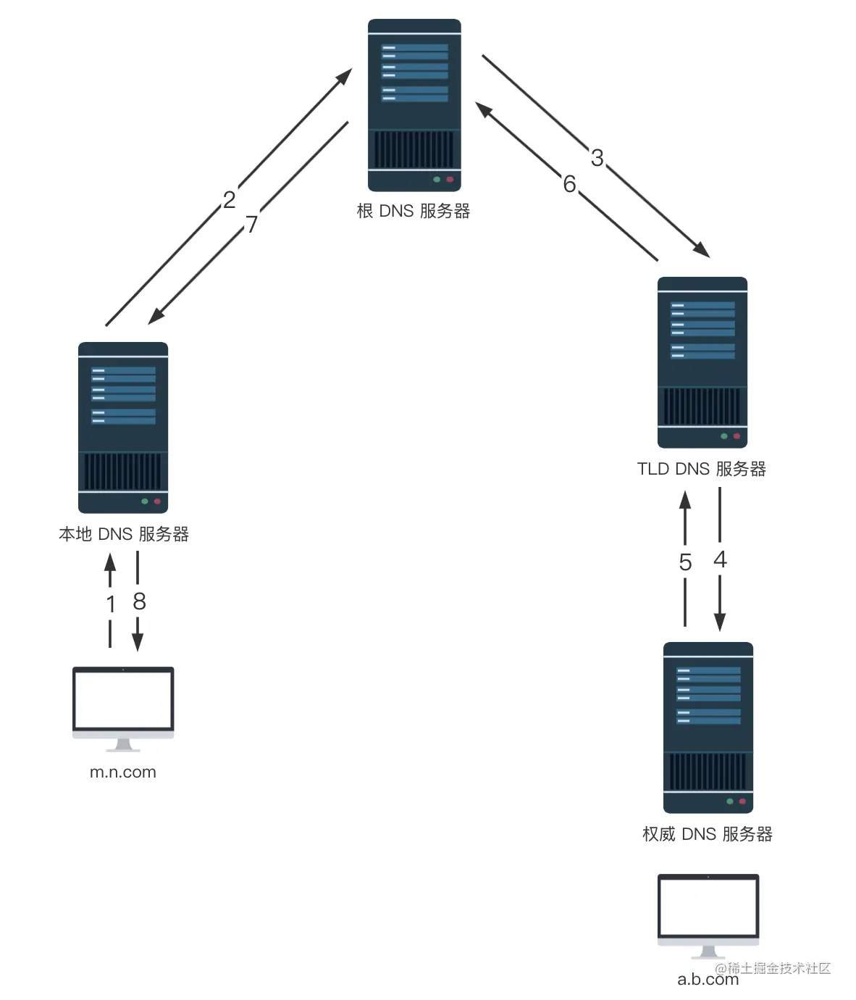

## 什么是DNS

DNS全称Domain Name System，直译成中文就是域名系统。

DNS实际上是一个全球范围的分布式数据库，存储了域名和IP地址的映射关系。

### 分布式指？

整个DNS系统由分散在世界各地的DNS服务器组成，每台服务器都保存部分数据，没有哪台服务器能够保存全部数据

### 为什么要分布式？

和其他分布式系统一样，DNS也需要考虑性能、容错等问题，集中式容易出现单点故障（一台故障就全故障），远距离的延迟，可拓展性差（网络、存储容量等）等问题

摘自《计算机网络：自顶向下方法》：

> DNS 是：
>
> 1. 一个由分层的 DNS 服务器实现的**分布式数据库**
> 2. 一个使得主机能够查询分布式数据库的**应用层协议**

## DNS有什么用

将域名转换为对应的IP地址

## DNS的层级结构

DNS服务器是分布式的（物理），这些分散在全球的服务器组成了一个树形层级结构（抽象）

层级结构共分为三层：

1. 根DNS服务器（Root Domain，根域名用`.`表示，每个域名都有相同的根域名，平时是省略的，没写出来）
2. 顶级域DNS服务器（Top-level Domains，顶级域指如`com`, `net`, `org`, `edu`）
3. 权威DNS服务器（Second-level Domains，权威域指如`www.baidu.com`里的`baidu`）

**分层结构的工作流程**

从根DNS服务器开始逐层向下查询。

例如查询`www.baidu.com`，首先通过根DNS服务器获取对应的顶级域DNS服务器地址，再通过顶级域DNS服务器获取权威DNS服务器地址，最终获得具体的主机ip

### 根DNS服务器

根DNS服务器，存储着根域名及其映射。全世界目前有13组域名根节点（实际可能有更多的镜像）

什么是根域名？`www.baidu.com`的完整写法其实是`www.baidu.com.`，最后面这个`.`就是根域名。所有域名的尾部，实际上都有一个根域名。

**为什么平时不写.**

因为根域名对所有域名来说都是一样的，所以平时被省略掉了。

**根DNS服务器的作用**

查询并返回对应的顶级域DNS服务器的IP地址

**本地DNS是如何知道根DNS服务器IP的**

根域名服务器的IP地址一般是不会变化的，所以内置在本地DNS服务器里面。

**为什么是13个根域名服务器**

因为DNS协议用的是UDP查询，UDP查询能保证性能的最大长度是512字节，要让所有根域名服务器数据能包含在512字节的UDP包中，根服务器只能限制在13个

### 顶级域DNS服务器

存储着顶级域名及其映射的服务器

有什么用：能够查询并返回对应的权威DNS服务器的IP地址

常见的顶级域名有：`.com`, `.net`, `.org`, `.edu`

### 权威DNS服务器

有什么用：返回主机名 - IP 的最终映射（主机名就是指`www.baidu.com`）

权威域名是指`www.baidu.com`里的`baidu.com`

## 本地DNS服务器

是什么：本地DNS服务器是指我们所在区域内的一台机器，一般由网络运营商例如移动、电信等提供。

有什么用：可以将本地DNS服务器看作一个代理服务器，接收客户端的DNS解析请求，到DNS层级结构中查询目标IP地址并返回给客户端

什么是客户端：即我们的个人电脑

## 一次DNS解析在客户端、本地DNS服务器、DNS服务器之间的交互过程

假设主机 `m.n.com` 想要获取主机 `a.b.com` 的 IP 地址，会经过以下几个步骤：

1. 主机 `m.n.com` 向它的本地 DNS 服务器发送一个 DNS 解析报文，其中包含期待被解析的主机名 `a.b.com`；
2. 本地 DNS 服务器确认是否有缓存目标域名的IP地址，若有则直接返回，否则将该报文转发到根 DNS 服务器；
3. 根 DNS 服务器注意到 `com` 前缀，便向本地 DNS 服务器返回 `com` 对应的顶级域 DNS 服务器（TLD）的 IP 地址列表。
4. 本地 DNS 服务器向其中一台 TLD 服务器发送查询报文；
5. TLD 服务器注意到 `b.com` 前缀，便向本地 DNS 服务器返回权威 DNS 服务器的 IP 地址。
6. 本地 DNS 服务器向其中一台权威服务器发送查询报文；
7. 权威服务器返回了 `a.b.com` 的 IP 地址；
8. 本地 DNS 服务器将 `a.b.com` 跟 IP 地址的映射返回给主机 `m.n.com`，`m.n.com` 就可以用该 IP 向 `a.b.com` 发送请求啦。

### DNS解析过程中的迭代

本地 DNS 服务器向根 DNS 服务器发送查询请求、本地 DNS 服务器向 TLD 服务器发送查询请求、本地 DNS 服务器向权威 DNS 服务器发送查询请求，**所有的请求都是由本地 DNS 服务器发出，所有的响应都是直接返回给本地 DNS 服务器**，这一过程为迭代

### DNS解析过程中的递归

主机 `m.n.com` 向本地 DNS 服务器 `dns.n.com` 发出的查询就是**递归查询**，这个查询是主机 `m.n.com` 以自己的名义向本地 DNS 服务器请求想要的 IP 映射，并且本地 DNS 服务器直接返回映射结果给到主机。上图的递归展示并不明显，看下图就比较容易明白了。（实际上，上图有多个递归，例如本地DNS与根服务器之间就是一次递归，本地DNS与顶级域服务器之间也是一次递归……而这几次递归，可以合起来看作是一次迭代）

下图是一个纯递归的模式：客户端向本地DNS服务器发起请求，本地DNS服务器向根DNS服务器发起请求，根DNS服务器向顶级域名服务器发起请求……一直到最深层查询到主机ip后，再原路返回直到客户端，这就是一次完整的递归。

## DNS缓存

本地DNS服务器能够缓存之前的查询结果，再次收到查询请求时，会先检查缓存内容，若有则直接返回。并且支持分级缓存，例如先访问`www.baidu.com`，再访问`vip.baidu.com`时，可直接利用之前缓存的`baidu.com`的内容，直接向权威域服务器发起`vip`的查询请求。

有了缓存，大多数DNS查询都绕过了根DNS服务器

## 在浏览器输入地址后，DNS是如何运作的？

先查询host文件，再查询本地DNS服务器缓存……是这样吗

## DNS存在的问题

### DNS劫持

DNS劫持 就是通过劫持了 DNS 服务器，通过某些手段取得某域名的解析记录控制权，进而修改此域名的解析结果，导致对该域名的访问由原 IP 地址转入到修改后的指定 IP，其结果就是对特定的网址不能访问或访问的是假网址，从而实现窃取资料或者破坏原有正常服务的目的。

### 缓存有效期内、ip地址失效

在手机浏览器中输入baidu.com，由一个LocalDNS服务器像百度权威服务器查应该访问哪一台服务器，权威把结果返回给LocalDNS服务器,localDNS服务器返回结果给用户。

如果当LocalDNS缓存的有baidu.com对应的结果，那么他就不会像百度的权威服务器查询其对应的ip，而是直接返回缓存中的结果。如果此时权威服务器中的baidu.com对应的ip发生了变化，LocalDNS没有及时更新，这样会导致用户访问不到服务器。

https://juejin.cn/post/6990344840181940261

https://www.ruanyifeng.com/blog/2016/06/dns.html

https://www.eet-china.com/mp/a58976.html

https://juejin.cn/post/6844903987796246542#heading-14