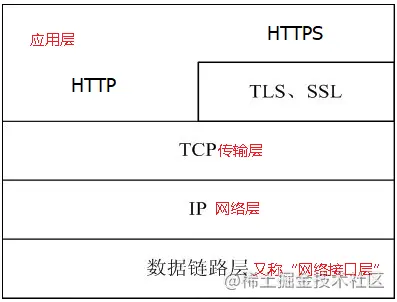
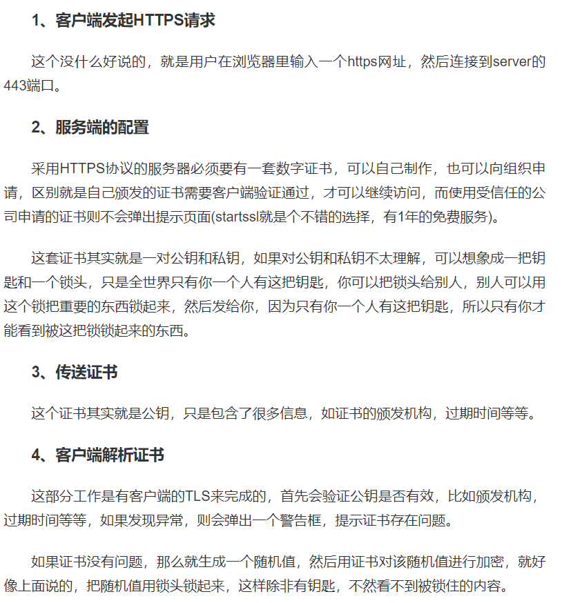
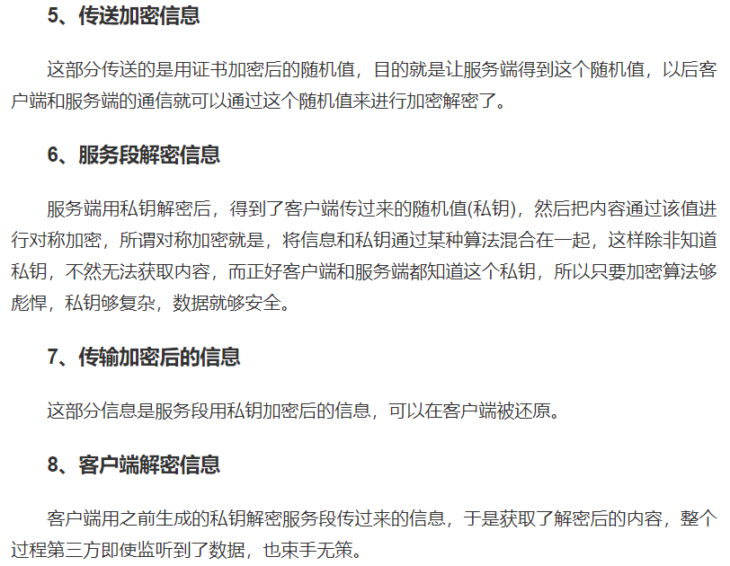

## HTTP的缺点

HTTP 天生明文传输的特性，在 HTTP 的传输过程中，任何人都有可能从中截获、修改或者伪造请求发送，所以可以认为 HTTP 是不安全的。

在 HTTP 的传输过程中不会验证通信方的身份，因此 HTTP 信息交换的双方可能会遭到伪装，也就是`没有用户验证`

在 HTTP 的传输过程中，接收方和发送方并`不会验证报文的完整性`

## HTTPS

### 什么是HTTPS

超文本传输安全协议。是一种通过计算机网络进行安全通信的传输协议。HTTPS经由HTTP进行通信，但利用SSL/TLS来加密数据包。HTTPS开发的主要目的，是提供对网站服务器的身份认证，保护交换数据的隐私与完整性

HTTPS 协议提供了三个关键的指标

- `加密(Encryption)`， HTTPS 通过对数据加密来使其免受窃听者对数据的监听，这就意味着当用户在浏览网站时，没有人能够监听他和网站之间的信息交换，或者跟踪用户的活动，访问记录等，从而窃取用户信息。
- `数据一致性(Data integrity)`，数据在传输的过程中不会被窃听者所修改，用户发送的数据会`完整`的传输到服务端，保证用户发的是什么，服务器接收的就是什么。
- `身份认证(Authentication)`，是指确认对方的真实身份，也就是`证明你是你`（可以比作人脸识别），它可以防止中间人攻击并建立用户信任。

HTTPS 并不是一项新的应用层协议，只是 HTTP 通信接口部分由 SSL 和 TLS 替代而已。通常情况下，HTTP 会先直接和 TCP 进行通信。在使用 SSL 的 HTTPS 后，则会先演变为和 SSL 进行通信，然后再由 SSL 和 TCP 进行通信。也就是说，**HTTPS 就是身披了一层 SSL 的 HTTP**。（HTTPS其实就是将HTTP的数据包再通过SSL/TLS加密后传输）

### SSL和TLS的关系

`TLS(Transport Layer Security)` 是 `SSL(Secure Socket Layer)` 的后续版本，它们是用于在互联网两台计算机之间用于`身份验证`和`加密`的一种协议

### HTTPS工作原理

用户在浏览器发起HTTPS请求（如 [juejin.cn](https://juejin.cn/user/747323638163768)），默认使用服务端的443端口进行连接；

HTTPS需要使用一套**CA数字证书**，证书内会附带一个**公钥Pub**，而与之对应的**私钥Private**保留在服务端不公开；

服务端收到请求，返回配置好的包含**公钥Pub**的证书给客户端；

客户端收到**证书**，校验合法性，主要包括是否在有效期内、证书的域名与请求的域名是否匹配，上一级证书是否有效（递归判断，直到判断到系统内置或浏览器配置好的根证书），如果不通过，则显示HTTPS警告信息，如果通过则继续；

客户端生成一个用于对称加密的**随机Key**，并用证书内的**公钥Pub**进行加密，发送给服务端；

服务端收到**随机Key**的密文，使用与**公钥Pub**配对的**私钥Private**进行解密，得到客户端真正想发送的**随机Key**；

服务端使用客户端发送过来的**随机Key**对要传输的HTTP数据进行对称加密，将密文返回客户端；

客户端使用**随机Key**对称解密密文，得到HTTP数据明文；

后续HTTPS请求使用之前交换好的**随机Key**进行对称加解密。

简单地说，就是在客户端先向服务端发起一个请求，服务端有一把服务端钥匙和一把锁，把证书和锁发给客户端。

客户端确认证书没问题后，生成一个客户端钥匙，并用服务端锁把这个钥匙锁住，然后发送给服务端。

服务端通过服务端钥匙解开服务端锁，拿到里面的客户端钥匙。

这样服务端和客户端就都知道客户端钥匙了，双方就可以开始通信了

（为什么不直接用服务端的锁来传递数据呢？因为这样客户端可以加密并发送，但客户端无法看到服务端返回的加密后的response）

### HTTPS和HTTP的区别

1. HTTPS协议需要到CA（证书颁发机构）申请证书，需要交费。
2. HTTP协议运行在TCP之上，所有传输的内容都是明文，HTTPS运行在SSL/TLS之上，SSL/TLS运行在TCP之上，所有传输的内容都经过加密的。
3. 端口不一样，http是80，https是443。