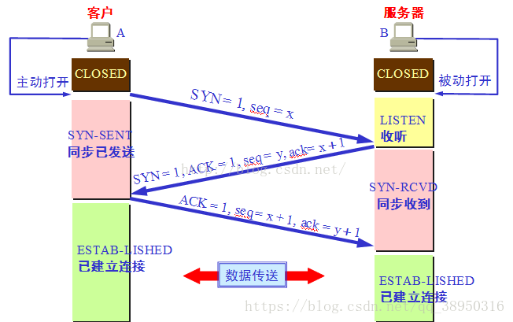
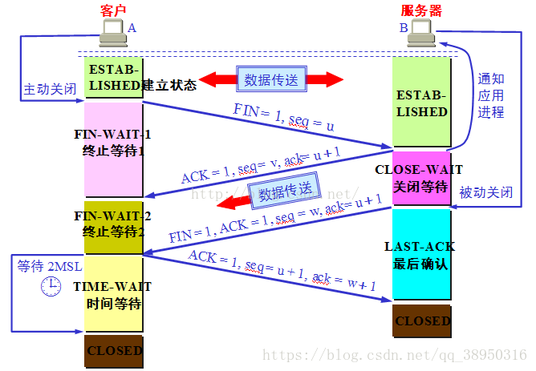

# OSI七层模型

OSI是一种网络互联模型，定义了一种用于网络通信的通用框架，共分为七层

| 层数 | 层名                  | 备注   |
| ---- | --------------------- | ------ |
| 7    | 应用层(Application)   |        |
| 6    | 表示层(Presentation)  |        |
| 5    | 会话层(Session)       |        |
| 4    | 传输层(Transport)     |        |
| 3    | 网络层(Network)       | 路由器 |
| 2    | 数据链路层(Data Link) | 交换机 |
| 1    | 物理层(Physical)      | 光纤   |

## 第七层——应用层(Application)

当用户使用浏览器来打开网页时，用到的两个协议（DNS和HTTP）都是工作在应用层上的协议。

应用层的其他常用协议：

- FTP：文件传输协议，用来在客户机和FTP服务器之间传输文件。
- DHCP：动态主机配置协议，DHCP服务器为客户机动态分配IP地址。
- POP3：邮件接收协议，用于从POP3服务器接收邮件。
- SMTP：邮件发送协议，用户通过SMTP服务器发送邮件。

## 第六层——表示层(Presentation)

该层的主要功能：负责数据格式的**转换**，**压缩**和**加密**。 

即将数据转换为适合网络传输的格式

常见的协议有`ASCII`、`SSL/TLS`

## 第五层——会话层(Session)

会话层作用是负责建立和断开通信连接（数据流动的逻辑通路），以及数据的分割等数据传输相关的管理

这些方法一般以API的形式出现。常用的API有RPC和Socket API。

**不同设备中的应用程序之间的连接**

## 第四层——传输层(Transport)

传输层的作用是为上层协议提供端到端的可靠的数据传输服务（这里的端指端口号，即传输层可以指定通信端口）

传输层上最重要的两个协议是TCP和UDP。

**两个主机端口之间的连接**

## 第三层——网络层(Network)

本层通过IP寻址来建立两个节点之间的连接，为源端的运输层送来的分组，选择合适的路由和交换节点，正确地将数据传输到目标地址

网络层将数据**从发送端的主机发送到接收端的主机**，两台主机间可能会存在很多数据链路，网络层会选择合适的路由和交换节点，将数据传递过去。

网络层上最重要的协议是`IP（Internet Protocol`）

## 第二层——数据链路层(Data Link)

该层负责**物理层面上互连的节点**之间的通信传输

例如：交换机

## 第一层——物理层(Physical)

物理层位于OSI的底层，所有其他层的数据最终都必须经由物理层才能发送出去。

例如：光纤

## OSI与TCP/IP的关系

osi更像是一种具有通用性的规范，适合各种网络

TCP/IP是根据协议集建立的模型，只适用于TCP/IP网络

# TCP/IP协议

`早期的TCP/IP模型是一个四层结构，后来在使用过程中，借鉴OSI七层参考模型，将网络接口层划分为了数据链路层和物理层（所以网上有两种说法）`

#### TCP/IP 的含义

TCP/IP协议是一组用于实现网络互连的通信协议。

TCP/IP协议是一个协议群的统称，它包括TCP、IP、UDP、TELNET 或 FTP、以及 HTTP等许多协议，这些协议一起称为TCP/IP协议

### 数据包

每个分层中，都会对所发送的数据附加一个**首部**，在这个首部中包含了该层必要的信息，如协议相关信息。通常**，为协议提供的信息为包首部，所要发送的内容为数据**。在下一层的角度看，从上一层收到的包全部都被认为是本层的数据。（数据包的接收流程是发送流程的逆序过程，逐层进行解包）

### TCP 和 UDP

**TCP是一个面向连接的、可靠的、基于字节流的传输层协议。**

**UDP是一个面向无连接的、不可靠的、基于数据报的传输层协议。**

### **UDP**

- 采用面向报文的传输方式，UDP对应用层交下来的报文，在添加首部后就向下交付IP层。
- 应用层交给UDP多长的报文，UDP就照样发送。因此，应用程序必须选择合适大小的报文。
- UDP 不止支持一对一的传输方式，同样支持一对多，多对多，多对一的方式
- 无法得知报文是否安全完整到达
- 优点：
  - 速度快：不像TCP 有拥塞控制，无须建立连接，数据报首部开销小
  - 并不是所有使用 UDP 协议的应用层都是`不可靠`的，应用程序可以自己实现可靠的数据传输，通过增加确认和重传机制。所以使用 UDP 协议最大的特点就是速度快

### **TCP**

- **面向连接**。在双方互相通信之前，TCP 需要三次握手建立连接
- **可靠的**。体现在两方面，一个是有状态，另一个是可控制
  - 有状态：TCP 会精准记录哪些数据发送了，哪些数据被对方接收了，哪些没有被接收到，而且保证数据包按序到达，不允许半点差错。
  - 可控制：当意识到丢包了或者网络环境不佳，TCP 会根据具体情况调整自己的行为，控制自己的发送速度或者重发。
- **拥塞控制**
- **面向字节流**。TCP 会将要传输的数据流分为多个`块(chunk)`，然后向每个 chunk 中添加 TCP 标头，这样就形成了一个 TCP 段也就是报文段。
- 提供全双工通信。`全双工指的是主机 A 与另外一个主机 B 存在一条 TCP 连接，那么应用程数据就可以从主机 B 流向主机 A 的同时，也从主机 A 流向主机 B`
- 每条TCP传输连接只能有两个端点，只能进行点对点的数据传输，不支持多播和广播传输方式

### TCP报文

（顶部数字单位为字节，1字节=8位）

#### 源端口、目标端口

如何标识唯一标识一个连接？答案是 TCP 连接的`四元组`——源 IP、源端口、目标 IP 和目标端口。

那 TCP 报文怎么没有源 IP 和目标 IP ？因为这是由IP协议处理的。TCP 只需要记录两者的端口即可。

#### 序列号

即`Sequence number`, 指的是**本报文段第一个字节的序列号**。(seq用来标记数据段的顺序，TCP把连接中发送的所有数据字节都编上一个序号，第一个字节的编号由本地随机产生；给字节编上序号后，就给每一个报文段**指派**一个序号，即seq，其值为报文段中的第一个字节的数据编号)

序列号是一个长为 4 个字节，也就是 32 位的无符号整数，表示范围为 0 ~ 2^32 - 1。如果到达最大值了后就循环到0。

序列号在 TCP 通信的过程中有两个作用:

1. 在 SYN 报文中交换彼此的初始序列号。
2. 保证数据包按正确的顺序组装。

#### 确认号

即`ACK(Acknowledgment number)`。用来告知对方下一个期望接收的序列号。序列号表示报文段携带数据的第一个字节的编号；而确认号指的是期望接收到下一个字节的编号，因此**当前报文段最后一个字节的编号+1**即为确认号

#### ISN

即`Initial Sequence Number（初始序列号）`,在三次握手的过程当中，双方会用过`SYN`报文来交换彼此的 `ISN`。

ISN 并不是一个固定的值，而是每 4 ms 加一，溢出则回到 0，这个算法使得猜测 ISN 变得很困难。那为什么要这么做？

如果 ISN 被攻击者预测到，要知道源 IP 和源端口号都是很容易伪造的，当攻击者猜测 ISN 之后，直接伪造一个 RST 后，就可以强制连接关闭的，这是非常危险的。

而动态增长的 ISN 大大提高了猜测 ISN 的难度。

#### 头部长度

表示报文段的数据部分的起始位置，距离整个报文段的起始位置的距离。间接的指出首部的长度。

#### 标记位

**URG(紧急)** 当URG=1，表明紧急指针字段有效，该报文段有紧急数据，应尽快发送。

**ACK(确认)** 仅当ACK=1时，确认号（上方的ack）才有效，连接建立后，所有的报文段ACK都为1。

**PSH(推送)** 提示接收端应用程序立即从TCP缓冲区把数据读走，不再等待整个缓存填满才读。

**RST(复位)** RST=1时，表示需要重新建立连接。

**SYN(同步)** 在建立连接时用来同步序号。SYN=1表示这是一个连接请求，或连接接受报文。当SYN=1,ACK=0，则表明是一个连接请求报文段。若响应报文中，SYN=1,ACK=1，则表示对方同意连接。SYN这个标志位只有在TCP建产连接时才会被置1，握手完成后SYN标志位被置0。

**FIN(终止)** 用来释放一个连接窗口。当FIN=1时，表明此报文段的发送方不再发送数据，请求释放单向连接。TCP断开连接用到。

#### 校验和

占用两个字节，防止传输过程中数据包有损坏，如果遇到校验和有差错的报文，TCP 直接丢弃之，等待重传。

#### 紧急指针

按序到达是`TCP协议`保证可靠性的一种机制，但是也存在一些报文想优先被处理，这时就可以设置`紧急指针`，指向该报文即可，同时将`紧急指针有效位` 置为 1

#### **窗口** 

发生流量控制时，接收端需要告知发送端自己的窗口大小，就是通过这个字段通知的

#### 可选项

常用的可选项有以下几个:

- TimeStamp: TCP 时间戳
- MSS: 指的是 TCP 允许的从对方接收的最大报文（数据）段。
- SACK: 选择确认选项。
- Window Scale： 窗口缩放选项。

### 超时重传

TCP 具有超时重传机制，即间隔一段时间没有等到数据包的回复时，重传这个数据包

### 流量控制

缓存：TCP连接的两端都分别有发送缓存和接收缓存

对于发送端和接收端而言，TCP 需要把发送的数据放到**发送缓存区**, 将接收的数据放到**接收缓存区**

而流量控制所要做的事情，就是通过接收缓存区的大小，控制发送端的发送。如果对方的接收缓存区满了，就不能再继续发送了（这里的流量控制是对双方都生效的，双方都可以既是发送端也是接收端）

#### 滑动窗口

TCP 滑动窗口分为两种: **发送窗口**和**接收窗口**。

**发送端**的滑动窗口结构如下:

发送窗口就是图中被框住的范围。SND 即`send`, WND 即`window`, UNA 即`unacknowledged`, 表示未被确认，NXT 即`next`, 表示下一个发送的位置

**接收端**的窗口结构如下:

REV 即 `receive`，NXT 表示下一个接收的位置，WND 表示接收窗口大小。

#### 流量控制过程

首先双方三次握手，初始化各自的窗口大小，均为 200 个字节。

假如当前发送端给接收端发送 100 个字节，那么此时对于发送端而言，SND.NXT 当然要右移 100 个字节，也就是说当前的`可用窗口`减少了 100 个字节，这很好理解。

现在这 100 个到达了接收端，被放到接收端的缓冲队列中。不过此时由于大量负载的原因，接收端处理不了这么多字节，只能处理 40 个字节，剩下的 `60` 个字节被留在了缓冲队列中。

注意了，此时接收端的情况是处理能力不够用啦，你发送端给我少发点，所以**此时接收端的接收窗口应该缩小，具体来说，缩小 60 个字节，由 200 个字节变成了 140 字节，因为缓冲队列还有 60 个字节没被应用拿走**。

因此，**接收端会在 ACK 的报文首部带上缩小后的滑动窗口 140 字节**，发送端对应地调整发送窗口的大小为 140 个字节。

此时对于发送端而言，已经发送且确认的部分增加 40 字节，也就是 SND.UNA 右移 40 个字节，同时**发送窗口**缩小为 140 个字节。

这也就是**流量控制**的过程。尽管回合再多，整个控制的过程和原理是一样的

### 拥塞控制

流量控制发生在发送端跟接收端之间，并没有考虑到整个网络环境的影响，如果说**当前网络特别差，特别容易丢包**，那么发送端就应该注意一些了。而这，也正是拥塞控制需要处理的问题

对于拥塞控制来说，TCP 每条连接都需要维护两个核心状态:

- 拥塞窗口（Congestion Window，cwnd）
- 慢启动阈值（Slow Start Threshold，ssthresh）

#### 拥塞窗口

- 拥塞窗口的大小取决于网络的拥塞程度，并且动态地在变化
- 发送窗口受接收窗口和拥塞窗口的限制，取两者最小值

#### 慢启动

刚开始传输数据时，并不知晓网络的拥堵情况，因此要采用一种保守的算法来慢慢地适应整个网路，这种算法叫`慢启动`，由小到大慢慢增大拥塞窗口的数值，也相当于增大发送窗口

#### **慢启动阈值**

当 拥塞窗口到达这个阈值之后，会降低增长速度

### 快速重传

在 TCP 传输的过程中，如果发生了丢包，即接收端发现数据段不是按序到达的时候，接收端的处理是重复发送之前的 ACK

比如第 5 个包丢了，即使第 6、7 个包到达的接收端，接收端也一律返回第 4 个包的 ACK。**当发送端收到 3 个重复的 ACK 时，意识到丢包了，于是马上进行重传，不用等到一个 RTO 的时间到了才重传。(与超时重传相比较)**

这就是**快速重传**，它解决的是**是否需要重传**的问题

### 选择性重传

既然要重传，那么只重传第 5 个包还是第5、6、7 个包都重传呢？

当然第 6、7 个都已经到达了，TCP 的设计者也不傻，已经传过去干嘛还要传？干脆记录一下哪些包到了，哪些没到，针对性地重传。

在收到发送端的报文后，接收端回复一个 ACK 报文，那么在这个报文首部的可选项中，就可以加上`SACK`这个属性，通过`left edge`和`right edge`告知发送端已经收到了哪些区间的数据报。因此，即使第 5 个包丢包了，当收到第 6、7 个包之后，接收端依然会告诉发送端，这两个包到了。剩下第 5 个包没到，就重传这个包。这个过程也叫做**选择性重传(SACK，Selective Acknowledgment)**，它解决的是**如何重传**的问题

### 快速恢复

发送端收到三次重复 ACK 之后，发现丢包，觉得现在的网络已经有些拥塞了，自己会进入**快速恢复**阶段。

在这个阶段，发送端如下改变：

- 拥塞阈值降低为拥塞窗口的一半
- 拥塞窗口的大小变为拥塞阈值
- 拥塞窗口线性增长

### 三次握手

第一次握手：建立连接时，客户端发送syn包（seq=x）到服务器，并进入SYN_SENT状态，等待服务器确认；SYN：同步序列编号（Synchronize Sequence Numbers）。

第二次握手：服务器收到syn包，必须确认客户的SYN（ack=x+1），同时自己也发送一个SYN包（seq=y），即SYN+ACK包，此时服务器进入SYN_RECV状态；

第三次握手：客户端收到服务器的SYN+ACK包，向服务器发送确认包ACK(ack=y+1），此包发送完毕，客户端和服务器进入ESTABLISHED（TCP连接成功）状态，完成三次握手。

从图中seq=x ack=x+1可看出，第一次握手是会消耗一个序列号的，这个序列号是SYN消耗掉的

#### 为什么不能用两次？

三次握手能确认双方的接收与发送功能

第一次握手确认发送方的发送能力

第二次握手确认接收方的接收能力和发送能力

第三次握手确认发送方的接收能力

如果只有两次握手，假设A发出第一次握手请求，B收到后发出第二次握手请求。如果第二次握手的请求没能正确到达A，A会认为连接没建立，即B没有响应。但B不知道，B认为连接已经建立了，可能会持续发送一些数据，这些数据肯定是没结果的，这样会造成资源的浪费。

#### 三次握手过程中可以携带数据么？

第三次握手的时候，可以携带。前两次握手不能携带数据。

如果前两次握手能够携带数据，那么一旦有人想攻击服务器，那么他只需要在第一次握手中的 SYN 报文中放大量数据，那么服务器势必会消耗更多的**时间**和**内存空间**去处理这些数据，增大了服务器被攻击的风险。

第三次握手的时候，客户端已经处于`ESTABLISHED`状态，并且已经能够确认服务器的接收、发送能力正常，这个时候相对安全了，可以携带数据。

### 四次挥手

1）客户端进程发出连接释放报文，并且停止发送数据。释放数据报文首部，FIN=1，其序列号为seq=u（等于前面已经传送过来的数据的最后一个字节的序号加1），此时，客户端进入FIN-WAIT-1（终止等待1）状态。 TCP规定，FIN报文段即使不携带数据，也要消耗一个序号。
2）服务器收到连接释放报文，发出确认报文，ACK=1，ack=u+1，并且带上自己的序列号seq=v，此时，服务端就进入了CLOSE-WAIT（关闭等待）状态。TCP服务器通知高层的应用进程，客户端向服务器的方向就释放了，这时候处于半关闭状态，即客户端已经没有数据要发送了，但是服务器若发送数据，客户端依然要接受。这个状态还要持续一段时间，也就是整个CLOSE-WAIT状态持续的时间。
3）客户端收到服务器的确认请求后，此时，客户端就进入FIN-WAIT-2（终止等待2）状态，等待服务器发送连接释放报文（在这之前还需要接受服务器发送的最后的数据）。
4）服务器将最后的数据发送完毕后，就向客户端发送连接释放报文，FIN=1，ack=u+1，由于在半关闭状态，服务器很可能又发送了一些数据，假定此时的序列号为seq=w，此时，服务器就进入了LAST-ACK（最后确认）状态，等待客户端的确认。
5）客户端收到服务器的连接释放报文后，必须发出确认，ACK=1，ack=w+1，而自己的序列号是seq=u+1，此时，客户端就进入了TIME-WAIT（时间等待）状态。注意此时TCP连接还没有释放，要等待2 个 `MSL`(`Maximum Segment Lifetime，报文最大生存时间`), 在这段时间内如果客户端没有收到服务端的重发请求，那么表示 ACK 成功到达，挥手结束，否则客户端重发 ACK。
6）服务器只要收到了客户端发出的确认，立即进入CLOSED状态。同样，撤销TCB后，就结束了这次的TCP连接。可以看到，服务器结束TCP连接的时间要比客户端早一些。

#### 等待2MSL的意义

最后阶段，主动关闭方发送出最后的ACK响应包，但该ACK可能丢失。对端如果没有收到ACK，将不断重复发送FIN片段。所以主动关闭方不能立即关闭，它必须确认对端接收到了该ACK。

照这样说一个 MSL 不就不够了吗，为什么要等待 2 MSL? 

2MSL是对端重新发送的FIN报文到达主动关闭方的最长时间

- 1 个 MSL 是主动关闭方最后的 ACK 报文达到对端的时间
- 1 个 MSL 对端没有收到 ACK，重传的 FIN 报文到达主动关闭方的时间

#### 为什么是四次挥手而不是三次？

因为服务端在接收到`FIN`, 往往不会立即返回`FIN`, 必须等到服务端所有的报文都发送完毕了，才能发`FIN`。因此先发一个`ACK`表示已经收到客户端的`FIN`，延迟一段时间才发`FIN`。这就造成了四次挥手。

#### 如果是三次挥手会有什么问题？

等于说服务端将`ACK`和`FIN`的发送合并为一次挥手，这个时候**可能有长时间的延迟，会导致客户端误以为`FIN`没有到达客户端，从而让客户端不断的重发`FIN`**。（这里延迟的原因是，服务端仍在发送其他的数据）

#### 如果已经建立了连接，但是客户端突然出现故障了怎么办？

TCP还设有一个保活计时器，显然，客户端如果出现故障，服务器不能一直等下去，白白浪费资源。服务器每收到一次客户端的请求后都会重新复位这个计时器，时间通常是设置为2小时，若两小时还没有收到客户端的任何数据，服务器就会发送一个探测报文段，以后每隔75秒钟发送一次。若一连发送10个探测报文仍然没反应，服务器就认为客户端出了故障，接着就关闭连接
### **适用场景**

UDP适用于实时应用（IP电话、视频会议、直播等）

TCP适用于要求可靠传输的应用，例如文件传输

TCP 是面向连接的、可靠的流协议。流就是指不间断的数据结构，当应用程序采用 TCP 发送消息时，虽然可以保证发送的顺序，但还是犹如没有任何间隔的数据流发送给接收端。TCP 为提供可靠性传输，实行“顺序控制”或“重发控制”机制。此外还具备“流控制（流量控制）”、“拥塞控制”、提高网络利用率等众多功能。

UDP 是不具有可靠性的数据报协议。细微的处理它会交给上层的应用去完成。在 UDP 的情况下，虽然可以确保发送消息的大小，却不能保证消息一定会到达。因此，应用有时会根据自己的需要进行重发处理。

TCP 和 UDP 的优缺点无法简单地、绝对地去做比较：TCP 用于在传输层有必要实现可靠传输的情况；而在一方面，UDP 主要用于那些对高速传输和实时性有较高要求的通信或广播通信。TCP 和 UDP 应该根据应用的目的按需使用。