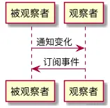
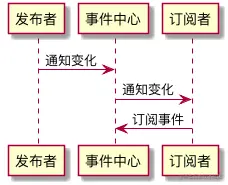

### 与观察者模式的区别

**发布者直接触及到订阅者**的操作，叫观察者模式，**发布者不直接触及到订阅者、而是由统一的第三方来完成实际的通信的操作，叫做发布-订阅模式**。





为什么要有观察者模式？观察者模式，解决的其实是模块间的耦合问题，有它在，即便是两个分离的、毫不相关的模块，也可以实现数据通信。但观察者模式仅仅是减少了耦合，**并没有完全地解决耦合问题**——被观察者必须去维护一套观察者的集合，这些观察者必须实现统一的方法供被观察者调用，两者之间还是有着说不清、道不明的关系。

而发布-订阅模式，则是快刀斩乱麻了——发布者完全不用感知订阅者，不用关心它怎么实现回调方法，事件的注册和触发都发生在独立于双方的第三方平台（事件总线）上。发布-订阅模式下，实现了完全地解耦。（也就是说，发布订阅的适用性更广）

但这并不意味着，发布-订阅模式就比观察者模式“高级”。在实际开发中，我们的模块解耦诉求**并非总是需要它们完全解耦**。如果两个模块之间本身存在关联，且这种关联是稳定的、必要的，那么我们使用观察者模式就足够了。而在模块与模块之间独立性较强、且没有必要单纯为了数据通信而强行为两者制造依赖的情况下，我们往往会倾向于使用发布-订阅模式

可以说是一种多个“一对多”关系的模型

```
class EventEmitter {
  constructor() {
    // handlers是一个map，用于存储事件与回调之间的对应关系
    this.handlers = {}
  }

  // on方法用于安装事件监听器，它接受目标事件名和回调函数作为参数
  on(eventName, cb) {
    // 先检查一下目标事件名有没有对应的监听函数队列
    if (!this.handlers[eventName]) {
      // 如果没有，那么首先初始化一个监听函数队列
      this.handlers[eventName] = []
    }

    // 把回调函数推入目标事件的监听函数队列里去
    this.handlers[eventName].push(cb)
  }

  // emit方法用于触发目标事件，它接受事件名和监听函数入参作为参数
  emit(eventName, ...args) {
    // 检查目标事件是否有监听函数队列
    if (this.handlers[eventName]) {
      // 这里需要对 this.handlers[eventName] 做一次浅拷贝，主要目的是为了避免通过 once 安装的监听器在移除的过程中出现顺序问题
      const handlers = this.handlers[eventName].slice()
      // 如果有，则逐个调用队列里的回调函数
      handlers.forEach((callback) => {
        callback(...args)
      })
    }
  }

  // 移除某个事件回调队列里的指定回调函数
  off(eventName, cb) {
    const callbacks = this.handlers[eventName]
    const index = callbacks.indexOf(cb)
    if (index !== -1) {
      callbacks.splice(index, 1)
    }
  }

  // 为事件注册单次监听器
  once(eventName, cb) {
    // 对回调函数进行包装，使其执行完毕自动被移除
    const wrapper = (...args) => {
      cb(...args)
      this.off(eventName, wrapper)
    }
    this.on(eventName, wrapper)
  }
}
```

